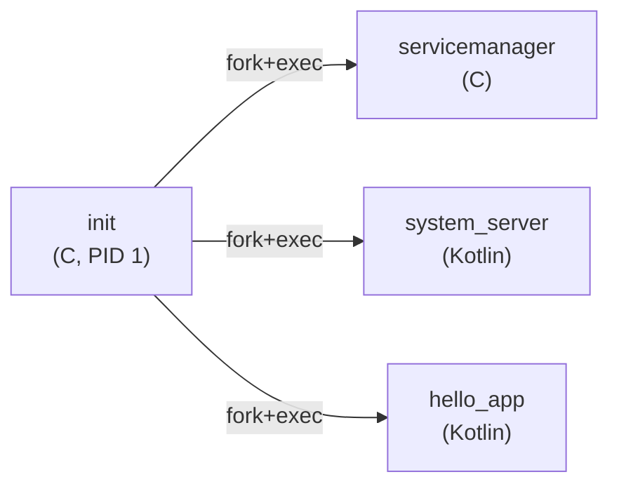
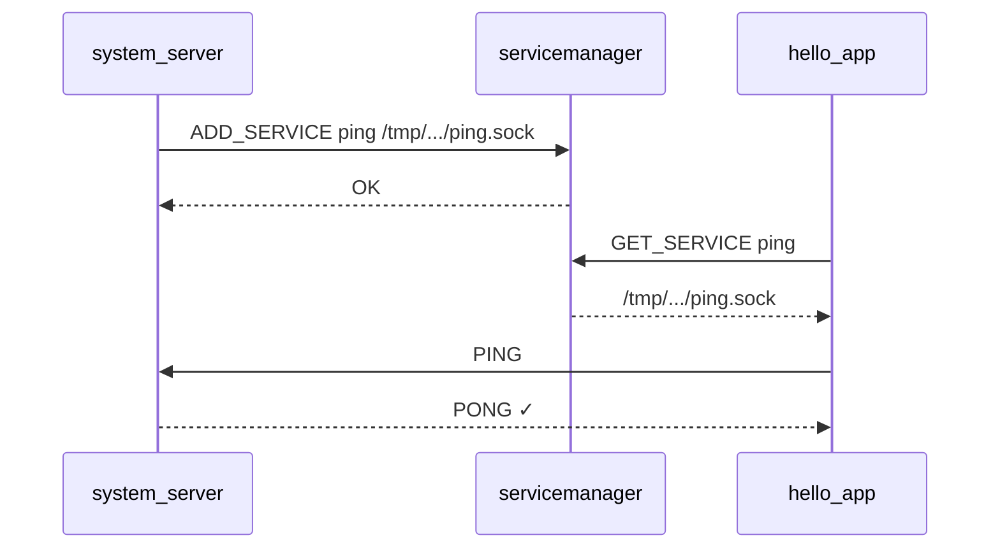
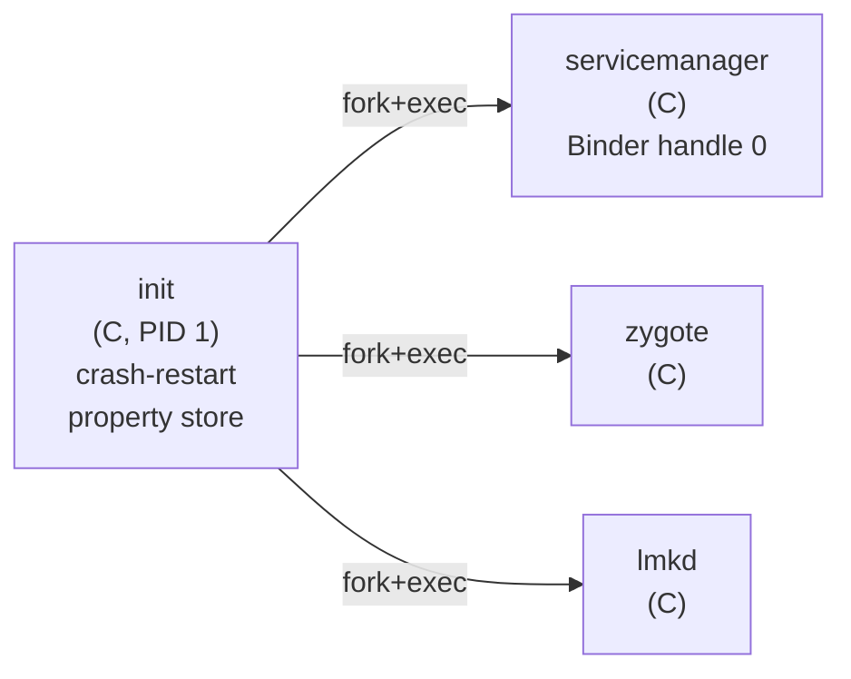
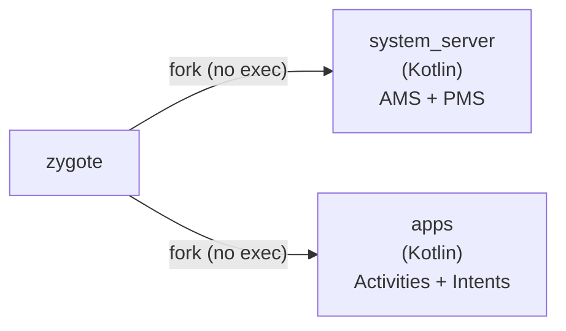
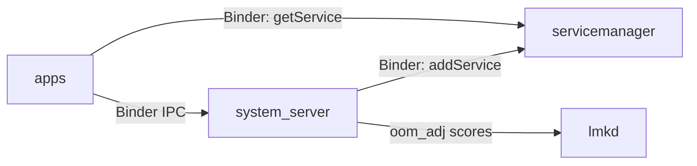

# mini-AOSP

Learn Android internals by building a minimal, educational Android-shaped OS from scratch.

Real `fork()`, real `exec()`, real Unix sockets — not a simulation.

---

## What is this?

A from-scratch reimplementation of Android's core architecture (AOSP) for learning purposes. Each component mirrors the real AOSP — same directory paths, same responsibilities, same boot sequence — but stripped down to the essential logic.

### Current (Stage 0)

**1. Boot: init starts all services**



**2. IPC: service discovery + PING/PONG**



### Target (Phase 1, Stage 8)

**1. Boot: init starts native daemons**



**2. Zygote forks JVM processes**



**3. Runtime: Binder IPC + memory management**



---

## Quick Start

### Linux (fastest)

```bash
sudo apt install -y gcc make openjdk-17-jdk
# install kotlinc (see docs/00-setup.md)

git clone <repo> mini-AOSP && cd mini-AOSP
make -C build all
./scripts/start.sh
# See "✓ Full stack verified" → Ctrl+C to stop
```

### macOS

```bash
brew install gcc make openjdk kotlin
make -C build all
./scripts/start.sh
```

### K8s sandbox (one command)

```bash
./scripts/one-off.sh o1 --first   # deploy + bootstrap + test
./scripts/one-off.sh o1            # re-run test only
```

---

## Scripts

| Script | Usage |
|--------|-------|
| `scripts/start.sh` | Generate init.rc + launch init (foreground) |
| `scripts/stop.sh` | Graceful shutdown (SIGTERM → SIGKILL) |
| `scripts/status.sh` | Show running processes + sockets |
| `scripts/run-test.sh` | Headless test: start → wait for PASS → shutdown |
| `scripts/build.sh` | Build all (wrapper for `make -C build all`) |
| `scripts/clean.sh` | Remove `out/` build artifacts |
| `scripts/deploy.sh o1` | Deploy to K8s pod by short name |
| `scripts/one-off.sh o1 --first` | Full pipeline: deploy + bootstrap + test |
| `scripts/bootstrap.sh` | Install deps on a fresh Linux server |

---

## Project Structure

```
mini-AOSP/
├── system/core/                     # Native daemons (C)
│   ├── init/main.c                  #   PID 1 — parse init.rc, fork+exec, monitor
│   ├── liblog/log.{h,c}            #   Tagged colored logging
│   ├── libcommon/                   #   Shared constants + utilities
│   │   ├── constants.h              #     paths, buffer sizes, timeouts
│   │   └── common.{h,c}            #     signal setup, file ops, log helper
│   ├── lmkd/main.c                 #   Low Memory Killer (stub, Stage 8)
│   └── rootdir/init.rc             #   Service definitions template
│
├── frameworks/
│   ├── native/
│   │   ├── cmds/servicemanager/     #   Service registry daemon (C)
│   │   │   └── main.c
│   │   └── libs/binder/             #   IPC library (C, stub for Stage 2)
│   │       ├── Binder.{h,c}
│   │       └── Parcel.{h,c}
│   └── base/
│       ├── cmds/app_process/main.c  #   Zygote entry (stub, Stage 5)
│       ├── core/kotlin/os/Log.kt    #   Kotlin logging
│       └── services/core/kotlin/    #   system_server (Kotlin)
│           └── SystemServer.kt
│
├── packages/apps/
│   └── HelloApp/HelloApp.kt        # Demo app — PING/PONG
│
├── build/Makefile                   # Build system
├── scripts/                         # Operational scripts
│
└── docs/                            # Documentation
    ├── README.md                    #   Doc index + reading order
    ├── 00-setup.md                  #   Environment setup
    ├── phase-1/                     #   Learning guides
    ├── components/                  #   Per-component design docs
    ├── reference/                   #   Code conventions
    └── stages/                      #   Stage 0-8 implementation plans
```

---

## Documentation

See [docs/README.md](./docs/README.md) for full index.

**Start here:**
1. [docs/00-setup.md](./docs/00-setup.md) — setup
2. [docs/phase-1/01-why-each-layer.md](./docs/phase-1/01-why-each-layer.md) — why each component exists
3. [docs/phase-1/03-system-walkthrough.md](./docs/phase-1/03-system-walkthrough.md) — code execution flow

**Component deep-dives:**
- [docs/components/07-init.md](./docs/components/07-init.md) — init (PID 1)
- [docs/components/04-servicemanager.md](./docs/components/04-servicemanager.md) — servicemanager
- [docs/components/08-system-server.md](./docs/components/08-system-server.md) — system_server

---

## Roadmap

| Stage | What | Status |
|-------|------|--------|
| 0 | Boot → IPC → PING/PONG | ✅ Done |
| 1 | init crash-restart + property store | |
| 2 | Binder IPC transport | |
| 3 | servicemanager on Binder | |
| 4 | PMS + Intent resolution | |
| 5 | Zygote (fork without exec) | |
| 6 | AMS + Activity lifecycle | |
| 7 | Multi-app support | |
| 8 | lmkd + BroadcastReceiver | |

See [docs/stages/](./docs/stages/) for detailed plans per stage.
