# mini-AOSP Phase 1 學習指南

> 動手做 → 做完再解釋 → 對照真正 AOSP source code
>
> 每個 Step 都是一個可以獨立完成、獨立驗證的小任務。
>
> 📋 **AOSP 對照檢查：** 所有 Stage 已與真正 AOSP source code 交叉驗證。
> 詳見 `[docs/aosp-cross-check.md](./aosp-cross-check.md)`。
>
> 🔧 **語言選擇：** Native 層使用 **C**（不是 C++）。所有 syscall 介面本身就是 C，
> 且 AOSP 早期的 servicemanager 也是純 C。詳見 [`decisions.md` DEC-013](../decisions.md)。

---

## 總覽

### 你會建造什麼

一個真正能跑的迷你 Android 作業系統——從 kernel 開機到 app 執行，完整走過 Android 的核心架構。

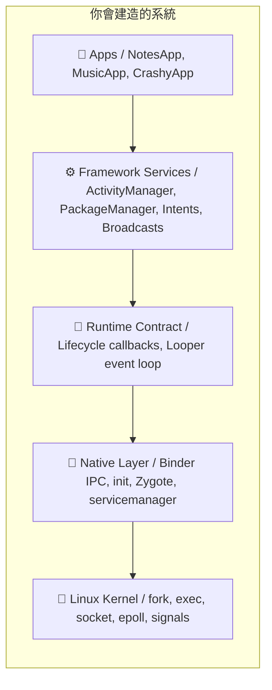


### Stage 地圖

Phase 1 分成 9 個 Stage，按依賴關係排序：

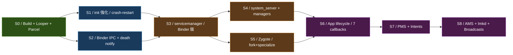


**顏色含義：** 🟢 基礎設施 → 🔵 底層元件 → 🟠 系統服務 → 🟣 App 層

### 每個 Stage 的目標


| Stage | 你會建什麼                                              | 完成的標誌                                              | 預估時間    |
| ----- | -------------------------------------------------- | -------------------------------------------------- | ------- |
| **0** | Build system, Looper event loop, Parcel 序列化        | Looper 能處理 timer + socket 事件；Parcel C↔Kotlin 互通  | 3-5 小時  |
| **1** | init crash-restart, property store                 | Service crash 後 init 自動重啟；getprop/setprop 可用       | 3-4 小時  |
| **2** | Binder IPC transport, Proxy/Stub, linkToDeath      | Process A 呼叫 Process B 的方法，10k 次無 leak             | 8-12 小時 |
| **3** | servicemanager 改用 Binder                           | 10 個 service 註冊+查詢；servicemanager crash 後恢復        | 4-6 小時  |
| **4** | system_server + AMS/PMS/PropertyManager stubs      | 所有 manager 註冊成功；launcher 能查詢                       | 4-6 小時  |
| **5** | Zygote — preload, fork, specialize                 | Zygote fork 出 child，child 拿到正確 UID/env             | 4-6 小時  |
| **6** | App process + 7 lifecycle callbacks + save/restore | App 完整走過 create→resume→pause→stop→destroy          | 6-8 小時  |
| **7** | PackageManager + Intent resolution                 | 安裝 5 個 app，implicit intent 正確 resolve              | 6-8 小時  |
| **8** | AMS fg/bg tracking + lmkd + BroadcastReceiver      | LRU eviction, BOOT_COMPLETED broadcast, force-stop | 8-10 小時 |


**總計：約 45-65 小時**（兼職 3-5 週）

---

## Stage 0：基礎設施

> **目標：** 建立 build system、Looper event loop、binary Parcel 格式。
> 這是所有後續 Stage 的地基。

### 你現在在哪裡

Stage 0 的 Hello World prototype 已經完成 ✅：

- init（C）用 `fork()+exec()` 啟動 servicemanager 和 system_server
- servicemanager（C）用 Unix socket 做 text-based service registry
- system_server（Kotlin）註冊 PingService
- HelloApp（Kotlin）查詢 → PING → PONG

**還缺什麼：**

1. **Looper** — epoll-based event loop（Stage 2 的 Binder 和 Stage 6 的 app 都需要它）
2. **Parcel** — binary 序列化格式（取代目前的 text protocol）

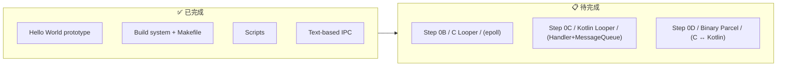


---

### Step 0B：C Looper（epoll event loop）

#### 🎯 目標

寫一個 event loop，能同時等待：

- **Timer 事件** — 「5 秒後執行這個 callback」
- **File descriptor 事件** — 「這個 socket 有資料可讀時通知我」

這就是 Android 裡每個 process 的心跳——Looper 不斷地等事件、dispatch callback、再等。

#### 📋 動手做

**檔案：** `frameworks/native/libs/binder/Looper.h` + `Looper.c`

1. 建立 `Looper` struct，包含：
  `addFd(fd, callback)` — 監聽一個 file descriptor
   `removeFd(fd)` — 停止監聽
   `postDelayed(callback, delayMs)` — 延遲執行
   `loop()` — 主迴圈，永遠不回傳（除非呼叫 `quit()`）
   `quit()` — 停止迴圈
2. 內部用 Linux `epoll`：
  `poll_create1(0) → 建立 epoll instance poll_ctl(ADD, fd, ...) → 加入要監聽的 fd poll_wait(timeout) → 等待事件，timeout 從最近的 timer 算出`
3. 寫一個測試程式 `tests/test_looper.c`：
  建立一個 Unix socket pair
   用 Looper 監聽讀端
   用 `postDelayed` 在 100ms 後往寫端送 "hello"
   驗證 fd callback 收到 "hello"

#### ✅ 驗證

```bash
make -C build test_looper
./out/bin/test_looper
# 預期輸出：
# [test] Timer fired at ~100ms
# [test] FD callback received: hello
# [test] Looper quit cleanly
```

#### 🔍 做完後讀這段

**epoll 是什麼？**

Linux kernel 提供三種等待多個 fd 的方式：`select()`、`poll()`、`epoll`。


| 方式          | 複雜度                              | 適合            |
| ----------- | -------------------------------- | ------------- |
| `select()`  | O(n) 每次呼叫都要重建 fd_set             | fd 數量少（<100）  |
| `poll()`    | O(n) 但不需要重建                      | 中等數量          |
| `**epoll`** | **O(1)** amortized，kernel 維護監聽列表 | **大量 fd，高效能** |


Android 選 `epoll` 是因為 system_server 可能同時有 100+ 個 binder 連線。

**為什麼 Looper 很重要？**

Android 的 golden rule：**main thread 永遠不能 block**。
所有 I/O（socket read、binder call）都必須是 event-driven 的。
Looper 就是實現這個 rule 的機制——它把「等待」集中到一個地方（`epoll_wait`），
所有工作都變成 callback。

#### 🆚 真正 AOSP 對照


|         | 真正 AOSP                                      | mini-AOSP                                  |
| ------- | -------------------------------------------- | ------------------------------------------ |
| **檔案**  | `system/core/libutils/Looper.cpp`            | `frameworks/native/libs/binder/Looper.c` |
| **核心**  | `epoll_wait()` + `timerfd`                   | `epoll_wait()` + 手動算 timeout               |
| **訊息**  | `Message` struct + `MessageHandler`          | 簡化版 callback                               |
| **跨語言** | C native + Java `android.os.Looper` 透過 JNI | 分開的 C 和 Kotlin 實作                        |


**去讀真正 AOSP 的 source：**

```
system/core/libutils/Looper.cpp → pollOnce(), addFd(), sendMessageDelayed()
system/core/libutils/include/utils/Looper.h → API 定義
frameworks/base/core/java/android/os/Looper.java → Java 側
```

重點看 `Looper::pollOnce()` — 它計算最近的 timer deadline，用它當 `epoll_wait` 的 timeout。
這跟你要寫的邏輯一模一樣。

#### 📚 學習材料

- **man epoll(7)** — `man 7 epoll`，或搜尋 "Linux epoll tutorial"
- **Beej's Guide to Network Programming** §7.2 — `poll()` 和 `select()` 的解說，理解為什麼需要 `epoll`
- **AOSP `Looper.cpp`** — [在線閱讀](https://cs.android.com/android/platform/superproject/+/main:system/core/libutils/Looper.cpp)

> ⚠️ **macOS 注意：** macOS 沒有 `epoll`，用 `kqueue` 代替。
> 如果你想在本機開發，可以先用 `poll()`（API 更簡單），部署到 Linux 再改 `epoll`。
> 或者直接在 server 上開發。

---

### Step 0C：Kotlin Looper（Handler + MessageQueue）

#### 🎯 目標

寫 Kotlin 版的 event loop，讓 framework 層（system_server、app）能用：

- `Looper.loop()` — 主迴圈
- `Handler.post(runnable)` — 排隊一個任務
- `Handler.postDelayed(runnable, delayMs)` — 延遲執行
- `MessageQueue` — 按時間排序的訊息佇列

#### 📋 動手做

**檔案：**

- `frameworks/base/core/kotlin/os/MessageQueue.kt`
- `frameworks/base/core/kotlin/os/Looper.kt`（新增，取代目前的 stub）
- `frameworks/base/core/kotlin/os/Handler.kt`
- `frameworks/base/core/kotlin/os/Message.kt`

1. `Message` — data class：`what: Int`, `obj: Any?`, `callback: Runnable?`, `when: Long`（執行時間）
2. `MessageQueue` — 按 `when` 排序的 priority queue：
  `enqueue(msg)` — 插入訊息
   `next()` — 取出下一個到期的訊息（如果沒到期就 `wait()`）
3. `Looper` —
  `prepare()` — 建立當前 thread 的 Looper（存在 `ThreadLocal`）
   `loop()` — 從 MessageQueue 不斷取訊息、dispatch
   `myLooper()` — 取得當前 thread 的 Looper
   `quit()` — 停止
4. `Handler(looper)` —
  `post(runnable)` / `postDelayed(runnable, ms)` — 包裝成 Message 丟進 queue
   `sendMessage(msg)` — 直接送 Message
   `handleMessage(msg)` — 子類覆寫來處理
5. 寫測試 `tests/TestLooper.kt`：
  在背景 thread 啟動 Looper
   用 Handler post 三個 delayed 任務（100ms, 200ms, 300ms）
   驗證它們按順序執行
   呼叫 `quit()` 結束

#### ✅ 驗證

```bash
make -C build test_looper_kt
java -jar out/jar/test_looper.jar
# 預期輸出：
# [test] Message 1 at ~100ms
# [test] Message 2 at ~200ms
# [test] Message 3 at ~300ms
# [test] Looper quit
```

#### 🔍 做完後讀這段

**為什麼 Android 要有 Handler/Looper？**

Android app 的 main thread 是單執行緒的——所有 lifecycle callback（onCreate, onResume...）
都在 main thread 上跑。但 Binder call 可能從任何 thread 進來。

Handler/Looper 解決的問題是：**把跨 thread 的呼叫安全地轉到 main thread 上執行。**

```
Binder thread 收到 "scheduleLaunchActivity"
 → handler.post { activity.onCreate() }
 → Message 放進 MessageQueue
 → main thread 的 Looper 取出 Message
 → 在 main thread 上執行 onCreate()
```

這就是為什麼你在 Android 裡不能從背景 thread 直接操作 UI——
你必須透過 Handler 把工作 post 到 main thread。

#### 🆚 真正 AOSP 對照


|                  | 真正 AOSP                                                  | mini-AOSP                                        |
| ---------------- | -------------------------------------------------------- | ------------------------------------------------ |
| **Looper**       | `frameworks/base/core/java/android/os/Looper.java`       | `frameworks/base/core/kotlin/os/Looper.kt`       |
| **Handler**      | `frameworks/base/core/java/android/os/Handler.java`      | `frameworks/base/core/kotlin/os/Handler.kt`      |
| **MessageQueue** | `frameworks/base/core/java/android/os/MessageQueue.java` | `frameworks/base/core/kotlin/os/MessageQueue.kt` |
| **底層**           | Native `epoll` + JNI `nativePollOnce()`                  | 純 Kotlin `Object.wait()` + `notify()`            |


**去讀真正 AOSP 的 source：**

```
frameworks/base/core/java/android/os/Looper.java → loop() 方法
frameworks/base/core/java/android/os/Handler.java → post(), dispatchMessage()
frameworks/base/core/java/android/os/MessageQueue.java → next(), enqueueMessage()
```

重點看 `Looper.loop()` 裡的 `for (;;)` — 它就是不斷地 `queue.next()` → `msg.target.dispatchMessage(msg)`。跟你寫的結構一模一樣。

#### 📚 學習材料

- **Android Developers: Looper** — 官方文件，解釋 threading model
- **AOSP `Looper.java` source** — [在線閱讀](https://cs.android.com/android/platform/superproject/+/main:frameworks/base/core/java/android/os/Looper.java)
- **YouTube: "Android Handler Looper MessageQueue"** — 搜尋這個，有很多 visual 解說

---

### Step 0D：Binary Parcel（C ↔ Kotlin 共用格式）

#### 🎯 目標

定義一個 binary 序列化格式，讓 C 寫的資料 Kotlin 能讀，反過來也行。
這是 Binder IPC 的基礎——所有跨 process 的呼叫都用 Parcel 傳參數和回傳值。

#### 📋 動手做

**C 側：** 升級 `frameworks/native/libs/binder/Parcel.h` + `.c`（取代目前的 stub）
**Kotlin 側：** 新增 `frameworks/base/core/kotlin/os/Parcel.kt`

Wire format 定義（Little-endian）：

```
Int32: 4 bytes, little-endian
Int64: 8 bytes, little-endian
String: Int32(byte length) + UTF-8 bytes + padding to 4-byte boundary
Bytes: Int32(length) + raw bytes + padding to 4-byte boundary
```

1. C `Parcel` class：
  `writeInt32(val)`, `readInt32()` → `int32_t`
   `writeInt64(val)`, `readInt64()` → `int64_t`
   `writeString(val)`, `readString()` → `char*`
   `writeBytes(ptr, len)`, `readBytes()` → `uint8_t*` + `size_t` length
   `data()` / `dataSize()` — 取得 raw buffer
   `setData(ptr, size)` — 從 raw buffer 還原
2. Kotlin `Parcel` class：同樣的 API，同樣的 wire format
3. 寫互通測試：
  C 程式寫一個 Parcel（int32 + string + int64），dump 成 binary file
   Kotlin 程式讀同一個 binary file，驗證解出來的值一樣
   反過來也測（Kotlin 寫，C 讀）

#### ✅ 驗證

```bash
make -C build test_parcel
./out/bin/test_parcel_write # C 寫 /tmp/mini-aosp/test.parcel
java -jar out/jar/test_parcel_read.jar # Kotlin 讀
# 預期輸出：
# [C] Wrote: int32=42, string="hello mini-aosp", int64=1234567890
# [Kotlin] Read: int32=42, string="hello mini-aosp", int64=1234567890
# [test] ✓ C → Kotlin parcel interop verified
```

然後反過來：

```bash
java -jar out/jar/test_parcel_write.jar # Kotlin 寫
./out/bin/test_parcel_read # C 讀
# [test] ✓ Kotlin → C parcel interop verified
```

#### 🔍 做完後讀這段

**為什麼不用 JSON 或 protobuf？**


| 格式         | 速度                 | 大小                          | Android 用途        |
| ---------- | ------------------ | --------------------------- | ----------------- |
| JSON       | 慢（parse string）    | 大（text + key names）         | 只在 config 用       |
| Protobuf   | 中（varint encoding） | 小                           | Perfetto tracing  |
| **Parcel** | **最快（memcpy）**     | **最緊湊（no schema overhead）** | **所有 Binder IPC** |


Parcel 的設計哲學：**犧牲可讀性和版本管理，換取極致速度。**
因為 Binder call 每秒可能發生上千次（UI 每幀都要跨 process 呼叫 SurfaceFlinger），
多一個 byte 的 overhead 都會累積。

Parcel 不是自描述的（self-describing）——沒有 field name、沒有 type tag。
讀和寫必須用完全相同的順序。這就是為什麼需要 AIDL codegen——
它自動產生「先寫 arg1，再寫 arg2」和「先讀 arg1，再讀 arg2」的 code。

#### 🆚 真正 AOSP 對照


|                    | 真正 AOSP                                            | mini-AOSP                                  |
| ------------------ | -------------------------------------------------- | ------------------------------------------ |
| **C**            | `frameworks/native/libs/binder/Parcel.c`         | `frameworks/native/libs/binder/Parcel.c` |
| **Java**           | `frameworks/base/core/java/android/os/Parcel.java` | `frameworks/base/core/kotlin/os/Parcel.kt` |
| **Alignment**      | 4-byte aligned                                     | 4-byte aligned                             |
| **String**         | UTF-16 (Java char = 2 bytes)                       | UTF-8 (更簡單)                                |
| **FileDescriptor** | 支援（透過 kernel）                                      | 不支援（Phase 1 不需要）                           |


**去讀真正 AOSP 的 source：**

```
frameworks/native/libs/binder/Parcel.cpp → writeInt32(), writeString16()
frameworks/native/libs/binder/include/binder/Parcel.h → API
frameworks/base/core/java/android/os/Parcel.java → Java 側 API
```

重點看 `writeString16()` — 注意它先寫 string length，再寫 UTF-16 字元，最後 padding 到 4 byte。
你的實作用 UTF-8 更簡單，但結構相同。

#### 📚 學習材料

- **AOSP `Parcel.cpp`** — [在線閱讀](https://cs.android.com/android/platform/superproject/+/main:frameworks/native/libs/binder/Parcel.cpp)
- **Wikipedia: Serialization** — 理解序列化的通用概念
- **Endianness** — 搜尋 "little endian vs big endian"，理解為什麼要統一 byte order

---

### Stage 0 完成條件

全部三個 Step 做完後，你應該有：

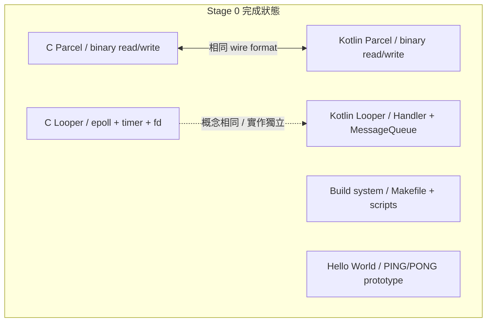


**驗證：**

```bash
make -C build all # 零 error
./out/bin/test_looper # C looper works
java -jar out/jar/test_looper.jar # Kotlin looper works
./out/bin/test_parcel_write && java -jar out/jar/test_parcel_read.jar # interop works
```

通過後就可以進 Stage 1。

---

## Stage 1：init 強化

> **目標：** 讓 init 能自動重啟 crash 的 service，並提供 property store（key-value 設定）。

### 為什麼需要這個

目前的 init 很天真——service 死了就死了。真正的 Android init 會：

1. **自動重啟** crash 的 service（帶 exponential backoff）
2. 區分 **oneshot**（跑一次就好）和 **persistent**（必須一直活著）
3. 提供 **property system**——system-wide 的 key-value store（類似 registry）

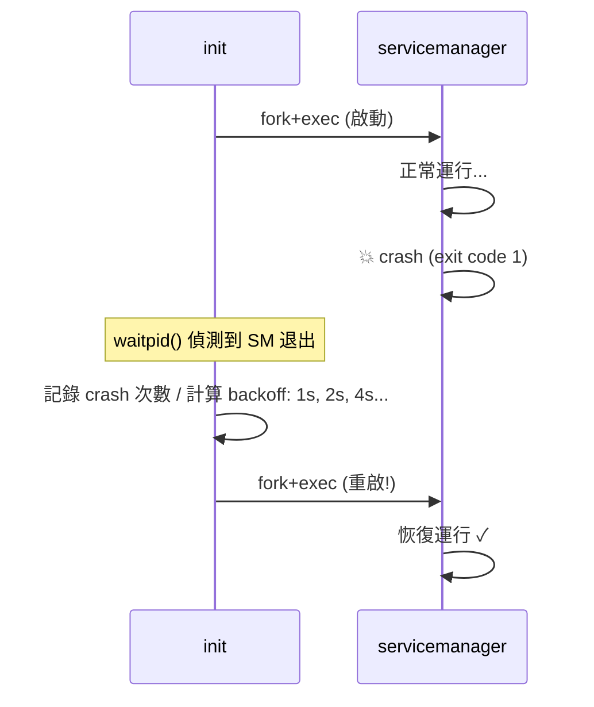


### Step 1A：Crash-Restart

#### 🎯 目標

Service crash 後 init 自動重啟它，帶 exponential backoff（1s → 2s → 4s → 最多 60s）。

#### 📋 動手做

**修改檔案：** `system/core/init/main.c`, `system/core/rootdir/init.rc`

1. 在 `Service` struct 加入：
  `c int restart_count = 0; bool oneshot = false; // true = 不重啟 ime_t last_crash_time = 0;` 
2. `init.rc` 新增語法：
  ``
  ervice servicemanager /path/to/servicemanager
  estart always # crash 後自動重啟（預設）
  ervice hello_app /path/to/HelloApp.jar
  estart oneshot # 跑完就算了
  ``
3. 在 `waitpid()` loop 裡：
  Service 退出時，檢查是 oneshot 還是 persistent
   Persistent service crash → 算 backoff delay → `sleep(delay)` → 重新 `fork+exec`
   如果 4 分鐘內 crash 超過 5 次，印 warning 但繼續重啟
4. 寫一個故意 crash 的測試 service `tests/crashy_service.c`：
  啟動後 2 秒 exit(1)
   用它測試 init 的 restart 邏輯

#### ✅ 驗證

```bash
# 編譯後，修改 init.rc 加入 crashy_service
./scripts/start.sh
# 預期：
# [init] Starting crashy_service (PID 1234)...
# [crashy] Started! Will crash in 2s...
# [init] crashy_service exited with code 1
# [init] Restarting crashy_service in 1s (attempt 1)...
# [init] Starting crashy_service (PID 1235)...
# [crashy] Started! Will crash in 2s...
# [init] crashy_service exited with code 1
# [init] Restarting crashy_service in 2s (attempt 2)...
# ...backoff 持續增加...
```

#### 🆚 真正 AOSP 對照

**去讀真正 AOSP 的 source：**

```
system/core/init/service.cpp → Service::Reap(), Restart()
system/core/init/service.h → Service class, restart_period_, crash_count_
system/core/init/README.md → restart 行為文件
```

真正 AOSP 的 restart 邏輯在 `Service::Reap()` 裡——
service 死了之後，根據 `SVC_ONESHOT` flag 和 `restart_period_` 決定要不要重啟。

我們的實作簡化了：沒有 service class 分組、沒有 `critical` flag（crash 太多次就 reboot）。
但 crash-restart + backoff 的核心概念相同。

#### 📚 學習材料

- **AOSP `init/README.md`** — [在線閱讀](https://cs.android.com/android/platform/superproject/+/main:system/core/init/README.md) — service restart 行為
- **Exponential backoff** — 搜尋 "exponential backoff algorithm"，理解為什麼 1s→2s→4s 而不是固定間隔
- `**man waitpid(2)`** — 理解 `WIFEXITED`, `WIFSIGNALED`, `WEXITSTATUS` 宏

---

### Step 1B：Property Store

#### 🎯 目標

實作 system-wide key-value store，其他 process 可以 get/set properties。

Android 的 property system 用於：

- `ro.build.version` — build 版本（唯讀）
- `sys.boot_completed` — 開機完成 flag
- `persist.sys.language` — 使用者語言設定

#### 📋 動手做

**新增檔案：** `system/core/init/property_store.h` + `.c`
**修改檔案：** `system/core/init/main.c`

1. 在 init 裡新增一個 `PropertyStore` struct：
  `struct prop_entry` 固定大小陣列存 properties
   支援 `ro.` prefix 的 property 只能設一次（read-only after first set）
2. 開一個 Unix socket `/tmp/mini-aosp/property.sock`，接受指令：
  `ETPROP <key>\n → <value>\n 或 NOT_FOUND\n ETPROP <key> <value>\n → OK\n 或 READ_ONLY\n ISTPROP\n → key1=value1\nkey2=value2\n...\n`
3. init 啟動時設定初始 properties：
  `o.build.version = "mini-aosp-0.1" o.build.type = "eng" ys.boot_completed = "0" ← 所有 service 啟動完畢後改成 "1"`
4. 寫一個 CLI 工具 `tools/getprop.sh` / `tools/setprop.sh`：
  `bash  用 socat 或 nc 連到 property socket cho "GETPROP ro.build.version" | socat - UNIX-CONNECT:/tmp/mini-aosp/property.sock` 

#### ✅ 驗證

```bash
./scripts/start.sh &
# 等 init 跑起來後：
echo "GETPROP ro.build.version" | socat - UNIX-CONNECT:/tmp/mini-aosp/property.sock
# → mini-aosp-0.1

echo "SETPROP my.custom.key hello" | socat - UNIX-CONNECT:/tmp/mini-aosp/property.sock
# → OK

echo "SETPROP ro.build.version hacked" | socat - UNIX-CONNECT:/tmp/mini-aosp/property.sock
# → READ_ONLY

echo "LISTPROP" | socat - UNIX-CONNECT:/tmp/mini-aosp/property.sock
# → ro.build.version=mini-aosp-0.1
# ro.build.type=eng
# sys.boot_completed=1
# my.custom.key=hello
```

#### 🆚 真正 AOSP 對照


|            | 真正 AOSP                                       | mini-AOSP                    |
| ---------- | --------------------------------------------- | ---------------------------- |
| **儲存**     | 共享記憶體（`/dev/__properties__`），mmap 到每個 process | Unix socket request/response |
| **讀取**     | 直接讀 mmap，零 syscall，O(1)                       | Socket round-trip            |
| **寫入**     | 只有 init 能寫（透過 `property_service` socket）      | 任何人都能寫（Stage 3 加權限）          |
| `**ro.*`** | 唯讀 property，boot 後不可改                         | 同                            |


**去讀真正 AOSP 的 source：**

```
system/core/init/property_service.cpp → handle_property_set_fd(), PropertySet()
system/core/init/property_service.h → PropertyInit()
bionic/libc/bionic/system_property_api.cpp → __system_property_get()
```

真正 AOSP 用 shared memory 是為了讀取性能（每個 app 每幀都可能讀 property），
我們用 socket 因為簡單，而且 Stage 0 的流量很小。

#### 📚 學習材料

- **Android Property System** — 搜尋 "Android system properties internals"
- **Shared memory vs socket IPC** — 理解為什麼真正 AOSP 用 mmap
- `**man unix(7)`** — Unix domain socket 完整手冊

---

### Stage 1 完成條件

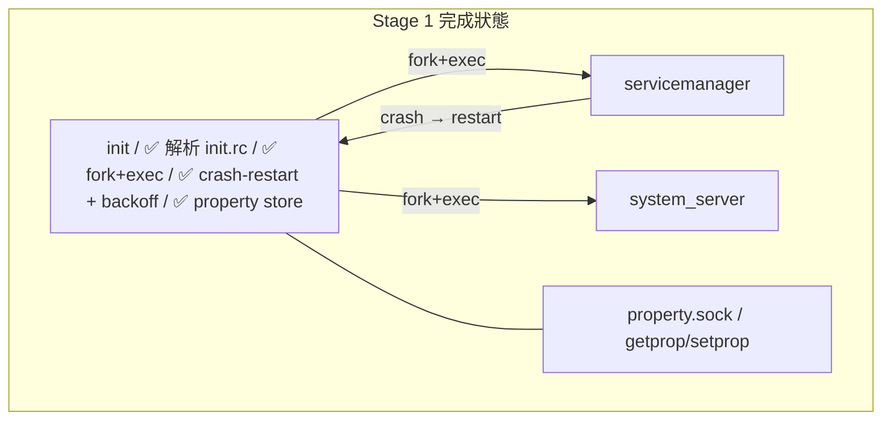


**驗證：**

```bash
# 1. Crash-restart 測試
# 手動 kill servicemanager，觀察 init 自動重啟它
kill $(cat /tmp/mini-aosp/servicemanager.pid)
# → init 偵測到 crash，1 秒後重啟

# 2. Property 測試
echo "GETPROP sys.boot_completed" | socat - UNIX-CONNECT:/tmp/mini-aosp/property.sock
# → 1
```

通過後就可以進 Stage 2。

---

## Stage 2：Binder IPC

> **目標：** 建造 Android 的 IPC 骨幹——讓 Process A 能呼叫 Process B 裡的方法，
> 就像呼叫本地函數一樣。加上 death notification（對方 crash 時收到通知）。
>
> 這是整個 Phase 1 最重要、最大的 Stage。所有後續的 service 互動都建在它上面。

### 為什麼 Binder 這麼重要

Android 裡幾乎所有跨 process 的互動都走 Binder：

- App 呼叫 `startActivity()` → 透過 Binder 呼叫 AMS
- App 讀 GPS 位置 → 透過 Binder 呼叫 LocationManager
- 甚至顯示一個 View → 透過 Binder 跟 SurfaceFlinger 溝通

**一個典型的 Android 手機上，每秒有數千次 Binder transaction。**

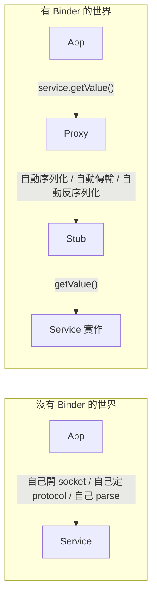


Binder 把「跨 process 呼叫」變成「看起來像本地呼叫」——
這叫 **location transparency**（位置透明）。

### 整體架構

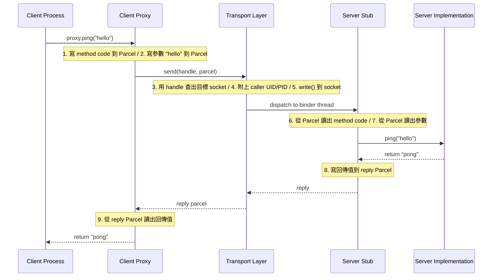


我們把這拆成 4 個 Step：

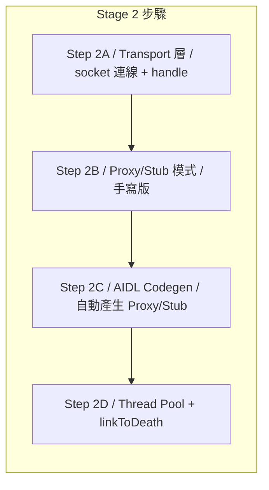


---

### Step 2A：Binder Transport 層

#### 🎯 目標

建造 Binder 的底層：client 和 server 之間的 socket 連線、handle-based addressing、caller identity。

**Handle 是什麼？**
在真正 Binder 裡，每個 service 有一個 integer handle（類似 file descriptor）。
Client 不需要知道 service 的 socket 路徑——它只需要 handle。
servicemanager 永遠是 handle 0。

```
Handle 0 → servicemanager
Handle 1 → ActivityManagerService
Handle 2 → PackageManagerService
...
```

#### 📋 動手做

**新增/修改檔案：**

- `frameworks/native/libs/binder/Binder.h` + `.c` — 大幅升級
- `frameworks/native/libs/binder/IPCThreadState.h` + `.c` — transport 層核心
- `frameworks/base/core/kotlin/os/Binder.kt` — Kotlin 側

1. **定義 Transaction 結構**（在 Parcel 上層）：
  ``
  ransaction wire format:
  ──────────┬──────────┬──────────┬──────────┬───────────────┐
   handle │ code │ flags │ data_len │ data (Parcel) │
   int32 │ int32 │ int32 │ int32 │ N bytes │
  ──────────┴──────────┴──────────┴──────────┴───────────────┘
  eply wire format:
  ──────────┬──────────┬───────────────┐
   status │ data_len │ data (Parcel) │
   int32 │ int32 │ N bytes │
  ──────────┴──────────┴───────────────┘
  ``
   `handle` — 目標 service 的 ID
   `code` — 方法編號（1=ping, 2=getValue, ...）
   `flags` — 0=同步（等回覆）, 1=oneway（fire-and-forget）
2. **C `IPCThreadState`** struct — 每個 thread 一個：
  `transact(handle, code, data, reply, flags)` — 送 transaction，等 reply
   內部：連到 servicemanager 用 handle 查出目標 socket path → connect → write transaction → read reply
   用 `SO_PEERCRED`（Linux）讀取 caller 的 UID/PID
3. **Kotlin `Binder`** class：
  `transact(code, data, reply, flags)` — 被 Proxy 呼叫
   `onTransact(code, data, reply, flags)` — 被 Stub 覆寫
4. 寫一個手動測試——兩個 process：
  Server：開 socket，等 transaction，回 reply
   Client：連 socket，送 transaction，讀 reply

#### ✅ 驗證

```bash
make -C build test_binder_transport

# Terminal 1: 啟動 server
./out/bin/test_binder_server
# [server] Listening on /tmp/mini-aosp/test_service.sock

# Terminal 2: 跑 client
./out/bin/test_binder_client
# [client] Sending transaction: code=1, data="hello"
# [server] Received: code=1, data="hello", caller_uid=1000, caller_pid=12345
# [client] Reply: status=0, data="world"
# [test] ✓ Binder transport works
```

#### 🔍 做完後讀這段

**Handle-based addressing 的好處**

為什麼不直接用 socket path，要多一層 handle？

1. **間接層（indirection）** — 如果 service restart 換了 socket path，handle 不變，
  lient 不需要更新
2. **權限控制** — servicemanager 可以拒絕給某些 client handle
  「你沒有權限存取 LocationManager」）
3. **Reference counting** — 知道有幾個 client 持有某個 service 的 handle，
  人用了就可以回收

**SO_PEERCRED 是什麼？**

Linux 的 Unix domain socket 有一個特殊能力：
`getsockopt(fd, SOL_SOCKET, SO_PEERCRED, &cred, &len)`
可以取得連線對方的 UID 和 PID——**而且是 kernel 保證的，不能偽造。**

這是 Android 安全模型的基石。當 App 呼叫 `startActivity()` 時，
AMS 能從 Binder 拿到 caller 的 UID，查出是哪個 app，
再根據它的 permission 決定要不要放行。

> ⚠️ **macOS 注意：** macOS 有 `LOCAL_PEERCRED` 但 API 不同。
> 如果在 macOS 開發，可以先略過 UID/PID，部署到 Linux 再加。

#### 🆚 真正 AOSP 對照


|               | 真正 AOSP                                            | mini-AOSP                           |
| ------------- | -------------------------------------------------- | ----------------------------------- |
| **Transport** | `/dev/binder` kernel driver，`ioctl()`              | Unix domain socket，`read()/write()` |
| **Handle**    | Kernel 維護的 handle table（per-process）               | 自己在 user space 維護的 map              |
| **Identity**  | Kernel stamp UID/PID 到每個 transaction               | `SO_PEERCRED`                       |
| **Copy 次數**   | 1 次（mmap，zero-copy reply）                          | 2 次（user→kernel→user）               |
| **檔案**        | `frameworks/native/libs/binder/IPCThreadState.cpp` | 同路徑                                 |


**去讀真正 AOSP 的 source：**

```
frameworks/native/libs/binder/IPCThreadState.cpp → transact(), writeTransactionData(), waitForResponse()
frameworks/native/libs/binder/Binder.cpp → BBinder::transact(), BpBinder::transact()
drivers/android/binder.c (kernel) → binder_ioctl(), binder_thread_write()
```

重點看 `IPCThreadState::transact()` — 它寫 transaction data 到 `mOut` buffer，
然後 `talkWithDriver()` 用 `ioctl(BINDER_WRITE_READ)` 跟 kernel 互動。
我們用 socket `write()` + `read()` 取代 `ioctl()`，但流程結構相同。

#### 📚 學習材料

- **"Android Binder IPC Mechanism" 論文** — 搜尋這個標題，有幾篇很好的深度解析
- **AOSP Binder overview** — [source.android.com/docs/core/architecture/hidl/binder-ipc](https://source.android.com/docs/core/architecture/hidl/binder-ipc)
- `**man getsockopt(2)`** — `SO_PEERCRED` 的文件
- **"Binder for dummies"** — 搜尋 "android binder for dummies"，有不少 blog 用圖解解釋

---

### Step 2B：Proxy/Stub 模式（手寫版）

#### 🎯 目標

用 Proxy/Stub pattern 包裝 Step 2A 的 raw transport，讓跨 process 呼叫看起來像本地呼叫。

**先手寫一對 Proxy/Stub**，理解 pattern 後再寫 codegen。

> **命名慣例（follow AOSP）：**
>
> - `I`* = interface（如 `ICalculator`）
> - `Bp*` = **B**inder **P**roxy — client 側，負責序列化參數 + 送 transaction
> - `Bn`* = **B**inder **N**ative — server 側（Stub），負責反序列化 + 呼叫實作
>
> 我們使用跟 AOSP 相同的命名，這樣讀真正 AOSP source 時能直接對應。

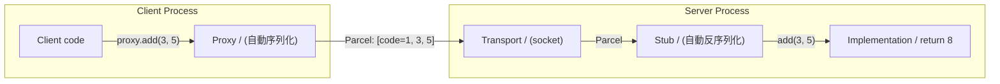


#### 📋 動手做

我們以一個 `ICalculator` interface 為例：

1. **定義 interface**（先用 Kotlin，還不是 AIDL）：
  ``kotlin
  nterface ICalculator {
  un add(a: Int, b: Int): Int // code = 1
  un multiply(a: Int, b: Int): Int // code = 2
  ``
2. **手寫 BpCalculator（Binder Proxy）**（client 側）：
  ``kotlin
  lass BpCalculator(private val handle: Int) : ICalculator {
  verride fun add(a: Int, b: Int): Int {
  al data = Parcel()
  ata.writeInt32(a)
  ata.writeInt32(b)
  al reply = Parcel()
  / 送到 handle，method code=1
  ransact(handle, 1, data, reply)
  eturn reply.readInt32()
  / multiply 同理，code=2
  ``
3. **手寫 BnCalculator（Binder Native / Stub）**（server 側）：
  ``kotlin
  bstract class BnCalculator : ICalculator {
  un onTransact(code: Int, data: Parcel, reply: Parcel) {
  hen (code) {
   -> {
  al a = data.readInt32()
  al b = data.readInt32()
  al result = add(a, b)
  eply.writeInt32(result)
   -> { /* multiply */ }
  ``
4. **寫 Implementation**：
  ``kotlin
  lass CalculatorImpl : BnCalculator() {
  verride fun add(a: Int, b: Int) = a + b
  verride fun multiply(a: Int, b: Int) = a * b
  ``
5. **兩個 process 測試**：
  Server process 建立 CalculatorImpl，監聯 socket
   Client process 建立 BpCalculator，呼叫 `add(3, 5)` → 得到 8

#### ✅ 驗證

```bash
# Terminal 1
java -jar out/jar/test_binder_server.jar
# [server] CalculatorService listening...

# Terminal 2
java -jar out/jar/test_binder_client.jar
# [client] proxy.add(3, 5) = 8
# [client] proxy.multiply(4, 7) = 28
# [test] ✓ Proxy/Stub pattern works across processes
```

#### 🔍 做完後讀這段

**Proxy/Stub 模式的核心洞察**

寫完你會發現 Proxy 和 Stub 的程式碼非常機械化——
它們就是在做「把參數寫進 Parcel」和「從 Parcel 讀出參數」的重複工作。

```
Interface: fun add(a: Int, b: Int): Int

Proxy: data.writeInt32(a) ← 寫參數
 data.writeInt32(b)
 transact(1, data, reply)
 return reply.readInt32() ← 讀回傳值

Stub: val a = data.readInt32() ← 讀參數
 val b = data.readInt32()
 val result = add(a, b) ← 呼叫實作
 reply.writeInt32(result) ← 寫回傳值
```

**每一對 Proxy/Stub 的結構都一樣**——只有參數類型和數量不同。
這就是為什麼 Android 用 AIDL codegen 自動產生它們（下一個 Step）。

#### 🆚 真正 AOSP 對照

**去讀真正 AOSP 的 source（手寫的 Proxy/Stub 範例）：**

```
frameworks/native/libs/binder/IServiceManager.cpp
 → BpServiceManager::addService() ← 這就是 Proxy（Bp = Binder Proxy）
 → BnServiceManager::onTransact() ← 這就是 Stub（Bn = Binder Native）
```

注意 AOSP 的命名慣例：

- `I*` = interface（如 `IServiceManager`）
- `Bp*` = Binder Proxy（client 側）
- `Bn*` = Binder Native / Stub（server 側）

我們的命名更直白（`*Proxy` / `*Stub`），但結構一致。

#### 📚 學習材料

- **Design Patterns: Proxy Pattern** — 搜尋 "proxy pattern explained"
- **RPC (Remote Procedure Call)** — Binder 本質上就是 RPC，搜尋 "what is RPC"
- **AOSP `IServiceManager.cpp`** — [在線閱讀](https://cs.android.com/android/platform/superproject/+/main:frameworks/native/libs/binder/IServiceManager.cpp) — 最好的手寫 Proxy/Stub 範例

---

### Step 2C：AIDL Codegen

#### 🎯 目標

寫一個 code generator：讀 `.aidl` 檔案，自動產生 Proxy/Stub Kotlin 程式碼。

這樣之後每增加一個 service interface，只需要寫 `.aidl`，
不需要手寫重複的 Parcel read/write code。

#### 📋 動手做

**修改檔案：** `tools/aidl/codegen.py`
**新增範例：** `frameworks/aidl/ICalculator.aidl`

1. **定義簡化的 AIDL 語法**：
  ``
  / ICalculator.aidl
  nterface ICalculator {
  nt add(int a, int b);
  nt multiply(int a, int b);
  tring echo(String msg);
  ``
  援的類型（Phase 1）：`int`, `long`, `boolean`, `String`, `byte[]`
2. **codegen.py 輸入/輸出**：
  `bash ython3 tools/aidl/codegen.py frameworks/aidl/ICalculator.aidl \ -lang kotlin \ -out frameworks/base/core/kotlin/generated/` 
  生三個檔案：
   `ICalculator.kt` — interface 定義
   `BpCalculator.kt` — client 側 Proxy
   `BnCalculator.kt` — server 側 Stub
3. **Codegen 邏輯**：
  Parse `.aidl` 檔案（簡單的 line-by-line，不需要完整 parser）
   每個 method：
   分配 method code（1, 2, 3...）
   Proxy：為每個參數生成 `parcel.writeXxx()`，最後 `transact()`
   Stub：為每個參數生成 `parcel.readXxx()`，呼叫 interface 方法
4. **驗證 codegen 輸出**：
  codegen 產生的 Proxy/Stub 取代 Step 2B 手寫的版本，
  認測試結果不變。

#### ✅ 驗證

```bash
# 1. 產生 code
python3 tools/aidl/codegen.py frameworks/aidl/ICalculator.aidl \
 --lang kotlin --out frameworks/base/core/kotlin/generated/

# 2. 檢查產生的檔案
cat frameworks/base/core/kotlin/generated/BpCalculator.kt
# 應該看到自動產生的 add(), multiply(), echo() proxy code

# 3. 用 codegen 的 Proxy/Stub rebuild + 跑測試
make -C build test_binder_codegen
java -jar out/jar/test_binder_codegen.jar
# [test] proxy.add(3, 5) = 8 (via generated proxy/stub)
# [test] proxy.echo("hi") = "hi" (via generated proxy/stub)
# [test] ✓ AIDL codegen works
```

#### 🔍 做完後讀這段

**為什麼要 codegen 而不是 reflection？**

Java/Kotlin 有 reflection，理論上可以在 runtime 自動序列化。
Android 選擇 compile-time codegen 是因為：

1. **速度** — codegen 的 code 是直接的 `writeInt(a)` 呼叫，沒有 reflection overhead
2. **類型安全** — compile-time 就能抓到 type mismatch
3. **跨語言** — AIDL 可以同時產生 Java、C++、Rust code，靠 reflection 做不到

**AIDL 的演化**


| 時期          | AIDL 狀態                 |
| ----------- | ----------------------- |
| Android 1.0 | 只支援 Java                |
| Android 10  | 加入 stable AIDL（版本管理）    |
| Android 11+ | 加入 C++/NDK/Rust backend |
| Android 13+ | 取代 HIDL（HAL 的 IDL）      |


我們只做 Kotlin backend，但概念跟 multi-backend codegen 完全相同。

#### 🆚 真正 AOSP 對照


|        | 真正 AOSP                                     | mini-AOSP                          |
| ------ | ------------------------------------------- | ---------------------------------- |
| **工具** | `aidl` compiler（C++，非常複雜）                   | Python script（~200 行）              |
| **輸入** | `.aidl` file                                | 同（語法簡化）                            |
| **輸出** | Java + C++ + Rust proxy/stub                | Kotlin proxy/stub only             |
| **型別** | 所有 Java types + Parcelable + FileDescriptor | int, long, boolean, String, byte[] |


**去讀真正 AOSP 的 source：**

```
system/tools/aidl/ → AIDL compiler source code
system/tools/aidl/generate_java.cpp → Java codegen 邏輯
system/tools/aidl/aidl_language_y.yy → AIDL 語法定義（yacc grammar）
out/soong/.intermediates/.../IServiceManager.java → 範例 codegen 輸出
```

真正的 AIDL compiler 用 yacc parser，非常複雜。
我們的 Python script 用 regex line-by-line parsing，足夠教學用。

#### 📚 學習材料

- **AIDL 官方文件** — [developer.android.com/guide/components/aidl](https://developer.android.com/guide/components/aidl)
- **Code generation pattern** — 搜尋 "code generation vs reflection"
- **Protocol Buffers** — 作為對照，看 protobuf 的 codegen 怎麼做（`protoc` compiler）

---

### Step 2D：Thread Pool + linkToDeath

#### 🎯 目標

1. **Thread pool** — server 端用多個 thread 處理同時進來的 Binder 請求
2. **linkToDeath** — 當持有 handle 的 service process crash 時，通知所有 client

#### 📋 動手做

**Part 1: Thread Pool**

目前 server 是單 thread 依序處理請求——如果一個請求很慢，後面的全部卡住。

1. Server 啟動時建立 N 個 binder thread（Android 預設 15，我們用 4）
2. 每個 thread 都在 `accept()` → `handle_client()` 的 loop
3. 或者用一個 accept thread + worker thread pool（producer-consumer）

**修改：** `frameworks/native/libs/binder/IPCThreadState.c`（C 側）
和 `frameworks/base/core/kotlin/os/Binder.kt`（Kotlin 側）

**Part 2: linkToDeath**

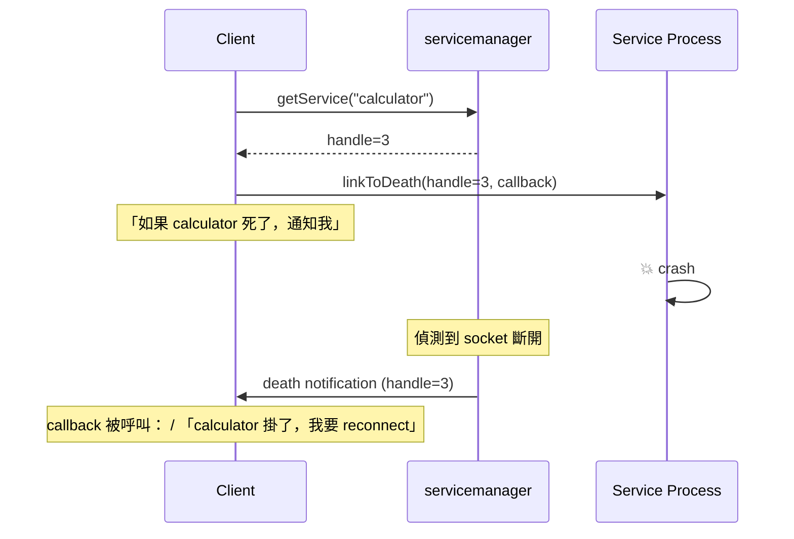


1. Client 呼叫 `linkToDeath(handle, deathRecipient)` 註冊一個 callback
2. Transport 層監聽 socket 連線——如果對方斷開，觸發所有註冊的 deathRecipient
3. `DeathRecipient` interface：`fun binderDied(handle: Int)`

**Kotlin 側：**

```kotlin
interface DeathRecipient {
 fun binderDied()
}

class BinderProxy(val handle: Int) {
 fun linkToDeath(recipient: DeathRecipient, flags: Int)
 fun unlinkToDeath(recipient: DeathRecipient)
}
```

**偵測方式：** 對 socket 做 `read()`，如果回傳 0（EOF）或 error，表示對方掛了。
可以用 Looper 的 `addFd()` 監聽。

#### ✅ 驗證

**Thread Pool 測試：**

```bash
# Server 啟動 4 個 binder thread
# Client 同時發 10 個請求（每個 sleep 100ms 模擬慢操作）
# 驗證 4 個請求並行，10 個在 ~300ms 內完成（不是 1000ms）
java -jar out/jar/test_thread_pool.jar
# [server] Binder thread pool: 4 threads
# [client] 10 concurrent requests completed in ~300ms
# [test] ✓ Thread pool works
```

**linkToDeath 測試：**

```bash
# 啟動 server，client linkToDeath
# kill server process
# 驗證 client 收到 death notification
java -jar out/jar/test_link_to_death.jar
# [client] Linked to service (handle=1)
# [server] Running... will crash in 2s
# [server] 💥 exit
# [client] binderDied() called! Service is gone.
# [test] ✓ linkToDeath works
```

#### 🔍 做完後讀這段

**為什麼 linkToDeath 很重要？**

想像 App A bind 到 MusicService（在 App B 的 process 裡）。
如果 App B crash 了，App A 手上的 proxy 就變成殭屍——
呼叫任何方法都會 fail。

沒有 linkToDeath 的話，App A 只能在下次呼叫 fail 時才發現。
有了 linkToDeath，App A **立刻收到通知**，可以：

- 清理 UI（「音樂播放已停止」）
- 嘗試重新 bind
- 或者自己也 graceful shutdown

這就是 Android 裡 **robust service interaction** 的基礎。

**Thread pool 在真正 Android 裡**

system_server 啟動 31 個 binder thread。
每個 thread 等在 `ioctl(BINDER_WRITE_READ)` 上。
Kernel 會把 incoming transaction 分配給空閒的 thread。

如果所有 31 個 thread 都忙，新的請求就 block——
這就是 "binder thread exhaustion"，一種常見的 Android performance 問題。

#### 🆚 真正 AOSP 對照


|                 | 真正 AOSP                                       | mini-AOSP          |
| --------------- | --------------------------------------------- | ------------------ |
| **Thread pool** | `ProcessState::startThreadPool()` + kernel 分配 | 自己管理的 thread pool  |
| **預設 thread 數** | 15 (app) / 31 (system_server)                 | 4                  |
| **linkToDeath** | Kernel 維護 death notification list             | Socket EOF 偵測      |
| **通知方式**        | Kernel 寫 `BR_DEAD_BINDER` 到 thread            | Looper fd callback |


**去讀真正 AOSP 的 source：**

```
frameworks/native/libs/binder/ProcessState.cpp → startThreadPool(), spawnPooledThread()
frameworks/native/libs/binder/BpBinder.cpp → linkToDeath(), sendObituary()
frameworks/native/libs/binder/IPCThreadState.cpp → joinThreadPool() — 每個 binder thread 的主迴圈
```

重點看 `BpBinder::sendObituary()` — 當 kernel 通知 binder 對方死了，
它遍歷所有 registered `DeathRecipient` 並呼叫 `binderDied()`。

#### 📚 學習材料

- **Thread pool pattern** — 搜尋 "thread pool pattern explained"
- **Observer pattern** — linkToDeath 本質上是 observer pattern，搜尋 "observer pattern"
- **AOSP `BpBinder.cpp`** — [在線閱讀](https://cs.android.com/android/platform/superproject/+/main:frameworks/native/libs/binder/BpBinder.cpp) — `linkToDeath` 的實作

---

### Stage 2 完成條件

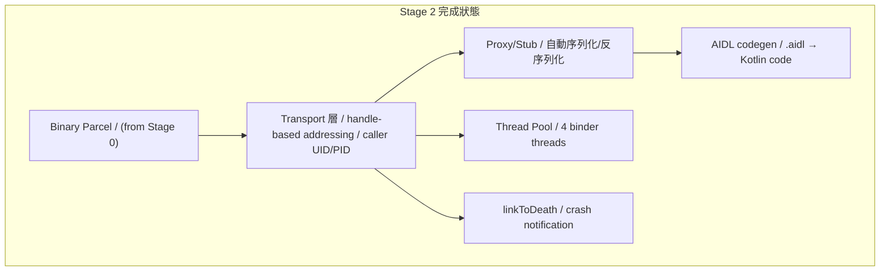


**完整驗證——10k transaction 壓力測試：**

```bash
java -jar out/jar/test_binder_stress.jar
# [test] Sending 10,000 transactions...
# [test] All 10,000 completed, 0 errors
# [test] Avg latency: 0.2ms, p99: 1.1ms
# [test] No leaked sockets or threads
# [test] ✓ Binder IPC is production-ready for Phase 1
```

通過後就可以進 Stage 3（用 Binder 重寫 servicemanager）。

---

## Stage 3：servicemanager 改用 Binder

> **目標：** 把 Stage 0 的 text-based servicemanager 改成 Binder-based。
> 它是 handle 0——所有 process 啟動後第一個連的對象。

### 為什麼要重寫

目前 servicemanager 用 `ADD_SERVICE ping /tmp/mini-aosp/ping.sock\n` 的 text protocol。
這在 Stage 0 夠用，但有幾個問題：

1. **沒有型別安全** — 傳的全是 string，打錯字只能 runtime 才發現
2. **沒有 caller identity** — 不知道是誰在註冊/查詢
3. **跟 Binder 不統一** — 別的 service 走 Binder，servicemanager 走自己的 protocol

真正 Android 裡 servicemanager 就是一個 Binder service，用 `IServiceManager.aidl` 定義 interface。
所有 process 都用同一套 Binder 機制跟它溝通。

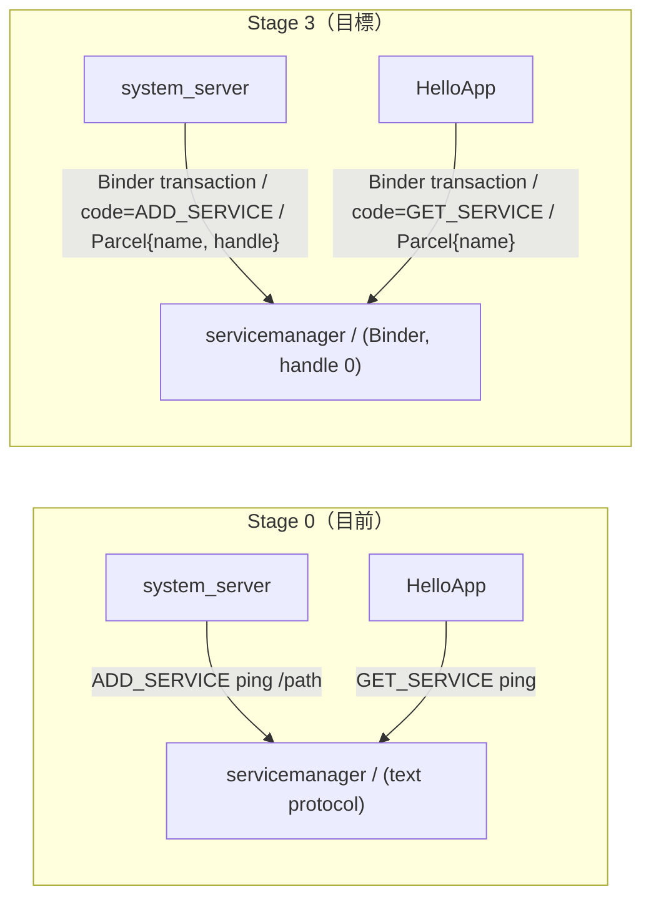


### Step 3A：IServiceManager AIDL + Binder 重寫

#### 🎯 目標

用 AIDL 定義 `IServiceManager` interface，用 Step 2C 的 codegen 產生 Proxy/Stub，
重寫 servicemanager 使用 Binder transport。

#### 📋 動手做

**修改檔案：**

- `frameworks/aidl/IServiceManager.aidl` — 從 placeholder 升級成真正的定義
- `frameworks/native/cmds/servicemanager/main.c` — 改用 Binder
- `frameworks/base/core/kotlin/os/ServiceManager.kt` — Kotlin client helper

1. **升級 AIDL 定義：**
  ``
  / IServiceManager.aidl
  nterface IServiceManager {
  / 註冊 service：name → binder handle
  oid addService(String name, int handle);
  / 查詢 service：name → binder handle，找不到回 -1
  nt getService(String name);
  / 列出所有已註冊的 service names
  tring[] listServices();
  ``
2. **跑 codegen** 產生 `BpServiceManager.kt` + `BnServiceManager.kt`
3. **重寫 servicemanager（C）：**
  仍然是第一個啟動的 service
   監聽固定的 well-known socket：`/tmp/mini-aosp/binder`
   自己是 handle 0
   內部維護 `map<string, int>` — service name → handle
   處理 Binder transaction（用 Stage 2A 的 wire format）
4. **Kotlin client helper `ServiceManager.kt`：**
  ``kotlin
  bject ServiceManager {
  un addService(name: String, binder: IBinder) { ... }
  un getService(name: String): IBinder? { ... }
  ``
  部用 `BpServiceManager(handle=0)` 跟 servicemanager 通訊。
5. **修改 system_server 和 HelloApp** — 改用新的 `ServiceManager.addService()` / `getService()`

#### ✅ 驗證

```bash
make -C build all
./scripts/start.sh
# 預期輸出跟 Stage 0 的 PING/PONG 相同，但底層走 Binder：
# [servicemanager] Listening on /tmp/mini-aosp/binder (handle 0)
# [system_server] addService("ping", handle=1) via Binder
# [HelloApp] getService("ping") → handle=1 via Binder
# [HelloApp] PING → PONG — round-trip Xms
# [HelloApp] ✓ Full stack verified (now via Binder IPC)
```

#### 🔍 做完後讀這段

**Handle 0 的特殊地位**

在真正 Android 裡，每個 process 天生就知道 handle 0 = servicemanager。
這是 **hardcoded** 的——不需要查詢，不需要 discover。

這解決了 bootstrap 問題：

> 「我要透過 servicemanager 查詢其他 service，但我怎麼找到 servicemanager 本身？」

答案：handle 0，永遠在那裡。就像 DNS 裡的 root name server。

**servicemanager 的 bootstrap 順序：**

```
1. init 啟動 servicemanager（第一個 service）
2. servicemanager 綁定到 well-known socket，宣告自己是 handle 0
3. init 啟動其他 service（system_server, zygote...）
4. 其他 service 連到 handle 0（servicemanager），註冊自己
5. App 連到 handle 0，查詢想要的 service
```

#### 🆚 真正 AOSP 對照


|                        | 真正 AOSP                                                    | mini-AOSP                 |
| ---------------------- | ---------------------------------------------------------- | ------------------------- |
| **handle 0**           | Kernel Binder driver 的 context manager                     | 自己的 handle map 裡 handle 0 |
| **AIDL**               | `IServiceManager.aidl` → Java + C++                        | 同 → Kotlin                |
| **成為 context manager** | `ioctl(BINDER_SET_CONTEXT_MGR)`                            | 綁定 well-known socket path |
| **檔案**                 | `frameworks/native/cmds/servicemanager/ServiceManager.cpp` | 同路徑 `main.c`            |


**去讀真正 AOSP 的 source：**

```
frameworks/native/cmds/servicemanager/ServiceManager.cpp → addService(), getService()
frameworks/native/cmds/servicemanager/main.cpp → main()，成為 context manager
frameworks/native/libs/binder/IServiceManager.cpp → defaultServiceManager()
```

重點看 `ServiceManager::addService()` — 它檢查 caller 的 UID
（只有 `AID_SYSTEM` 等特權 UID 能註冊 service）。
我們 Stage 3 先不做權限檢查，Stage 8 再加。

#### 📚 學習材料

- **Service discovery pattern** — 搜尋 "service discovery pattern microservices"，概念相同
- **Bootstrap problem** — 搜尋 "bootstrapping problem in distributed systems"
- **AOSP ServiceManager source** — [在線閱讀](https://cs.android.com/android/platform/superproject/+/main:frameworks/native/cmds/servicemanager/ServiceManager.cpp)

---

### Step 3B：Crash Recovery — servicemanager restart

#### 🎯 目標

servicemanager crash 後 init 重啟它，所有 service 需要重新註冊。
測試整個系統在 servicemanager crash → restart 後能恢復。

#### 📋 動手做

1. **servicemanager 重啟後的問題：**
  Handle map 清空了（所有 service 的 handle 都丟了）
   已連線的 client socket 全斷
   之前的 linkToDeath 全失效
2. **解法——re-registration 機制：**
  system_server 用 `linkToDeath(handle=0)` 監聽 servicemanager
   servicemanager crash → system_server 收到 `binderDied()`
   system_server 重新連到新的 servicemanager，重新 `addService()` 所有 service
   Client 會收到自己 service 的 `binderDied()`，需要重新 `getService()`
3. **在 init.rc 裡，servicemanager 標記為 `restart always`**（Stage 1A 的功能）
4. **寫測試腳本：**
  啟動系統 → service 全部註冊 → kill servicemanager → 驗證自動恢復

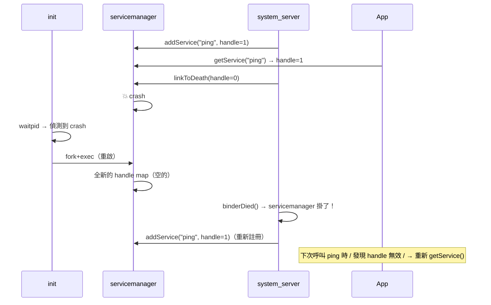


#### ✅ 驗證

```bash
./scripts/start.sh &
sleep 3

# 驗證 service 正常
echo "LIST_SERVICES" | ... # → 有 ping

# 殺掉 servicemanager
kill $(cat /tmp/mini-aosp/servicemanager.pid)

# 等 init 重啟它（1-2 秒）
sleep 3

# 驗證 service 重新註冊
echo "LIST_SERVICES" | ... # → 又有 ping 了

# 跑一次 PING/PONG 驗證完整流程恢復
java -jar out/jar/HelloApp.jar
# → PONG（成功 = 恢復正常）
```

#### 🔍 做完後讀這段

**真正 Android 裡 servicemanager crash 會怎樣？**

幾乎所有 system service 都會收到 death notification 然後重新註冊。
但在 servicemanager 重啟的那幾百毫秒裡，所有 `getService()` 都會 block 或 fail。

這在真正 Android 上其實很少發生——servicemanager 是最穩定的 daemon 之一。
但測試它的 recovery 路徑是驗證系統 robustness 的好方法。

**比較：如果 system_server crash？**

那更嚴重——Android 會 reboot（soft reboot）。
因為 system_server 裡有太多 stateful service（AMS, PMS...），
重建它們的 state 不如直接重啟整個 framework。

我們在 Stage 8 會處理這個。

#### 📚 學習材料

- **Circuit breaker pattern** — 搜尋 "circuit breaker pattern"，類似的 failure recovery 概念
- **Android system crash recovery** — 搜尋 "what happens when android system server crashes"

---

### Stage 3 完成條件

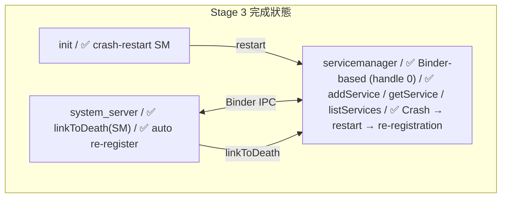


**驗證：**

```bash
# 1. 正常 flow
make -C build && ./scripts/start.sh
# → PING/PONG 成功，走 Binder

# 2. Crash recovery
kill $(cat /tmp/mini-aosp/servicemanager.pid)
sleep 3
java -jar out/jar/HelloApp.jar
# → PONG（servicemanager 已恢復）
```

通過後就可以進 Stage 4。

---

## Stage 4：system_server + Core Managers

> **目標：** 把 system_server 從只有 PingService 的 demo，
> 升級成真正 host 多個 framework service 的容器。

### 這些 Manager 是什麼

在真正 Android 裡，system_server 啟動後會載入 100+ 個 service。
我們只建三個最核心的：


| Manager                          | 對應真正 AOSP                             | 用途                                       |
| -------------------------------- | ------------------------------------- | ---------------------------------------- |
| **ActivityManagerService (AMS)** | `ActivityManagerService.java`         | 管理 app lifecycle、process 優先順序、force-stop |
| **PackageManagerService (PMS)**  | `PackageManagerService.java`          | 掃描 manifest、分配 UID、resolve intent        |
| **PropertyManagerService**       | `SettingsProvider` / property_service | 暴露 property store（Stage 1B）over Binder   |


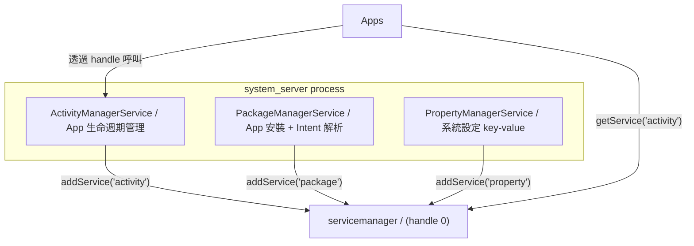


---

### Step 4A：system_server 架構 + AMS Stub

#### 🎯 目標

重構 system_server 成一個 service 容器——按順序初始化 + 註冊多個 manager。
AMS 先是 stub（能被呼叫，但只有基本功能），Stage 6-8 再逐步完善。

#### 📋 動手做

**修改檔案：**

- `frameworks/base/services/core/kotlin/SystemServer.kt` — 重構
- **新增：** `frameworks/base/services/core/kotlin/am/ActivityManagerService.kt`
- **新增：** `frameworks/aidl/IActivityManager.aidl`

1. **重構 SystemServer.kt：**
  ``kotlin
  bject SystemServer {
  un main(args: Array) {
  og.i(TAG, "Starting services...")
  / Phase 1: Boot-critical services
  tartBootstrapServices()
  / Phase 2: Core services
  tartCoreServices()
  / Phase 3: Other services
  tartOtherServices()
  og.i(TAG, "All services started.")
  / Enter looper — 永遠不回傳
  ooper.loop()
  / AMS 必須在 PMS 之前——跟真正 AOSP 一樣
  / PMS 依賴 AMS 來追蹤 app process state
  rivate fun startBootstrapServices() {
  al ams = ActivityManagerService()
  erviceManager.addService("activity", ams)
  og.i(TAG, "Registered: activity (AMS)")
  al pms = PackageManagerService()
  erviceManager.addService("package", pms)
  og.i(TAG, "Registered: package (PMS)")
  rivate fun startCoreServices() {
  / Core services that depend on AMS + PMS being ready
  rivate fun startOtherServices() {
  al prop = PropertyManagerService()
  erviceManager.addService("property", prop)
  og.i(TAG, "Registered: property")
  ``
2. **IActivityManager.aidl（Stage 4 的 stub 版）：**
  ``
  nterface IActivityManager {
  / Stage 6 才實作完整版
  nt getCurrentState(); // 回傳系統狀態
  oid forceStopPackage(String packageName); // 強制停止 app
  tring[] getRunningProcesses(); // 列出執行中的 process
  ``
3. **AMS stub 實作：**
  `getCurrentState()` → 回傳 `BOOT_COMPLETED` 常數
   `forceStopPackage()` → 印 log（Stage 8 才真的 kill）
   `getRunningProcesses()` → 回傳空 array（Stage 6 才追蹤）
4. **codegen 產生 Proxy/Stub**，用它跟 servicemanager 對接

#### ✅ 驗證

```bash
make -C build all
./scripts/start.sh &
sleep 3

# 驗證三個 service 都註冊了
# （用 servicemanager 的 listServices）
java -jar out/jar/test_list_services.jar
# [test] Services registered: activity, package, property
# [test] ✓ All managers registered

# 驗證 AMS 能被呼叫
java -jar out/jar/test_ams_client.jar
# [test] AMS.getCurrentState() = BOOT_COMPLETED
# [test] AMS.getRunningProcesses() = []
# [test] ✓ AMS stub responds via Binder
```

#### 🔍 做完後讀這段

**真正 system_server 的啟動順序**

真正 AOSP 的 `SystemServer.java` 也有三個 phase，而且**順序非常重要**：

```java
// frameworks/base/services/java/com/android/server/SystemServer.java
startBootstrapServices(); // AMS, PMS, PowerManager — 最核心，互相依賴
startCoreServices(); // BatteryService, UsageStatsService
startOtherServices(); // NetworkManager, LocationManager, 100+ services
```

AMS 和 PMS 必須先啟動，因為幾乎所有其他 service 都依賴它們。
例如 NetworkManager 需要 PMS 來檢查 app 的 network permission。

**我們的簡化版也保留了這個三階段結構，** 讓你理解 bootstrap 順序的概念。

#### 🆚 真正 AOSP 對照

**去讀真正 AOSP 的 source：**

```
frameworks/base/services/java/com/android/server/SystemServer.java
 → main(), run(), startBootstrapServices(), startCoreServices()

frameworks/base/services/core/java/com/android/server/am/ActivityManagerService.java
 → 23,000+ 行的巨型 class，先瀏覽目錄和 public 方法

frameworks/base/core/java/android/app/IActivityManager.aidl
 → 真正的 AMS AIDL 定義
```

建議先看 `SystemServer.java` 的 `startBootstrapServices()` — 只看它呼叫了哪些 `new XxxService()`
和 `ServiceManager.addService()`，跳過細節。

#### 📚 學習材料

- **"Android SystemServer boot" blog** — 搜尋這個，有很多 boot flow 圖解
- **Dependency injection / service container pattern** — system_server 本質上是個 service container

---

### Step 4B：PackageManagerService + PropertyManagerService Stubs

#### 🎯 目標

完成剩下兩個 manager 的 stub，讓三個核心 service 都能被外部呼叫。

#### 📋 動手做

**新增檔案：**

- `frameworks/aidl/IPackageManager.aidl`
- `frameworks/aidl/IPropertyManager.aidl`
- `frameworks/base/services/core/kotlin/pm/PackageManagerService.kt`
- `frameworks/base/services/core/kotlin/prop/PropertyManagerService.kt`

1. **IPackageManager.aidl（stub 版）：**
  ``
  nterface IPackageManager {
  tring[] getInstalledPackages();
  nt getUidForPackage(String packageName); // → UID 或 -1
  / Stage 7 再加 resolveIntent()
  ``
2. **PMS stub 實作：**
  啟動時掃描 `packages/apps/*/AndroidManifest.json`
   讀取 package name
   為每個 app 分配 UID（從 10000 開始，跟真 Android 一樣）
   `getInstalledPackages()` → 回傳所有 package name
   `getUidForPackage()` → 從 map 查
3. **IPropertyManager.aidl：**
  ``
  nterface IPropertyManager {
  tring getProperty(String key);
  oid setProperty(String key, String value);
  tring[] listProperties();
  ``
4. **PropertyManagerService 實作：**
  連到 init 的 property socket（Stage 1B）
   把 Binder 呼叫轉換成 property socket 指令
   或者直接自己維護一份 in-memory map

#### ✅ 驗證

```bash
java -jar out/jar/test_pms_client.jar
# [test] PMS.getInstalledPackages() = [com.miniaosp.helloapp]
# [test] PMS.getUidForPackage("com.miniaosp.helloapp") = 10000
# [test] ✓ PMS stub works

java -jar out/jar/test_prop_client.jar
# [test] PropMgr.getProperty("ro.build.version") = "mini-aosp-0.1"
# [test] PropMgr.setProperty("test.key", "test.value") → OK
# [test] PropMgr.getProperty("test.key") = "test.value"
# [test] ✓ PropertyManager works
```

#### 🆚 真正 AOSP 對照


|              | 真正 AOSP                                          | mini-AOSP                                 |
| ------------ | ------------------------------------------------ | ----------------------------------------- |
| **PMS**      | 掃描 `/data/app/*.apk`，解析 binary XML               | 掃描 `packages/apps/*/AndroidManifest.json` |
| **UID 分配**   | `Settings.java` 持久化到 `/data/system/packages.xml` | In-memory map，重啟後重新分配                     |
| **Property** | mmap 共享記憶體 + `property_service`                  | Binder → in-memory map                    |
| **起始 UID**   | 10000（`FIRST_APPLICATION_UID`）                   | 同                                         |


**去讀真正 AOSP 的 source：**

```
frameworks/base/services/core/java/com/android/server/pm/PackageManagerService.java
 → scanDirTracedLI() — 掃描 app 目錄
 → 12,000+ 行，先看 constructor 和 main()

frameworks/base/services/core/java/com/android/server/pm/Settings.java
 → mPackages map — 就是 package name → UID 的 map
```

#### 📚 學習材料

- **Android Package Manager internals** — 搜尋 "android packagemanager internals"
- **UID isolation on Android** — 搜尋 "android app sandbox uid"，理解每個 app 一個 UID 的安全模型

---

### Stage 4 完成條件

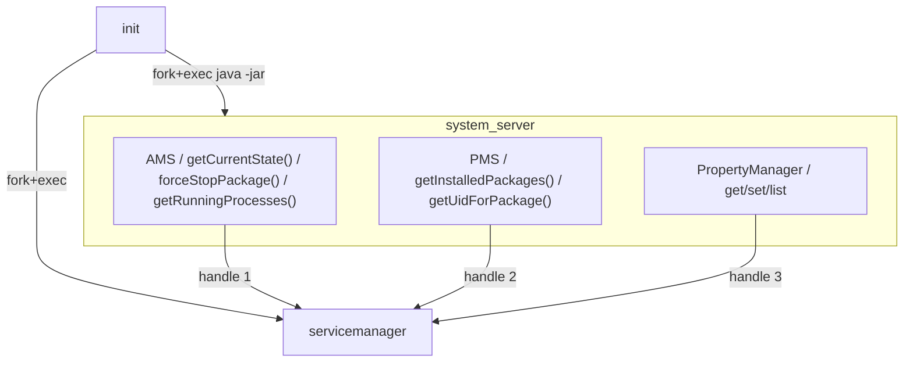


**驗證：**

```bash
./scripts/start.sh &
sleep 3

# 所有 service 都在
java -jar out/jar/test_list_services.jar
# → activity, package, property

# 各 manager 都能被呼叫
java -jar out/jar/test_ams_client.jar # → ✓
java -jar out/jar/test_pms_client.jar # → ✓
java -jar out/jar/test_prop_client.jar # → ✓
```

通過後就可以進 Stage 5。

---

## Stage 5：Zygote

> **目標：** 建造 Android 的 process spawner——
> 所有 app process 都從 Zygote fork 出來，不再由 init 直接啟動。

### 為什麼需要 Zygote

目前每個 Kotlin process 都是 `java -jar xxx.jar` 獨立啟動的。
這有兩個問題：

1. **慢** — 每次啟動都要重新載入 JVM + framework classes（冷啟動 ~2 秒）
2. **浪費記憶體** — 5 個 app = 5 份相同的 framework code 在記憶體裡

Zygote 的解法：**先載入一次共用的 code，然後用 `fork()` 複製出 app process。**

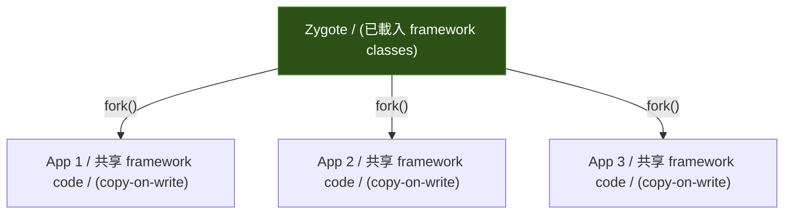


`fork()` 用 **copy-on-write** — child process 跟 parent 共享記憶體頁面，
只有寫入時才複製。所以 5 個 app 的 framework code 實際上只佔一份記憶體。

---

### Step 5A：Zygote — Preload + Fork + Specialize

#### 🎯 目標

寫 Zygote daemon：

1. 啟動時 preload 共用資源
2. 監聽 socket，等待 fork 請求
3. 收到請求後 `fork()` 出 child，設定 UID/env/classpath
4. Child 進入 app 的 `main()`

#### 📋 動手做

**修改檔案：** `frameworks/base/cmds/app_process/main.c`（從 stub 升級）
**新增：** Zygote socket protocol

1. **Zygote 主流程（C）：**
  ``
  ain():
  reload() ← 載入共用資源（Phase 1: 幾乎空的）
  isten on /tmp/mini-aosp/zygote.sock
  oop:
  equest = accept + read ← 等 fork 請求
  id = fork()
  f child:
  pecialize(request) ← 設 UID, env, argv
  xec("java", "-jar", request.jar_path)
  lse:
  eport pid to caller
  ``
2. **Fork 請求格式（text，Stage 2 的 Binder 版可以之後升級）：**
  `ORK <package_name> <jar_path> <uid> <gid>\n  PID <child_pid>\n`
3. **Specialize — child process 個性化：**
  `setuid(uid)` / `setgid(gid)` — 設定 Linux UID（需要 root 或 CAP_SETUID）
   設定環境變數：`PACKAGE_NAME`, `MINI_AOSP_ROOT`
   `exec("java", "-jar", jar_path)` — 啟動 app
4. **修改 init.rc** — 不再直接啟動 system_server 和 app，改由 Zygote fork：
  ``
   init.rc
  ervice servicemanager /path/to/servicemanager
  ervice zygote /path/to/app_process
  estart always
   system_server 和 app 不再列在 init.rc
   改由 system_server 透過 zygote socket 啟動 app
  ``
5. **修改 system_server 啟動方式：**
  Zygote 啟動後，自動 fork 出 system_server（第一個 child）
   system_server 不再由 init 直接啟動

> ⚠️ **setuid 限制：** 在 K8s pod 裡你可能沒有 root，`setuid()` 會失敗。
> 可以先跳過 UID 設定（所有 process 用同一個 UID），在有 root 的環境再開啟。

#### ✅ 驗證

```bash
./scripts/start.sh
# 預期啟動順序改變：
# [init] Starting servicemanager (PID 1001)...
# [init] Starting zygote (PID 1002)...
# [zygote] Preloading shared resources...
# [zygote] Listening on /tmp/mini-aosp/zygote.sock
# [zygote] Forking system_server...
# [zygote] system_server forked (PID 1003)
# [system_server] Started, registering services...
```

**手動 fork 測試：**

```bash
# 用 socat 手動送 fork 請求
echo "FORK com.miniaosp.helloapp /path/to/HelloApp.jar 10000 10000" | \
 socat - UNIX-CONNECT:/tmp/mini-aosp/zygote.sock
# → PID 1234
# → HelloApp 啟動
```

#### 🔍 做完後讀這段

**真正 Android 的 Zygote 做了什麼 preload？**

```java
// frameworks/base/core/java/com/android/internal/os/ZygoteInit.java
static void preload() {
 preloadClasses(); // ~7,000 個 Java class
 preloadResources(); // 系統 theme、drawable
 preloadSharedLibraries(); // libandroid_runtime.so, libsqlite.so...
 preloadTextResources(); // 國際化字串
}
```

Preload 大約佔 Zygote 啟動的 5-8 秒。
但之後每次 fork 都是瞬間的（~10ms），因為 preloaded 的東西全部被 copy-on-write 共享。

**Phase 1 我們的 preload 幾乎是空的**（不跑 ART，沒有那麼多 class 要載入）。
但 fork + specialize 的架構完全相同。

#### 🆚 真正 AOSP 對照


|                | 真正 AOSP                                         | mini-AOSP                                 |
| -------------- | ----------------------------------------------- | ----------------------------------------- |
| **語言**         | C（`app_main.c`）+ Java（`ZygoteInit.java`）    | C                                         |
| **Preload**    | 7,000 classes + resources + .so                 | 幾乎空的（Phase 1）                             |
| **Fork**       | `fork()` 繼承 ART VM state（copy-on-write）         | `fork()` + `exec("java -jar")`（fresh JVM） |
| **Socket**     | `/dev/socket/zygote` (init 建立)                  | `/tmp/mini-aosp/zygote.sock`              |
| **Specialize** | `setuid` + `setgid` + `seccomp` + SELinux label | `setuid` + `setgid`（如果有 root）             |


**去讀真正 AOSP 的 source：**

```
frameworks/base/cmds/app_process/app_main.cpp → main()，決定是 zygote 還是 app
frameworks/base/core/java/com/android/internal/os/ZygoteInit.java → preload(), forkSystemServer()
frameworks/base/core/java/com/android/internal/os/Zygote.java → nativeForkAndSpecialize()
```

重點看 `ZygoteInit.forkSystemServer()` — 這是 Zygote fork 出的第一個 child。
看它怎麼構造 `args[]` 給 system_server，跟我們的 FORK 指令對照。

#### 📚 學習材料

- **Copy-on-write (COW)** — 搜尋 "copy on write fork explained"，理解為什麼 fork 這麼快
- `**man fork(2)`** — fork 的完整語義
- `**man setuid(2)**` — process UID 的概念
- **"Android Zygote deep dive"** — 搜尋這個，有很多 boot flow 分析

---

### Stage 5 完成條件

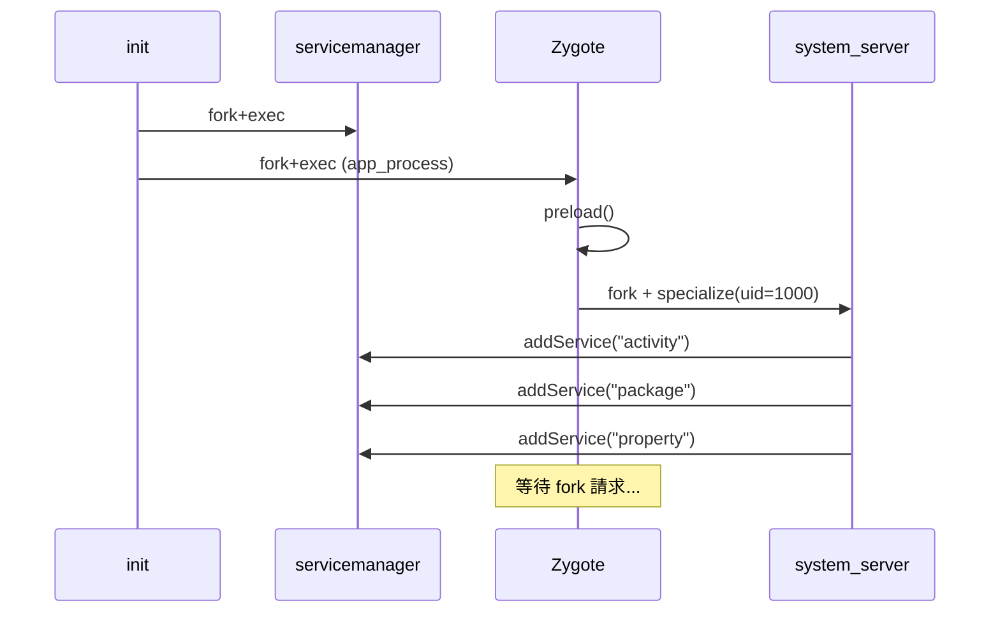


**驗證：**

```bash
# 1. Boot 順序正確
./scripts/start.sh
# → init 啟動 servicemanager + zygote
# → zygote fork 出 system_server
# → system_server 註冊所有 manager

# 2. 手動 fork 一個 app
echo "FORK com.miniaosp.helloapp out/jar/HelloApp.jar 10000 10000" | \
 socat - UNIX-CONNECT:/tmp/mini-aosp/zygote.sock
# → HelloApp 啟動 + PING/PONG 成功
```

通過後就可以進 Stage 6。

---

## Stage 6：App Process + Lifecycle

> **目標：** 建造 Android app 的骨架——event loop、7 個 Activity lifecycle callbacks、
> save/restore state、Service 的 started/bound 模式。
>
> 這是 Android developer 最常接觸的層面。做完這個 Stage，你會理解
> 「為什麼 onPause 在 onCreate 之前」、「為什麼 onSaveInstanceState 在 onStop 之前」。

### Activity Lifecycle 全貌

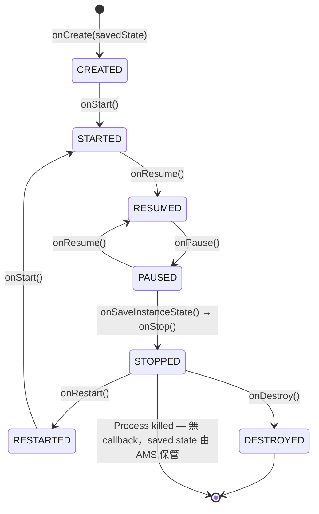


**關鍵行為（必須實作）：**


| 行為                     | 規則                                                   |
| ---------------------- | ---------------------------------------------------- |
| A 啟動 B                 | `onPause(A)` **先於** `onCreate(B)`                    |
| 可被 kill 的時機            | 只有 `onStop()` 之後 process 才能被 lmkd kill               |
| onSaveInstanceState    | 在 `onStop()` 之前呼叫，AMS 保管 Bundle                      |
| onRestoreInstanceState | 在 `onStart()` 之後呼叫，只有有 saved state 時才觸發              |
| onRestart vs onCreate  | `onRestart()` = 從背景回來；`onCreate()` = 全新建立或被 kill 後重建 |
| onDestroy 不保證          | Process 被 kill 時不會呼叫 `onDestroy()`                   |


---

### Step 6A：App Process Template + Event Loop

#### 🎯 目標

建立標準的 app process 骨架——Zygote fork 出來後，每個 app 都跑同樣的 bootstrap 流程。

#### 📋 動手做

**新增檔案：**

- `frameworks/base/core/kotlin/app/ActivityThread.kt` — app process 的真正入口
- `frameworks/base/core/kotlin/app/Application.kt` — Application 基底 class

1. **App process 啟動順序：**
  `ygote fork → exec java -jar app.jar  ActivityThread.main()  建立 main Looper（Looper.prepareMainLooper()）  連到 servicemanager  建立 IApplicationThread binder（AMS 用它推 lifecycle 到 app）  連到 AMS，呼叫 attachApplication(appThread binder)  AMS 回覆「啟動這個 Activity」（透過 appThread binder 回呼）  ActivityThread 建立 Activity instance，呼叫 onCreate()  Looper.loop()（永遠不回傳）`
   **重要：attachApplication 傳的是 binder，不只是 PID**
   真正 AOSP 裡，app 呼叫 `AMS.attachApplication(mAppThread)` 時，
   `mAppThread` 是一個 `IApplicationThread` binder 物件。
   AMS 持有這個 binder 的 handle，之後用它推送 lifecycle 事件回 app。
   這就是為什麼 AMS 能呼叫 app 的 `scheduleLaunchActivity()`——
   它是透過 app 在 attach 時給的 binder 回呼過去的。
2. **ActivityThread.kt：**
  ``kotlin
  bject ActivityThread {
  ateinit var mainHandler: Handler
  rivate lateinit var mainLooper: Looper
  / IApplicationThread — AMS 持有這個 binder 來推送 lifecycle 事件
  al appThread = ApplicationThread()
  un main(args: Array) {
  / 1. 建立 main looper
  ooper.prepareMainLooper()
  ainLooper = Looper.myLooper()!!
  ainHandler = Handler(mainLooper)
  /
  1. 連到 AMS，把自己的 binder 傳過去
  al ams = ServiceManager.getService("activity") as IActivityManager
  ms.attachApplication(appThread)  // 傳 binder，不只是 PID
  /
  1. 進入 event loop
  ooper.loop()
  / AMS 透過這個 binder 回呼 app（在 binder thread 上）
  / 用 Handler.post 轉到 main thread 執行
  lass ApplicationThread : BnApplicationThread() {
  verride fun scheduleLaunchActivity(activityName: String, savedState: Bundle?) {
  ctivityThread.mainHandler.post {
  al activity = instantiateActivity(activityName)
  ctivity.performCreate(savedState)
  ctivity.performStart()
  ctivity.performResume()
  verride fun schedulePauseActivity() {
  ctivityThread.mainHandler.post {
  urrentActivity?.performPause()
  ``
3. **AMS 端的 `attachApplication(appThread)`：**
  保管 appThread binder handle（之後用它推 lifecycle）
   記錄 pid → package → appThread 的映射
   查看是否有待啟動的 Activity → 透過 appThread 呼叫 `scheduleLaunchActivity()`

#### ✅ 驗證

```bash
# Zygote fork 一個 app，觀察 bootstrap 流程
./scripts/start.sh &
sleep 3

# 透過 zygote fork 一個 test app
echo "FORK com.miniaosp.testapp out/jar/TestApp.jar 10001 10001" | \
 socat - UNIX-CONNECT:/tmp/mini-aosp/zygote.sock
# [TestApp] ActivityThread.main() started
# [TestApp] Attached to AMS (pid=1234)
# [TestApp] Looper running on main thread
```

#### 🆚 真正 AOSP 對照

**去讀真正 AOSP 的 source——這是 Android 裡最重要的 class 之一：**

```
frameworks/base/core/java/android/app/ActivityThread.java
 → main() ← app 的真正入口（超重要）
 → handleLaunchActivity() ← 收到 AMS 的啟動指令
 → performLaunchActivity() ← 建立 Activity + 呼叫 onCreate

frameworks/base/core/java/android/app/Activity.java
 → performCreate(), performStart(), performResume()
```

`ActivityThread.main()` 是每個 Android app 的起點——
你手機上每一個 app process 都從這個函數開始。
裡面做的事跟我們的 `ActivityThread.main()` 結構一模一樣。

---

### Step 6B：Activity — 7 Lifecycle Callbacks

#### 🎯 目標

實作 `Activity` base class，支援完整的 7 個 lifecycle callback。
AMS 負責在正確的時機、正確的順序呼叫它們。

#### 📋 動手做

**新增檔案：**

- `frameworks/base/core/kotlin/app/Activity.kt`
- `frameworks/base/core/kotlin/os/Bundle.kt` — key-value state container

1. **Activity base class：**
  ``kotlin
  bstract class Activity {
  ar state: LifecycleState = LifecycleState.INITIALIZED
  / === 7 lifecycle callbacks（子類覆寫）===
  pen fun onCreate(savedInstanceState: Bundle?) {}
  pen fun onStart() {}
  pen fun onResume() {}
  pen fun onPause() {}
  pen fun onStop() {}
  pen fun onRestart() {}
  pen fun onDestroy() {}
  / === Save/Restore ===
  pen fun onSaveInstanceState(outState: Bundle) {}
  pen fun onRestoreInstanceState(savedInstanceState: Bundle) {}
  / === Internal — 由 ActivityThread 呼叫 ===
  nternal fun performCreate(saved: Bundle?) {
  tate = LifecycleState.CREATED
  nCreate(saved)
  f (saved != null) {
  nRestoreInstanceState(saved) // 只有有 state 才呼叫
  nternal fun performStart() {
  tate = LifecycleState.STARTED
  nStart()
  / ... performResume, performPause, performStop, performDestroy
  num class LifecycleState {
  NITIALIZED, CREATED, STARTED, RESUMED, PAUSED, STOPPED, DESTROYED
  ``
2. **Bundle（simplified）：**
  ``kotlin
  lass Bundle {
  rivate val map = mutableMapOf<String, Any?>()
  un putString(key: String, value: String) { map[key] = value }
  un getString(key: String): String? = map[key] as? String
  un putInt(key: String, value: Int) { map[key] = value }
  un getInt(key: String, default: Int = 0): Int = map[key] as? Int ?: default
  / Parcel 序列化（跨 process 傳 saved state 用）
  un writeToParcel(parcel: Parcel) { ... }
  ompanion object {
  un readFromParcel(parcel: Parcel): Bundle { ... }
  ``
3. **AMS 端的 lifecycle 驅動：**
  ``mermaid
  equenceDiagram
  articipant AMS as AMS
  articipant Old as App A (old)
  articipant New as App B (new)
  ote over AMS: 收到 startActivity(B)
  MS->>Old: schedulePauseActivity()
  ld->>Old: onPause()
  ld-->>AMS: activityPaused()
  MS->>New: scheduleLaunchActivity()
  ew->>New: onCreate() → onStart() → onResume()
  ew-->>AMS: activityResumed()
  ote over AMS: A 已不可見
  MS->>Old: scheduleStopActivity(wantsSaveState=true)
  ld->>Old: onSaveInstanceState() → onStop()
  ld-->>AMS: activityStopped(savedState)
  ote over AMS: 保管 A 的 savedState
  ``
  *關鍵順序：`onPause(A)` 必須在 `onCreate(B)` 之前完成。**
4. **寫一個 TestActivity 驗證順序：**
  ``kotlin
  lass TestActivity : Activity() {
  verride fun onCreate(saved: Bundle?) {
  og.i(TAG, "onCreate(saved=${saved != null})")
  verride fun onStart() { Log.i(TAG, "onStart()") }
  verride fun onResume() { Log.i(TAG, "onResume()") }
  verride fun onPause() { Log.i(TAG, "onPause()") }
  verride fun onSaveInstanceState(out: Bundle) {
  ut.putString("key", "saved_value")
  og.i(TAG, "onSaveInstanceState()")
  verride fun onStop() { Log.i(TAG, "onStop()") }
  verride fun onRestart() { Log.i(TAG, "onRestart()") }
  verride fun onDestroy() { Log.i(TAG, "onDestroy()") }
  ``

#### ✅ 驗證

```bash
# 啟動系統 + 啟動一個 app
# 預期 callback 順序：
# [TestApp] onCreate(saved=false)
# [TestApp] onStart()
# [TestApp] onResume()

# 啟動第二個 app（觸發第一個的 pause/stop）
# [TestApp] onPause()
# ← 這裡 App B 的 onCreate 才開始
# [TestApp] onSaveInstanceState()
# [TestApp] onStop()

# 切回第一個 app
# [TestApp] onRestart()
# [TestApp] onStart()
# [TestApp] onResume()
```

#### 🔍 做完後讀這段

**為什麼 onPause(A) 要在 onCreate(B) 之前？**

這是 Android 最重要的 lifecycle 保證之一。原因：

1. **資料一致性** — A 可能在 onPause 裡 save 資料（例如相機 app 存照片）。
  果 B 先 onCreate 然後要讀 A 存的資料，A 必須先存完。
2. **資源釋放** — A 可能持有獨占資源（相機、麥克風）。
  要用之前，A 必須先在 onPause 裡釋放。
3. **可預測性** — 開發者可以確信：「只要 onPause 被呼叫了，
  保存的東西一定在新 Activity 啟動之前已完成。」

**為什麼 onDestroy 不保證被呼叫？**

假設 App 在 STOPPED 狀態，lmkd 因記憶體不足 kill 了它。
OS 直接 `kill -9`，沒有機會跑任何 code。
所以**不能把重要的 cleanup 放在 onDestroy 裡**——要放在 `onStop()` 或 `onSaveInstanceState()`。

#### 📚 學習材料

- **Android Developers: Activity Lifecycle** — [官方文件](https://developer.android.com/guide/components/activities/activity-lifecycle) — 有互動式圖表
- **AOSP `Activity.java`** — [在線閱讀](https://cs.android.com/android/platform/superproject/+/main:frameworks/base/core/java/android/app/Activity.java) — 搜尋 `performCreate`

---

### Step 6C：Service Lifecycle — Started + Bound + Hybrid

#### 🎯 目標

實作 Android Service 的三種模式和 restart policy。

```mermaid
graph TD
 subgraph "Started Service"
 S1["startService()"] --> S2["onCreate()"]
 S2 --> S3["onStartCommand()"]
 S3 -->|"stopSelf()"| S4["onDestroy()"]
 end

 subgraph "Bound Service"
 B1["bindService()"] --> B2["onCreate()"]
 B2 --> B3["onBind() → IBinder"]
 B3 -->|"所有 client unbind"| B4["onUnbind()"]
 B4 --> B5["onDestroy()"]
 end

 subgraph "Hybrid（最複雜）"
 H1["startService() + bindService()"]
 H2["同時是 started 和 bound"]
 H3["stopSelf() 呼叫了 / AND / 所有 client unbind"]
 H4["才會 onDestroy()"]
 H1 --> H2 --> H3 --> H4
 end
```


#### 📋 動手做

**新增檔案：**

- `frameworks/base/core/kotlin/app/Service.kt`

1. **Service base class：**
  ``kotlin
  bstract class Service {
  / Started service
  pen fun onCreate() {}
  pen fun onStartCommand(intent: Intent?, flags: Int, startId: Int): Int {
  eturn START_NOT_STICKY
  pen fun onDestroy() {}
  un stopSelf(startId: Int? = null) { ... }
  / Bound service
  pen fun onBind(intent: Intent): IBinder? = null
  pen fun onUnbind(intent: Intent): Boolean = false // true = 之後 onRebind
  ompanion object {
  onst val START_NOT_STICKY = 0 // kill 後不重啟
  onst val START_STICKY = 1 // kill 後重啟，intent=null
  onst val START_REDELIVER_INTENT = 2 // kill 後重啟，重發最後的 intent
  ``
2. **AMS 追蹤 Service 狀態：**
  `startedServices: Map<ComponentName, ServiceRecord>`
   `bindings: Map<ComponentName, List<ConnectionRecord>>` — 誰 bind 了誰
   Service 的 destroy 條件：`!isStarted && bindCount == 0`
3. **Restart policy 實作（在 AMS 裡）：**

  | onStartCommand 回傳值       | Process 被 kill 後 AMS 做什麼               |
  | ------------------------ | -------------------------------------- |
  | `START_NOT_STICKY`       | 不重啟                                    |
  | `START_STICKY`           | 重啟 service，`onStartCommand(null, ...)` |
  | `START_REDELIVER_INTENT` | 重啟 service，重送最後一個 intent               |


#### ✅ 驗證

```bash
# MusicService 測試（started service）
# [MusicApp] MusicService.onCreate()
# [MusicApp] MusicService.onStartCommand(action=PLAY)
# ...kill MusicApp process...
# [AMS] MusicApp died, restart policy=START_STICKY
# [AMS] Restarting MusicService...
# [MusicApp] MusicService.onCreate()
# [MusicApp] MusicService.onStartCommand(null) ← STICKY: intent=null

# Bound service 測試
# [AppA] bindService(MusicService) → got IBinder
# [AppB] bindService(MusicService) → got IBinder
# [AppA] unbindService()
# ← MusicService 還活著（AppB 還 bind 著）
# [AppB] unbindService()
# [MusicApp] MusicService.onUnbind()
# [MusicApp] MusicService.onDestroy() ← 現在才 destroy
```

#### 🔍 做完後讀這段

**Hybrid service 是最常被誤解的 Android 概念**

很多開發者不知道一個 Service 可以同時是 started 和 bound。
常見場景：MusicService

1. 用戶按「播放」→ `startService()` → 音樂開始播
2. 用戶打開 MusicApp UI → `bindService()` → 取得 IBinder 控制播放
3. 用戶離開 UI → `unbindService()` → 音樂繼續播（因為還是 started）
4. 用戶按「停止」→ `stopService()` → 現在 Service 才真的結束

**如果只用 bind 不 start**，離開 UI 音樂就停了。
**如果只用 start 不 bind**，UI 沒辦法直接呼叫 Service 的方法。

#### 📚 學習材料

- **Android Developers: Bound Services** — [官方文件](https://developer.android.com/develop/background-work/services/bound-services)
- **"Android Service lifecycle explained"** — 搜尋這個，有很多圖解

---

### Step 6D：Process Priority（5 級）

#### 🎯 目標

實作 Android 的 5 級 process priority。這決定 lmkd 在記憶體不足時先 kill 誰。

#### 📋 動手做

**修改：** AMS 裡新增 `OomAdjuster`


| 優先順序        | Level | oom_adj | 條件                                                            |
| ----------- | ----- | ------- | ------------------------------------------------------------- |
| FOREGROUND  | 最高    | 0       | Activity 在 `RESUMED` 狀態，或 BroadcastReceiver 在 `onReceive()` 中 |
| VISIBLE     |       | 100     | Activity 在 `PAUSED` 狀態                                        |
| PERCEPTIBLE |       | 200     | 執行中的 foreground Service                                       |
| SERVICE     |       | 500     | 有 started Service（30 分鐘後降級為 CACHED）                           |
| CACHED      | 最低    | 900-999 | Activity 在 `STOPPED`，LRU 排序                                   |


```mermaid
graph LR
 FG["FOREGROUND / oom_adj=0 / 最後被 kill"] --- VIS["VISIBLE / 100"]
 VIS --- PERC["PERCEPTIBLE / 200"]
 PERC --- SVC["SERVICE / 500"]
 SVC --- CACHED["CACHED / 900-999 / 最先被 kill"]

 style FG fill:#2d5016,color:#fff
 style CACHED fill:#5c1a1a,color:#fff
```


**Priority inheritance：**
如果 App A（FOREGROUND）bind 到 App B 的 Service，
App B 的 priority 提升到至少跟 App A 一樣。
因為 kill B 會影響到前景的 A——用戶會感知到。

1. **OomAdjuster class：**
  ``kotlin
  lass OomAdjuster(private val ams: ActivityManagerService) {
  un updateOomAdj(processRecord: ProcessRecord) {
  ar adj = 999 // 從最低開始
  / 有 RESUMED activity → FOREGROUND
  f (processRecord.hasResumedActivity()) adj = 0
  / 有 PAUSED activity → VISIBLE
  lse if (processRecord.hasPausedActivity()) adj = 100
  / 有 foreground service → PERCEPTIBLE
  lse if (processRecord.hasForegroundService()) adj = 200
  / 有 started service → SERVICE
  lse if (processRecord.hasStartedService()) adj = 500
  / Priority inheritance via bindings
  or (binding in processRecord.bindings) {
  al clientAdj = binding.client.oomAdj
  f (clientAdj < adj) {
  dj = clientAdj // 提升到 client 的 priority
  rocessRecord.oomAdj = adj
  ``
2. 每次 lifecycle 狀態改變時重新計算所有相關 process 的 oom_adj

#### ✅ 驗證

```bash
# 啟動 App A（FOREGROUND, adj=0）
# 啟動 App B（A 變成 STOPPED → CACHED, adj=900）
# App A bind 到 App B 的 Service（B 提升到 adj=0）
# App A unbind（B 降回 adj=500 或 900）

java -jar out/jar/test_oom_adj.jar
# [test] AppA: FOREGROUND (adj=0)
# [test] AppB: CACHED (adj=900)
# [test] AppA binds to AppB.Service → AppB promoted to adj=0
# [test] AppA unbinds → AppB back to adj=900
# [test] ✓ OomAdjuster works with priority inheritance
```

#### 🆚 真正 AOSP 對照

**去讀真正 AOSP 的 source：**

```
frameworks/base/services/core/java/com/android/server/am/OomAdjuster.java
 → updateOomAdjLSP() ← 4,000+ 行的巨型方法，你的簡化版是它的精華

frameworks/base/services/core/java/com/android/server/am/ProcessList.java
 → FOREGROUND_APP_ADJ, VISIBLE_APP_ADJ, ... ← oom_adj 常數定義
```

真正的 `updateOomAdjLSP()` 非常複雜（考慮 provider、instrumentation、heavy-weight process 等），
但核心邏輯跟你寫的一樣：根據 component 狀態 + binding 關係計算 adj。

#### 📚 學習材料

- **"Android process priority explained"** — 搜尋這個
- **Linux OOM Killer** — 搜尋 "linux oom killer oom_adj"，理解 kernel 怎麼用 oom_adj
- **AOSP `OomAdjuster.java`** — [在線閱讀](https://cs.android.com/android/platform/superproject/+/main:frameworks/base/services/core/java/com/android/server/am/OomAdjuster.java) — 瀏覽 `computeOomAdjLSP()` 的 if-else 鏈

---

### Stage 6 完成條件

```mermaid
graph TB
 subgraph "Stage 6 完成狀態"
 AT["ActivityThread / main looper + AMS attach"]
 ACT["Activity / 7 callbacks + save/restore"]
 SVC["Service / started + bound + hybrid / restart policy"]
 OOM["OomAdjuster / 5 級 priority / binding inheritance"]
 end

 AMS["AMS"] -->|"schedule callbacks"| AT
 AT --> ACT
 AT --> SVC
 AMS --> OOM
```


**驗證——完整 lifecycle walk-through：**

```bash
# App 啟動
# → onCreate → onStart → onResume (FOREGROUND, adj=0)

# 第二個 App 啟動
# → onPause(first) → onCreate(second)... → onSaveInstanceState(first) → onStop(first)
# first: adj=900 (CACHED), second: adj=0 (FOREGROUND)

# 切回第一個 App
# → onPause(second) → onRestart(first) → onStart(first) → onResume(first)
# first: adj=0, second: adj=900
```

---

## Stage 7：PackageManagerService + Intent System

> **目標：** 讓 PMS 能掃描、安裝 app，並根據 Intent 找到正確的目標 component。
>
> 這是「我想打開地圖 app」如何變成「啟動 com.google.maps/.MapsActivity」的過程。

### Intent 的兩種模式

```mermaid
graph LR
 subgraph "Explicit Intent（明確指定）"
 E1["startActivity( / package=com.app.notes / class=NotesActivity)"]
 E1 -->|"直接找到"| E2["NotesApp.NotesActivity"]
 end

 subgraph "Implicit Intent（按 action 配對）"
 I1["startActivity( / action=ACTION_SEND / data='Hello')"]
 I1 -->|"PMS 查 manifest / 誰註冊了 ACTION_SEND？"| I2["ShareApp? ReceiverApp?"]
 I2 -->|"first match"| I3["ReceiverApp.ReceiveActivity"]
 end
```


---

### Step 7A：PMS — Manifest 掃描 + UID 分配 + 安裝

#### 🎯 目標

把 Stage 4B 的 PMS stub 升級成完整版：
掃描所有 app manifest，解析 component 和 intent-filter，分配 UID。

#### 📋 動手做

**修改：** `frameworks/base/services/core/kotlin/pm/PackageManagerService.kt`

1. **升級 AndroidManifest.json 格式：**
  ``json
  package": "com.miniaosp.notesapp",
  versionCode": 1,
  application": {
  label": "NotesApp",
  activities": [
  name": "NotesActivity",
  main": true,
  intentFilters": [
   "action": "android.intent.action.MAIN" }
  ,
  services": [
  name": "SyncService",
  exported": false
  ,
  receivers": [
  name": "BootReceiver",
  intentFilters": [
   "action": "android.intent.action.BOOT_COMPLETED" }
  ,
  permissions": ["android.permission.INTERNET"]
  ``
2. **PMS 啟動時：**
  掃描 `packages/apps/*/AndroidManifest.json`
   為每個 package 分配 UID（10000, 10001, 10002...）
   建立 index：
   `packageMap: Map<String, PackageInfo>` — package name → 完整資訊
   `componentMap: Map<ComponentName, ComponentInfo>` — component → 所屬 package
   `intentFilterIndex: Map<String, List<ResolveInfo>>` — action → 可以處理的 component list
3. **新增 API（升級 AIDL）：**
  ``
  nterface IPackageManager {
  tring[] getInstalledPackages();
  nt getUidForPackage(String packageName);
  esolveInfo resolveActivity(Intent intent); // ← 新增
  esolveInfo[] queryIntentActivities(Intent intent); // ← 新增
  esolveInfo resolveService(Intent intent); // ← 新增
  ``

#### ✅ 驗證

```bash
# 建立 5 個 sample app 的 manifest
# PMS 啟動時掃描它們
java -jar out/jar/test_pms_scan.jar
# [PMS] Scanned: com.miniaosp.notesapp (uid=10000)
# [PMS] Scanned: com.miniaosp.musicapp (uid=10001)
# [PMS] Scanned: com.miniaosp.crashyapp (uid=10002)
# [PMS] Scanned: com.miniaosp.receiverapp (uid=10003)
# [PMS] Scanned: com.miniaosp.shareapp (uid=10004)
# [PMS] Intent index: ACTION_SEND → [receiverapp.ReceiveActivity]
# [PMS] Intent index: BOOT_COMPLETED → [receiverapp.BootReceiver, notesapp.BootReceiver]
```

---

### Step 7B：Intent Resolution + App Launch via Intent

#### 🎯 目標

實作完整的 `startActivity(intent)` 流程：
Intent → PMS resolve → AMS → Zygote fork → Activity lifecycle。

#### 📋 動手做

**新增：** `frameworks/base/core/kotlin/content/Intent.kt`

1. **Intent data class：**
  ``kotlin
  ata class Intent(
  al action: String? = null, // implicit intent
  al packageName: String? = null, // explicit intent
  al className: String? = null, // explicit intent
  al extras: Bundle = Bundle() // 附帶資料
   {
  al isExplicit: Boolean get() = packageName != null && className != null
  ``
2. **startActivity 流程（在 AMS 裡）：**
  ``mermaid
  equenceDiagram
  articipant App as App
  articipant AMS as AMS
  articipant PMS as PMS
  articipant Z as Zygote
  articipant Target as Target App
  pp->>AMS: startActivity(intent)
  lt Explicit intent
  MS->>AMS: 直接用 package+class 找 component
  lse Implicit intent
  MS->>PMS: resolveActivity(intent)
  MS->>PMS: 查 intentFilterIndex
  MS-->>AMS: ResolveInfo (target component)
  nd
  lt Target process 已在跑
  MS->>Target: scheduleLaunchActivity()
  lse Target process 不存在
  MS->>Z: fork(package, jar, uid)
  -->>AMS: child pid
  ote over Target: process 啟動, attachApplication()
  MS->>Target: scheduleLaunchActivity()
  nd
  arget->>Target: onCreate() → onStart() → onResume()
  ``
3. **Sample apps — 建立 5 個 app 的 manifest + stub Activity：**

  | App         | 測試什麼                                           |
  | ----------- | ---------------------------------------------- |
  | NotesApp    | 背景存活、state save/restore                        |
  | MusicApp    | Foreground Service、bound service               |
  | CrashyApp   | 故意 crash、測試 linkToDeath 和 restart              |
  | ReceiverApp | BroadcastReceiver、intent-filter 接收 ACTION_SEND |
  | ShareApp    | 送 implicit intent（ACTION_SEND）                 |


#### ✅ 驗證

```bash
# Explicit intent — 直接指定目標
java -jar out/jar/test_intent.jar --explicit com.miniaosp.notesapp NotesActivity
# [AMS] Resolving explicit intent → com.miniaosp.notesapp/.NotesActivity
# [AMS] Process not running, requesting Zygote fork...
# [NotesApp] onCreate() → onStart() → onResume()

# Implicit intent — 按 action 配對
java -jar out/jar/test_intent.jar --implicit ACTION_SEND --extra text "Hello!"
# [AMS] Resolving implicit intent: action=ACTION_SEND
# [PMS] Matched: com.miniaosp.receiverapp/.ReceiveActivity
# [ReceiverApp] onCreate(extras={text=Hello!})
```

#### 🆚 真正 AOSP 對照

**去讀真正 AOSP 的 source：**

```
frameworks/base/services/core/java/com/android/server/pm/PackageManagerService.java
 → resolveIntentInternal() ← intent resolution 核心
 → queryIntentActivitiesInternal() ← 查 intent filter

frameworks/base/services/core/java/com/android/server/am/ActivityStarter.java
 → execute() ← startActivity 的完整流程（非常長）
 → startActivityUnchecked() ← 決定 task、launch mode
```

真正的 intent resolution 還考慮 MIME type、URI scheme、category 等。
我們只用 action string matching，但流程結構相同。

#### 📚 學習材料

- **Android Developers: Intents and Intent Filters** — [官方文件](https://developer.android.com/guide/components/intents-filters)
- **"How Android resolves intents"** — 搜尋這個

---

### Stage 7 完成條件

```bash
# 完整 flow：ShareApp 送 ACTION_SEND → PMS resolve → ReceiverApp 收到
./scripts/start.sh &
sleep 3

# 透過 launcher (或測試工具) 啟動 ShareApp
# ShareApp 呼叫 startActivity(Intent(action="ACTION_SEND", extras={text="hi"}))
# → PMS resolve → ReceiverApp.ReceiveActivity.onCreate(extras={text="hi"})
# ✓ Inter-app communication via intents
```

---

## Stage 8：AMS 完整版 + lmkd + BroadcastReceiver

> **目標：** Phase 1 的最後一塊拼圖——
> 完整的 foreground/background tracking、記憶體壓力下 kill cached apps、
> 系統 broadcast 事件。做完這個，Phase 1 就完成了。

### 大圖

```mermaid
graph TB
 subgraph "Stage 8 完成後的系統"
 INIT["init / PID 1"]
 SM["servicemanager"]
 Z["Zygote"]

 subgraph SS["system_server"]
 AMS["AMS / lifecycle + fg/bg + force-stop"]
 PMS["PMS / manifest + intent"]
 PROP["PropertyManager"]
 LMKD["lmkd / memory pressure / → kill by oom_adj"]
 BC["BroadcastDispatcher / BOOT_COMPLETED / LOW_MEMORY"]
 end

 subgraph apps["App Processes"]
 N["NotesApp"]
 M["MusicApp"]
 C["CrashyApp"]
 R["ReceiverApp"]
 S["ShareApp"]
 end
 end

 INIT --> SM
 INIT --> Z
 Z --> SS
 Z --> N
 Z --> M
 Z --> C
 Z --> R
 Z --> S

 apps <-->|"Binder IPC"| SS
 SS <-->|"Binder IPC"| SM
 LMKD -->|"kill"| apps
```


---

### Step 8A：AMS — fg/bg Tracking + Force-Stop

#### 🎯 目標

AMS 追蹤每個 app 的前景/背景狀態，維護 LRU list，支援 force-stop。

#### 📋 動手做

1. **ProcessRecord — 每個 app process 一份：**
  ``kotlin
  ata class ProcessRecord(
  al pid: Int,
  al uid: Int,
  al packageName: String,
  ar oomAdj: Int = 999,
  ar lastActivityTime: Long = System.currentTimeMillis(),
  al activities: MutableList = mutableListOf(),
  al services: MutableList = mutableListOf(),
  ar state: ProcessState = ProcessState.CACHED
  ``
2. **LRU list：**
  每次 Activity 狀態改變 → 更新 `lastActivityTime`
   排序：`oomAdj` 高的在前（先被 kill），同 adj 的看 `lastActivityTime`（最久沒用的先 kill）
3. **Force-stop：**
  ``kotlin
  un forceStopPackage(packageName: String) {
  al proc = findProcessByPackage(packageName) ?: return
  / 1. 呼叫所有 Activity 的 onDestroy
  / 2. 呼叫所有 Service 的 onDestroy
  / 3. kill process
  / 4. 通知所有 bind 到這個 process 的 client（linkToDeath）
  / 5. 清理 ProcessRecord
  s.kill(proc.pid, Signal.SIGKILL)
  emoveProcessRecord(proc)
  og.i(TAG, "Force-stopped: $packageName (pid=${proc.pid})")
  ``

#### ✅ 驗證

```bash
# 啟動 3 個 app
# NotesApp (adj=0, fg) → MusicApp (adj=0, fg; Notes→900) → CrashyApp (adj=0, fg; Music→900)
# LRU order: Notes(900, oldest) → Music(900, newer) → Crashy(0, fg)

# Force-stop NotesApp
java -jar out/jar/test_force_stop.jar com.miniaosp.notesapp
# [AMS] Force-stopped: com.miniaosp.notesapp (pid=1234)
# [AMS] Removed from LRU list
```

---

### Step 8B：lmkd — Low Memory Killer

#### 🎯 目標

當系統記憶體不足時，按 oom_adj 從高到低 kill cached app。

> **重要架構約束：lmkd 必須是獨立 daemon（C process），不在 system_server 裡。**
> 原因：如果 system_server OOM，lmkd 必須還活著才能 kill 其他 process。
> 這跟真正 AOSP 的架構一致——lmkd 由 init 啟動，跟 AMS 透過 socket 通訊。

#### 📋 動手做

**修改：** `system/core/lmkd/main.c`（從 stub 升級）
**修改：** `system/core/rootdir/init.rc`（加入 lmkd service）

1. **在 init.rc 加入 lmkd：**
  `ervice lmkd ${MINI_AOSP_ROOT}/out/bin/lmkd`
  mkd 由 init 啟動，跟 servicemanager 和 zygote 平級。
2. **lmkd 架構：**
  `mkd (獨立 C daemon，init 啟動)  ├─ 開 socket: /tmp/mini-aosp/lmkd.sock  ├─ AMS 連到這個 socket，定期推送 oom_adj 更新  ├─ 監聽 /proc/meminfo 或 PSI  └─ 壓力事件 → 查 oom_adj table → kill → 通知 AMS`
3. **記憶體壓力偵測：**
  Linux：讀 `/proc/meminfo` 的 `MemAvailable`
   或用 cgroup 的 `memory.pressure`（PSI）
   簡化版：定時 poll（每 5 秒），可用記憶體低於 threshold 就觸發
4. **Kill 策略：**
  `f (available_mb < THRESHOLD_CRITICAL): // < 200MB ill all CACHED processes (adj 900-999) lif (available_mb < THRESHOLD_LOW): // < 500MB ill oldest CACHED process lif (available_mb < THRESHOLD_MODERATE): // < 800MB ill oldest CACHED process only if idle > 30 min`
5. **lmkd ↔ AMS 通訊（透過 Unix socket，不是 Binder）：**
  MS → lmkd：`SET_OOM_ADJ <pid> <adj>\n` — 每次 oom_adj 改變時推送
  mkd → AMS：`PROC_KILLED <pid>\n` — kill 後通知
   為什麼不用 Binder？因為 Binder 依賴 servicemanager，而 lmkd 需要在
   servicemanager crash 時也能運作。用直接 socket 更可靠。
  ``mermaid
  equenceDiagram
  articipant I as init
  articipant L as lmkd
  articipant AMS as AMS (in system_server)
  ->>L: fork+exec (啟動 lmkd)
  ->>L: listen on lmkd.sock
  MS->>L: connect to lmkd.sock
  MS->>L: SET_OOM_ADJ 1234 0 (foreground)
  MS->>L: SET_OOM_ADJ 1235 900 (cached)
  ->>L: poll /proc/meminfo
  ->>L: MemAvailable < 500MB!
  ->>L: kill(1235, SIGKILL)
  ->>AMS: PROC_KILLED 1235
  MS->>AMS: cleanup ProcessRecord
  MS->>AMS: 保管 savedState
  ``

#### ✅ 驗證

```bash
# 模擬記憶體壓力（用一個程式吃掉大量記憶體）
java -jar out/jar/test_lmkd.jar --simulate-pressure
# [lmkd] Memory pressure detected: available=450MB (threshold=500MB)
# [lmkd] Killing cached process: com.miniaosp.notesapp (adj=999, pid=1234)
# [AMS] Process killed: com.miniaosp.notesapp, saved state retained
# [lmkd] Memory recovered: available=580MB

# 重新啟動被 kill 的 app — 驗證 state 恢復
# → NotesApp.onCreate(savedState={notes=["my note"]})
# → onRestoreInstanceState({notes=["my note"]})
```

#### 🔍 做完後讀這段

**這就是 Android 為什麼要有 onSaveInstanceState**

整個 save/restore 機制存在的唯一原因就是 lmkd。
當系統記憶體不足，Android 會 kill 背景 app，但**用戶不應該感知到**。

流程：

1. App 進入背景 → `onSaveInstanceState()` → AMS 保管 Bundle
2. 記憶體不足 → lmkd kill app → process 消失
3. 用戶切回 app → AMS 告訴 Zygote 重新 fork → `onCreate(savedState)` → 恢復狀態
4. 用戶感覺 app 從來沒被 kill 過

**這就是 Android 能在 4GB RAM 上跑 20+ 個 app 的祕密。**

#### 📚 學習材料

- **"Android lmkd internals"** — 搜尋這個
- **Linux PSI (Pressure Stall Information)** — `man 5 proc`，搜尋 `/proc/pressure/memory`
- **AOSP `lmkd.cpp`** — [在線閱讀](https://cs.android.com/android/platform/superproject/+/main:system/core/lmkd/lmkd.cpp)

---

### Step 8C：BroadcastReceiver

#### 🎯 目標

實作 pub/sub broadcast 系統——system_server 可以廣播事件，
所有在 manifest 裡註冊了 intent-filter 的 app 都會收到。

#### 📋 動手做

1. **系統 broadcast 事件：**

  | Broadcast        | 何時發送            | 用途             |
  | ---------------- | --------------- | -------------- |
  | `BOOT_COMPLETED` | 所有 service 啟動完畢 | App 可以做開機後的初始化 |
  | `LOW_MEMORY`     | lmkd 偵測到記憶體壓力   | App 應該釋放 cache |
  | `PACKAGE_ADDED`  | PMS 安裝新 app     | 其他 app 可以更新 UI |

2. **BroadcastReceiver base class：**
  ``kotlin
  bstract class BroadcastReceiver {
  bstract fun onReceive(context: Context, intent: Intent)
  / 10 秒限制：onReceive 必須在 10 秒內完成
  / 超時 → AMS 視為 ANR（Phase 1 只印 warning）
  ``
3. **Broadcast 發送流程：**
  ``mermaid
  equenceDiagram
  articipant SS as system_server
  articipant AMS as AMS
  articipant PMS as PMS
  articipant Z as Zygote
  articipant R1 as ReceiverApp
  articipant R2 as NotesApp
  S->>AMS: sendBroadcast(BOOT_COMPLETED)
  MS->>PMS: queryBroadcastReceivers(BOOT_COMPLETED)
  MS-->>AMS: [ReceiverApp.BootReceiver, NotesApp.BootReceiver]
  oop 每個 receiver
  lt Process 已在跑
  MS->>R1: scheduleReceiver(BOOT_COMPLETED)
  lse Process 沒在跑
  MS->>Z: fork(ReceiverApp)
  -->>AMS: pid
  MS->>R2: scheduleReceiver(BOOT_COMPLETED)
  nd
  nd
  1->>R1: onReceive(BOOT_COMPLETED)
  ote over R1: 10 秒限制
  1-->>AMS: receiverFinished()
  ote over AMS: R1 process priority 降回原本
  ``
4. **Receiver 執行中的 priority 提升：**
  `onReceive()` 執行期間，process 提升為 FOREGROUND（adj=0）
   `onReceive()` return 後，立刻降回原本的 priority
   這確保 broadcast 處理不會被 lmkd kill 中斷

#### ✅ 驗證

```bash
# 系統啟動 → BOOT_COMPLETED broadcast
./scripts/start.sh
# [system_server] Sending broadcast: BOOT_COMPLETED
# [ReceiverApp] BootReceiver.onReceive(BOOT_COMPLETED)
# [ReceiverApp] Boot time logged.
# [NotesApp] BootReceiver.onReceive(BOOT_COMPLETED)
# [NotesApp] Scheduled background sync.

# 手動發送 broadcast
java -jar out/jar/test_broadcast.jar LOW_MEMORY
# [AMS] Broadcasting: LOW_MEMORY → 3 receivers
# [NotesApp] LowMemoryReceiver: clearing image cache
# [MusicApp] LowMemoryReceiver: releasing audio buffers
```

---

### Step 8D：Final Integration — 全系統驗證

#### 🎯 目標

所有 Stage 整合在一起，跑完整的 verification scenario。

#### 📋 動手做

**建立完整的 sample apps（5 個 + launcher）：**


| App             | JAR               | 測試場景                                         |
| --------------- | ----------------- | -------------------------------------------- |
| **Launcher**    | `launcher.jar`    | 列出 app、啟動 app、顯示 running processes           |
| **NotesApp**    | `NotesApp.jar`    | 背景 save/restore、被 lmkd kill 後恢復              |
| **MusicApp**    | `MusicApp.jar`    | Foreground Service、bound service、其他 app bind |
| **CrashyApp**   | `CrashyApp.jar`   | 2 秒後 crash、測試 AMS restart 和 linkToDeath      |
| **ReceiverApp** | `ReceiverApp.jar` | BOOT_COMPLETED + ACTION_SEND receiver        |
| **ShareApp**    | `ShareApp.jar`    | 送 implicit intent 到 ReceiverApp              |


**Verification scenarios（全部跑過 = Phase 1 完成）：**

```bash
# === Scenario 1: Boot Smoke ===
./scripts/start.sh
# init → servicemanager → zygote → system_server → launcher
# BOOT_COMPLETED broadcast → receivers 收到
# ✅ 系統在 deadline 內啟動

# === Scenario 2: App Launch ===
# launcher → AMS.startActivity(NotesApp) → zygote fork → lifecycle
# ✅ NotesApp: onCreate → onStart → onResume

# === Scenario 3: Intent Launch ===
# ShareApp: startActivity(ACTION_SEND, text="Hello")
# PMS resolve → ReceiverApp.ReceiveActivity
# ✅ ReceiverApp 收到 extras.text = "Hello"

# === Scenario 4: Cross-App IPC ===
# Launcher bindService(MusicApp.PlaybackService)
# proxy.play() → MusicApp responds
# ✅ Bound Service works cross-process

# === Scenario 5: Background/Foreground ===
# Start Notes → Start Music (Notes goes bg) → Switch back to Notes
# ✅ Notes: pause→save→stop→restart→start→resume

# === Scenario 6: Force Stop ===
# AMS.forceStopPackage("com.miniaosp.notesapp")
# ✅ Process killed, pid cleared, relaunch = fresh start

# === Scenario 7: Low Memory ===
# Start 5+ apps → trigger memory pressure
# ✅ lmkd kills oldest cached app, AMS retains saved state

# === Scenario 8: Crash Recovery ===
# CrashyApp crashes after 2s
# ✅ AMS detects death, linkToDeath fires, can relaunch

# === Scenario 9: Broadcast ===
# sendBroadcast(LOW_MEMORY)
# ✅ All registered receivers execute onReceive within 10s

# === Scenario 10: servicemanager Crash ===
# kill servicemanager → init restarts → services re-register
# ✅ System recovers, apps can resume IPC
```

#### ✅ 最終驗證

```bash
./scripts/start.sh
# 看到完整的 boot log
# 所有 10 個 scenario 自動跑過（或手動觸發）
# 零 error, 零 crash (除了 CrashyApp 故意的)

echo ""
echo "============================================"
echo " 🎉 mini-AOSP Phase 1 Complete!"
echo " Boot → Binder → Services → Apps → Lifecycle"
echo " → Intents → Broadcasts → Memory Management"
echo "============================================"
```

---

### Stage 8 完成條件

```mermaid
graph TB
 subgraph "Phase 1 完成的完整系統"
 direction TB
 INIT["init / rc parser, crash-restart / property store"]
 SM["servicemanager / Binder handle 0"]
 Z["Zygote / preload, fork, specialize"]

 subgraph SS["system_server"]
 AMS["AMS / lifecycle, fg/bg, oom_adj / force-stop, LRU"]
 PMS["PMS / manifest scan, UID / intent resolve"]
 PROP["PropertyManager"]
 LMKD["lmkd / memory pressure → kill"]
 BCD["BroadcastDispatcher / BOOT_COMPLETED / LOW_MEMORY"]
 end

 subgraph APPS["5 Sample Apps + Launcher"]
 L["Launcher"]
 N["NotesApp"]
 M["MusicApp"]
 C["CrashyApp"]
 R["ReceiverApp"]
 S["ShareApp"]
 end
 end

 INIT -->|start| SM
 INIT -->|start| Z
 Z -->|fork| SS
 Z -->|fork| APPS
 APPS <-->|"Binder IPC"| SM
 SS <-->|"Binder IPC"| SM
 LMKD -->|"kill by oom_adj"| APPS
 BCD -->|"broadcast"| APPS
```


---

## Phase 1 完成後你學到了什麼

### Kernel 層

- `fork()`, `exec()`, `waitpid()`, `kill()` — process 生命週期
- `socket()`, `bind()`, `connect()`, `read()`, `write()` — IPC
- `epoll` — 高效能 event loop
- `SO_PEERCRED` — unforgeable caller identity
- cgroups — resource limits

### Native 層

- **init** — PID 1 的責任：啟動、監控、重啟 service
- **Binder** — handle-based IPC, Parcel 序列化, Proxy/Stub, thread pool, death notification
- **servicemanager** — service discovery (handle 0)
- **Zygote** — fork + specialize, copy-on-write 記憶體共享

### Framework 層

- **AMS** — Activity/Service lifecycle state machine, process priority, OomAdjuster, force-stop
- **PMS** — manifest 掃描, UID 分配, intent resolution
- **Intent** — explicit vs implicit, action-based routing
- **BroadcastReceiver** — pub/sub event system
- **lmkd** — memory pressure → kill by priority → save/restore state

### App 層

- **Activity** 7 個 lifecycle callbacks + save/restore
- **Service** 三種模式 (started/bound/hybrid) + restart policy
- **Process priority** 5 級 + priority inheritance via bindings

### Design Patterns

- Proxy/Stub (RPC)
- Observer (linkToDeath, BroadcastReceiver)
- Service Locator (servicemanager)
- Code Generation (AIDL)
- Event Loop (Looper/Handler)
- Copy-on-Write (Zygote fork)

---

## 接下來：Phase 2

Phase 1 完成後，你已經有一個完整運作的迷你 Android。Phase 2 加入：

- **HAL** — 模擬硬體（Camera, Audio, Sensors）
- **ART** — 自己的 bytecode VM
- **ContentProvider** — 跨 app 資料共享
- **Custom kernel modifications** — 在 Linux kernel 加入 Binder driver
- **Other form factors** — tablet, TV, auto

詳見 `phase-2-advanced.md`。

---

## 學習資源總表

### 必讀


| 資源                                                                                                                                                    | 對應 Stage | 重點                    |
| ----------------------------------------------------------------------------------------------------------------------------------------------------- | -------- | --------------------- |
| **AOSP Architecture Overview** — [source.android.com](https://source.android.com/docs/core/architecture)                                              | 全部       | 系統層次圖                 |
| **AOSP `init/README.md`** — [cs.android.com](https://cs.android.com/android/platform/superproject/+/main:system/core/init/README.md)                  | S0-S1    | init.rc 語法、service 行為 |
| **AOSP Binder docs** — [source.android.com/docs/core/architecture/hidl/binder-ipc](https://source.android.com/docs/core/architecture/hidl/binder-ipc) | S2-S3    | Binder 架構             |
| `**man epoll(7)`**                                                                                                                                    | S0       | Looper 的底層            |
| `**man unix(7)**`                                                                                                                                     | S0-S2    | Unix domain socket    |
| `**man fork(2)`, `exec(3)`, `waitpid(2)**`                                                                                                            | S1, S5   | Process 管理            |


### 推薦閱讀


| 資源                                                                                             | 對應 Stage | 重點                        |
| ---------------------------------------------------------------------------------------------- | -------- | ------------------------- |
| **Android Internals: A Confectioner's Cookbook** (Jonathan Levin)                              | 全部       | 最深入的非官方 internals 參考      |
| **xv6 教學 OS** — [pdos.csail.mit.edu/6.828/xv6](https://pdos.csail.mit.edu/6.828/2024/xv6.html) | S0-S1    | fork/exec/scheduler 的最小實作 |
| **Beej's Guide to Unix IPC**                                                                   | S0-S2    | Unix IPC 機制全覽             |


### AOSP Source 導航

隨時可以去 [cs.android.com](https://cs.android.com) 搜尋真正的 AOSP source code。
每個 Step 的 "🆚 真正 AOSP 對照" 都有具體檔案路徑。

**最有教學價值的 AOSP 檔案（建議通讀）：**

```
system/core/init/README.md ← init 的完整文件
system/core/init/service.cpp ← service 生命週期
system/core/libutils/Looper.cpp ← event loop
frameworks/native/libs/binder/Parcel.cpp ← 序列化
frameworks/native/cmds/servicemanager/ServiceManager.cpp ← service registry
frameworks/base/core/java/android/os/Looper.java ← Java Looper
frameworks/base/core/java/android/app/ActivityThread.java ← app 主入口（巨大但值得瀏覽）
frameworks/base/services/core/java/.../ActivityManagerService.java ← AMS 核心
```

