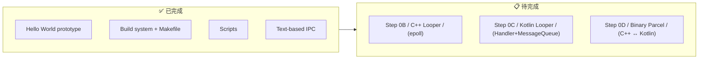
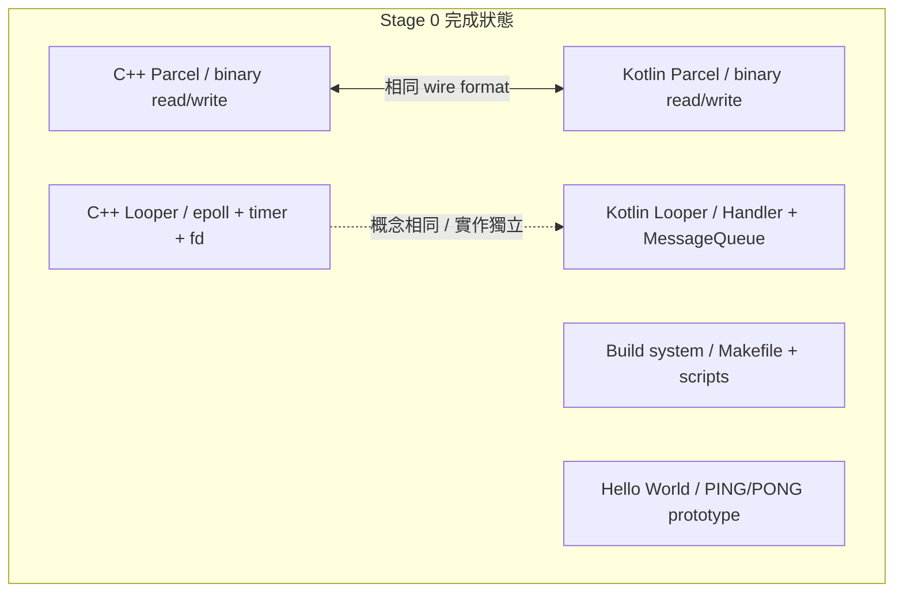

## Stage 0：基礎設施

> **目標：** 建立 build system、Looper event loop、binary Parcel 格式。
> 這是所有後續 Stage 的地基。

### 你現在在哪裡

Stage 0 的 Hello World prototype 已經完成 ✅：
- init（C++）用 `fork()+exec()` 啟動 servicemanager 和 system_server
- servicemanager（C++）用 Unix socket 做 text-based service registry
- system_server（Kotlin）註冊 PingService
- HelloApp（Kotlin）查詢 → PING → PONG

**還缺什麼：**
1. **Looper** — epoll-based event loop（Stage 2 的 Binder 和 Stage 6 的 app 都需要它）
2. **Parcel** — binary 序列化格式（取代目前的 text protocol）



---

### Step 0B：C++ Looper（epoll event loop）

#### 🎯 目標

寫一個 event loop，能同時等待：
- **Timer 事件** — 「5 秒後執行這個 callback」
- **File descriptor 事件** — 「這個 socket 有資料可讀時通知我」

這就是 Android 裡每個 process 的心跳——Looper 不斷地等事件、dispatch callback、再等。

#### 📋 動手做

**檔案：** `frameworks/native/libs/binder/Looper.h` + `Looper.cpp`

1. 建立 `Looper` class，包含：
 - `addFd(fd, callback)` — 監聽一個 file descriptor
 - `removeFd(fd)` — 停止監聽
 - `postDelayed(callback, delayMs)` — 延遲執行
 - `loop()` — 主迴圈，永遠不回傳（除非呼叫 `quit()`）
 - `quit()` — 停止迴圈

2. 內部用 Linux `epoll`：
 ```
 epoll_create1(0) → 建立 epoll instance
 epoll_ctl(ADD, fd, ...) → 加入要監聽的 fd
 epoll_wait(timeout) → 等待事件，timeout 從最近的 timer 算出
 ```

3. 寫一個測試程式 `tests/test_looper.cpp`：
 - 建立一個 Unix socket pair
 - 用 Looper 監聽讀端
 - 用 `postDelayed` 在 100ms 後往寫端送 "hello"
 - 驗證 fd callback 收到 "hello"

#### ✅ 驗證

```bash
make -C build test_looper
./out/bin/test_looper
# 預期輸出：
# [test] Timer fired at ~100ms
# [test] FD callback received: hello
# [test] Looper quit cleanly
```

#### 🔍 做完後讀這段

**epoll 是什麼？**

Linux kernel 提供三種等待多個 fd 的方式：`select()`、`poll()`、`epoll`。

| 方式 | 複雜度 | 適合 |
|------|--------|------|
| `select()` | O(n) 每次呼叫都要重建 fd_set | fd 數量少（<100） |
| `poll()` | O(n) 但不需要重建 | 中等數量 |
| **`epoll`** | **O(1)** amortized，kernel 維護監聽列表 | **大量 fd，高效能** |

Android 選 `epoll` 是因為 system_server 可能同時有 100+ 個 binder 連線。

**為什麼 Looper 很重要？**

Android 的 golden rule：**main thread 永遠不能 block**。
所有 I/O（socket read、binder call）都必須是 event-driven 的。
Looper 就是實現這個 rule 的機制——它把「等待」集中到一個地方（`epoll_wait`），
所有工作都變成 callback。

#### 🆚 真正 AOSP 對照

| | 真正 AOSP | mini-AOSP |
|---|---|---|
| **檔案** | `system/core/libutils/Looper.cpp` | `frameworks/native/libs/binder/Looper.cpp` |
| **核心** | `epoll_wait()` + `timerfd` | `epoll_wait()` + 手動算 timeout |
| **訊息** | `Message` struct + `MessageHandler` | 簡化版 callback |
| **跨語言** | C++ native + Java `android.os.Looper` 透過 JNI | 分開的 C++ 和 Kotlin 實作 |

**去讀真正 AOSP 的 source：**
```
system/core/libutils/Looper.cpp → pollOnce(), addFd(), sendMessageDelayed()
system/core/libutils/include/utils/Looper.h → API 定義
frameworks/base/core/java/android/os/Looper.java → Java 側
```

重點看 `Looper::pollOnce()` — 它計算最近的 timer deadline，用它當 `epoll_wait` 的 timeout。
這跟你要寫的邏輯一模一樣。

#### 📚 學習材料

- **man epoll(7)** — `man 7 epoll`，或搜尋 "Linux epoll tutorial"
- **Beej's Guide to Network Programming** §7.2 — `poll()` 和 `select()` 的解說，理解為什麼需要 `epoll`
- **AOSP `Looper.cpp`** — [在線閱讀](https://cs.android.com/android/platform/superproject/+/main:system/core/libutils/Looper.cpp)

> ⚠️ **macOS 注意：** macOS 沒有 `epoll`，用 `kqueue` 代替。
> 如果你想在本機開發，可以先用 `poll()`（API 更簡單），部署到 Linux 再改 `epoll`。
> 或者直接在 server 上開發。

---

### Step 0C：Kotlin Looper（Handler + MessageQueue）

#### 🎯 目標

寫 Kotlin 版的 event loop，讓 framework 層（system_server、app）能用：
- `Looper.loop()` — 主迴圈
- `Handler.post(runnable)` — 排隊一個任務
- `Handler.postDelayed(runnable, delayMs)` — 延遲執行
- `MessageQueue` — 按時間排序的訊息佇列

#### 📋 動手做

**檔案：**
- `frameworks/base/core/kotlin/os/MessageQueue.kt`
- `frameworks/base/core/kotlin/os/Looper.kt`（新增，取代目前的 stub）
- `frameworks/base/core/kotlin/os/Handler.kt`
- `frameworks/base/core/kotlin/os/Message.kt`

1. `Message` — data class：`what: Int`, `obj: Any?`, `callback: Runnable?`, `when: Long`（執行時間）

2. `MessageQueue` — 按 `when` 排序的 priority queue：
 - `enqueue(msg)` — 插入訊息
 - `next()` — 取出下一個到期的訊息（如果沒到期就 `wait()`）

3. `Looper` —
 - `prepare()` — 建立當前 thread 的 Looper（存在 `ThreadLocal`）
 - `loop()` — 從 MessageQueue 不斷取訊息、dispatch
 - `myLooper()` — 取得當前 thread 的 Looper
 - `quit()` — 停止

4. `Handler(looper)` —
 - `post(runnable)` / `postDelayed(runnable, ms)` — 包裝成 Message 丟進 queue
 - `sendMessage(msg)` — 直接送 Message
 - `handleMessage(msg)` — 子類覆寫來處理

5. 寫測試 `tests/TestLooper.kt`：
 - 在背景 thread 啟動 Looper
 - 用 Handler post 三個 delayed 任務（100ms, 200ms, 300ms）
 - 驗證它們按順序執行
 - 呼叫 `quit()` 結束

#### ✅ 驗證

```bash
make -C build test_looper_kt
java -jar out/jar/test_looper.jar
# 預期輸出：
# [test] Message 1 at ~100ms
# [test] Message 2 at ~200ms
# [test] Message 3 at ~300ms
# [test] Looper quit
```

#### 🔍 做完後讀這段

**為什麼 Android 要有 Handler/Looper？**

Android app 的 main thread 是單執行緒的——所有 lifecycle callback（onCreate, onResume...）
都在 main thread 上跑。但 Binder call 可能從任何 thread 進來。

Handler/Looper 解決的問題是：**把跨 thread 的呼叫安全地轉到 main thread 上執行。**

```
Binder thread 收到 "scheduleLaunchActivity"
 → handler.post { activity.onCreate() }
 → Message 放進 MessageQueue
 → main thread 的 Looper 取出 Message
 → 在 main thread 上執行 onCreate()
```

這就是為什麼你在 Android 裡不能從背景 thread 直接操作 UI——
你必須透過 Handler 把工作 post 到 main thread。

#### 🆚 真正 AOSP 對照

| | 真正 AOSP | mini-AOSP |
|---|---|---|
| **Looper** | `frameworks/base/core/java/android/os/Looper.java` | `frameworks/base/core/kotlin/os/Looper.kt` |
| **Handler** | `frameworks/base/core/java/android/os/Handler.java` | `frameworks/base/core/kotlin/os/Handler.kt` |
| **MessageQueue** | `frameworks/base/core/java/android/os/MessageQueue.java` | `frameworks/base/core/kotlin/os/MessageQueue.kt` |
| **底層** | Native `epoll` + JNI `nativePollOnce()` | 純 Kotlin `Object.wait()` + `notify()` |

**去讀真正 AOSP 的 source：**
```
frameworks/base/core/java/android/os/Looper.java → loop() 方法
frameworks/base/core/java/android/os/Handler.java → post(), dispatchMessage()
frameworks/base/core/java/android/os/MessageQueue.java → next(), enqueueMessage()
```

重點看 `Looper.loop()` 裡的 `for (;;)` — 它就是不斷地 `queue.next()` → `msg.target.dispatchMessage(msg)`。跟你寫的結構一模一樣。

#### 📚 學習材料

- **Android Developers: Looper** — 官方文件，解釋 threading model
- **AOSP `Looper.java` source** — [在線閱讀](https://cs.android.com/android/platform/superproject/+/main:frameworks/base/core/java/android/os/Looper.java)
- **YouTube: "Android Handler Looper MessageQueue"** — 搜尋這個，有很多 visual 解說

---

### Step 0D：Binary Parcel（C++ ↔ Kotlin 共用格式）

#### 🎯 目標

定義一個 binary 序列化格式，讓 C++ 寫的資料 Kotlin 能讀，反過來也行。
這是 Binder IPC 的基礎——所有跨 process 的呼叫都用 Parcel 傳參數和回傳值。

#### 📋 動手做

**C++ 側：** 升級 `frameworks/native/libs/binder/Parcel.h` + `.cpp`（取代目前的 stub）
**Kotlin 側：** 新增 `frameworks/base/core/kotlin/os/Parcel.kt`

Wire format 定義（Little-endian）：

```
Int32: 4 bytes, little-endian
Int64: 8 bytes, little-endian
String: Int32(byte length) + UTF-8 bytes + padding to 4-byte boundary
Bytes: Int32(length) + raw bytes + padding to 4-byte boundary
```

1. C++ `Parcel` class：
 - `writeInt32(val)`, `readInt32()` → `int32_t`
 - `writeInt64(val)`, `readInt64()` → `int64_t`
 - `writeString(val)`, `readString()` → `std::string`
 - `writeBytes(ptr, len)`, `readBytes()` → `std::vector<uint8_t>`
 - `data()` / `dataSize()` — 取得 raw buffer
 - `setData(ptr, size)` — 從 raw buffer 還原

2. Kotlin `Parcel` class：同樣的 API，同樣的 wire format

3. 寫互通測試：
 - C++ 程式寫一個 Parcel（int32 + string + int64），dump 成 binary file
 - Kotlin 程式讀同一個 binary file，驗證解出來的值一樣
 - 反過來也測（Kotlin 寫，C++ 讀）

#### ✅ 驗證

```bash
make -C build test_parcel
./out/bin/test_parcel_write # C++ 寫 /tmp/mini-aosp/test.parcel
java -jar out/jar/test_parcel_read.jar # Kotlin 讀
# 預期輸出：
# [C++] Wrote: int32=42, string="hello mini-aosp", int64=1234567890
# [Kotlin] Read: int32=42, string="hello mini-aosp", int64=1234567890
# [test] ✓ C++ → Kotlin parcel interop verified
```

然後反過來：
```bash
java -jar out/jar/test_parcel_write.jar # Kotlin 寫
./out/bin/test_parcel_read # C++ 讀
# [test] ✓ Kotlin → C++ parcel interop verified
```

#### 🔍 做完後讀這段

**為什麼不用 JSON 或 protobuf？**

| 格式 | 速度 | 大小 | Android 用途 |
|------|------|------|-------------|
| JSON | 慢（parse string） | 大（text + key names） | 只在 config 用 |
| Protobuf | 中（varint encoding） | 小 | Perfetto tracing |
| **Parcel** | **最快（memcpy）** | **最緊湊（no schema overhead）** | **所有 Binder IPC** |

Parcel 的設計哲學：**犧牲可讀性和版本管理，換取極致速度。**
因為 Binder call 每秒可能發生上千次（UI 每幀都要跨 process 呼叫 SurfaceFlinger），
多一個 byte 的 overhead 都會累積。

Parcel 不是自描述的（self-describing）——沒有 field name、沒有 type tag。
讀和寫必須用完全相同的順序。這就是為什麼需要 AIDL codegen——
它自動產生「先寫 arg1，再寫 arg2」和「先讀 arg1，再讀 arg2」的 code。

#### 🆚 真正 AOSP 對照

| | 真正 AOSP | mini-AOSP |
|---|---|---|
| **C++** | `frameworks/native/libs/binder/Parcel.cpp` | `frameworks/native/libs/binder/Parcel.cpp` |
| **Java** | `frameworks/base/core/java/android/os/Parcel.java` | `frameworks/base/core/kotlin/os/Parcel.kt` |
| **Alignment** | 4-byte aligned | 4-byte aligned |
| **String** | UTF-16 (Java char = 2 bytes) | UTF-8 (更簡單) |
| **FileDescriptor** | 支援（透過 kernel） | 不支援（Phase 1 不需要） |

**去讀真正 AOSP 的 source：**
```
frameworks/native/libs/binder/Parcel.cpp → writeInt32(), writeString16()
frameworks/native/libs/binder/include/binder/Parcel.h → API
frameworks/base/core/java/android/os/Parcel.java → Java 側 API
```

重點看 `writeString16()` — 注意它先寫 string length，再寫 UTF-16 字元，最後 padding 到 4 byte。
你的實作用 UTF-8 更簡單，但結構相同。

#### 📚 學習材料

- **AOSP `Parcel.cpp`** — [在線閱讀](https://cs.android.com/android/platform/superproject/+/main:frameworks/native/libs/binder/Parcel.cpp)
- **Wikipedia: Serialization** — 理解序列化的通用概念
- **Endianness** — 搜尋 "little endian vs big endian"，理解為什麼要統一 byte order

---

### Stage 0 完成條件

全部三個 Step 做完後，你應該有：



**驗證：**
```bash
make -C build all # 零 error
./out/bin/test_looper # C++ looper works
java -jar out/jar/test_looper.jar # Kotlin looper works
./out/bin/test_parcel_write && java -jar out/jar/test_parcel_read.jar # interop works
```

通過後就可以進 Stage 1。

---
