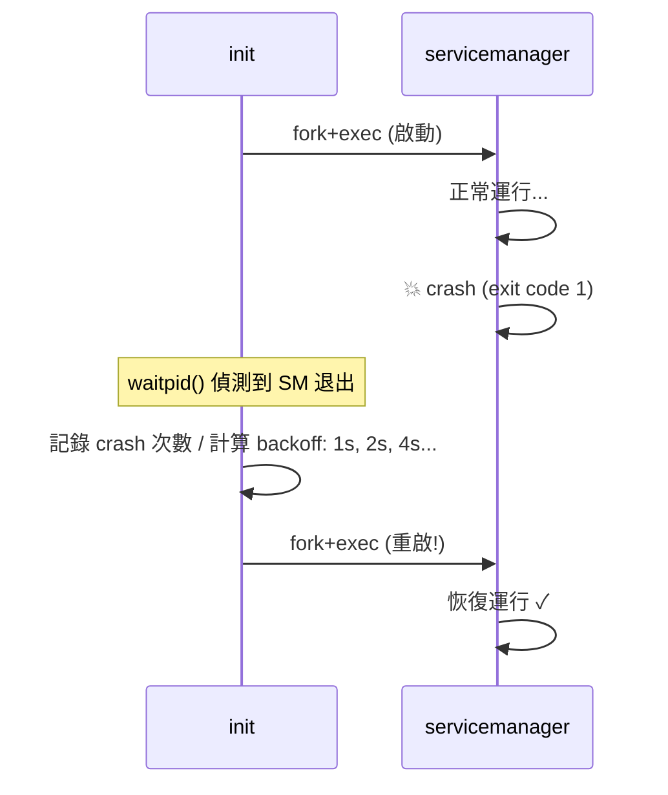
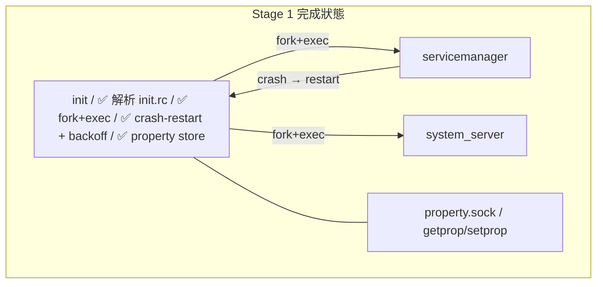

## Stage 1：init 強化

> **目標：** 讓 init 能自動重啟 crash 的 service，並提供 property store（key-value 設定）。

### 為什麼需要這個

目前的 init 很天真——service 死了就死了。真正的 Android init 會：
1. **自動重啟** crash 的 service（帶 exponential backoff）
2. 區分 **oneshot**（跑一次就好）和 **persistent**（必須一直活著）
3. 提供 **property system**——system-wide 的 key-value store（類似 registry）



### Step 1A：Crash-Restart

#### 🎯 目標

Service crash 後 init 自動重啟它，帶 exponential backoff（1s → 2s → 4s → 最多 60s）。

#### 📋 動手做

**修改檔案：** `system/core/init/main.cpp`, `system/core/rootdir/init.rc`

1. 在 `Service` struct 加入：
 ```cpp
 int restart_count = 0;
 bool oneshot = false; // true = 不重啟
 time_t last_crash_time = 0;
 ```

2. `init.rc` 新增語法：
 ```
 service servicemanager /path/to/servicemanager
 restart always # crash 後自動重啟（預設）

 service hello_app /path/to/HelloApp.jar
 restart oneshot # 跑完就算了
 ```

3. 在 `waitpid()` loop 裡：
 - Service 退出時，檢查是 oneshot 還是 persistent
 - Persistent service crash → 算 backoff delay → `sleep(delay)` → 重新 `fork+exec`
 - 如果 4 分鐘內 crash 超過 5 次，印 warning 但繼續重啟

4. 寫一個故意 crash 的測試 service `tests/crashy_service.cpp`：
 - 啟動後 2 秒 exit(1)
 - 用它測試 init 的 restart 邏輯

#### ✅ 驗證

```bash
# 編譯後，修改 init.rc 加入 crashy_service
./scripts/start.sh
# 預期：
# [init] Starting crashy_service (PID 1234)...
# [crashy] Started! Will crash in 2s...
# [init] crashy_service exited with code 1
# [init] Restarting crashy_service in 1s (attempt 1)...
# [init] Starting crashy_service (PID 1235)...
# [crashy] Started! Will crash in 2s...
# [init] crashy_service exited with code 1
# [init] Restarting crashy_service in 2s (attempt 2)...
# ...backoff 持續增加...
```

#### 🆚 真正 AOSP 對照

**去讀真正 AOSP 的 source：**
```
system/core/init/service.cpp → Service::Reap(), Restart()
system/core/init/service.h → Service class, restart_period_, crash_count_
system/core/init/README.md → restart 行為文件
```

真正 AOSP 的 restart 邏輯在 `Service::Reap()` 裡——
service 死了之後，根據 `SVC_ONESHOT` flag 和 `restart_period_` 決定要不要重啟。

我們的實作簡化了：沒有 service class 分組、沒有 `critical` flag（crash 太多次就 reboot）。
但 crash-restart + backoff 的核心概念相同。

#### 📚 學習材料

- **AOSP `init/README.md`** — [在線閱讀](https://cs.android.com/android/platform/superproject/+/main:system/core/init/README.md) — service restart 行為
- **Exponential backoff** — 搜尋 "exponential backoff algorithm"，理解為什麼 1s→2s→4s 而不是固定間隔
- **`man waitpid(2)`** — 理解 `WIFEXITED`, `WIFSIGNALED`, `WEXITSTATUS` 宏

---

### Step 1B：Property Store

#### 🎯 目標

實作 system-wide key-value store，其他 process 可以 get/set properties。

Android 的 property system 用於：
- `ro.build.version` — build 版本（唯讀）
- `sys.boot_completed` — 開機完成 flag
- `persist.sys.language` — 使用者語言設定

#### 📋 動手做

**新增檔案：** `system/core/init/property_store.h` + `.cpp`
**修改檔案：** `system/core/init/main.cpp`

1. 在 init 裡新增一個 `PropertyStore` class：
 - `std::unordered_map<std::string, std::string>` 存 properties
 - 支援 `ro.` prefix 的 property 只能設一次（read-only after first set）

2. 開一個 Unix socket `/tmp/mini-aosp/property.sock`，接受指令：
 ```
 GETPROP <key>\n → <value>\n 或 NOT_FOUND\n
 SETPROP <key> <value>\n → OK\n 或 READ_ONLY\n
 LISTPROP\n → key1=value1\nkey2=value2\n...\n
 ```

3. init 啟動時設定初始 properties：
 ```
 ro.build.version = "mini-aosp-0.1"
 ro.build.type = "eng"
 sys.boot_completed = "0" ← 所有 service 啟動完畢後改成 "1"
 ```

4. 寫一個 CLI 工具 `tools/getprop.sh` / `tools/setprop.sh`：
 ```bash
 # 用 socat 或 nc 連到 property socket
 echo "GETPROP ro.build.version" | socat - UNIX-CONNECT:/tmp/mini-aosp/property.sock
 ```

#### ✅ 驗證

```bash
./scripts/start.sh &
# 等 init 跑起來後：
echo "GETPROP ro.build.version" | socat - UNIX-CONNECT:/tmp/mini-aosp/property.sock
# → mini-aosp-0.1

echo "SETPROP my.custom.key hello" | socat - UNIX-CONNECT:/tmp/mini-aosp/property.sock
# → OK

echo "SETPROP ro.build.version hacked" | socat - UNIX-CONNECT:/tmp/mini-aosp/property.sock
# → READ_ONLY

echo "LISTPROP" | socat - UNIX-CONNECT:/tmp/mini-aosp/property.sock
# → ro.build.version=mini-aosp-0.1
# ro.build.type=eng
# sys.boot_completed=1
# my.custom.key=hello
```

#### 🆚 真正 AOSP 對照

| | 真正 AOSP | mini-AOSP |
|---|---|---|
| **儲存** | 共享記憶體（`/dev/__properties__`），mmap 到每個 process | Unix socket request/response |
| **讀取** | 直接讀 mmap，零 syscall，O(1) | Socket round-trip |
| **寫入** | 只有 init 能寫（透過 `property_service` socket） | 任何人都能寫（Stage 3 加權限） |
| **`ro.*`** | 唯讀 property，boot 後不可改 | 同 |

**去讀真正 AOSP 的 source：**
```
system/core/init/property_service.cpp → handle_property_set_fd(), PropertySet()
system/core/init/property_service.h → PropertyInit()
bionic/libc/bionic/system_property_api.cpp → __system_property_get()
```

真正 AOSP 用 shared memory 是為了讀取性能（每個 app 每幀都可能讀 property），
我們用 socket 因為簡單，而且 Stage 0 的流量很小。

#### 📚 學習材料

- **Android Property System** — 搜尋 "Android system properties internals"
- **Shared memory vs socket IPC** — 理解為什麼真正 AOSP 用 mmap
- **`man unix(7)`** — Unix domain socket 完整手冊

---

### Stage 1 完成條件



**驗證：**
```bash
# 1. Crash-restart 測試
# 手動 kill servicemanager，觀察 init 自動重啟它
kill $(cat /tmp/mini-aosp/servicemanager.pid)
# → init 偵測到 crash，1 秒後重啟

# 2. Property 測試
echo "GETPROP sys.boot_completed" | socat - UNIX-CONNECT:/tmp/mini-aosp/property.sock
# → 1
```

通過後就可以進 Stage 2。

---
