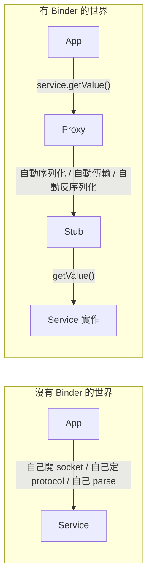
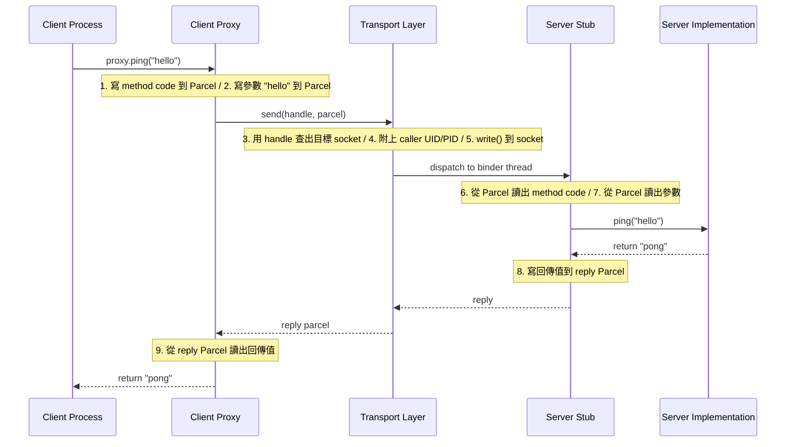
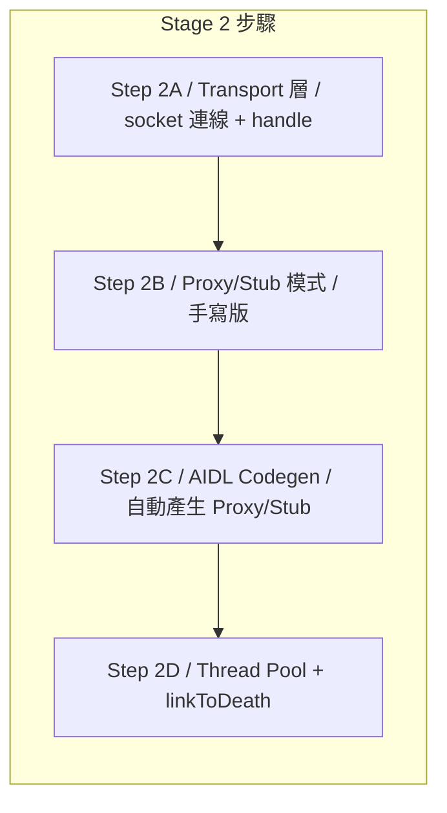
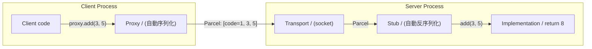
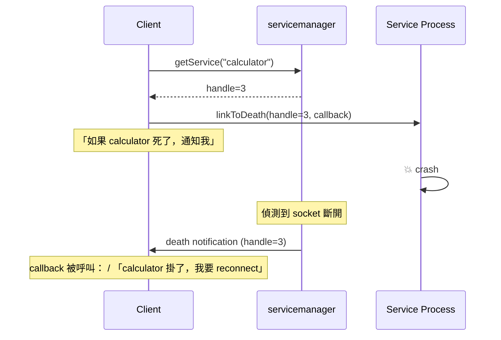
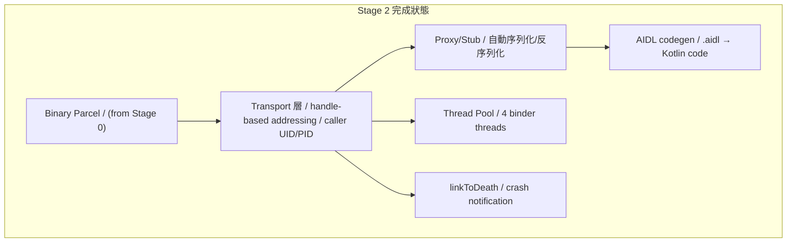

## Stage 2：Binder IPC

> **目標：** 建造 Android 的 IPC 骨幹——讓 Process A 能呼叫 Process B 裡的方法，
> 就像呼叫本地函數一樣。加上 death notification（對方 crash 時收到通知）。
>
> 這是整個 Phase 1 最重要、最大的 Stage。所有後續的 service 互動都建在它上面。

### 為什麼 Binder 這麼重要

Android 裡幾乎所有跨 process 的互動都走 Binder：
- App 呼叫 `startActivity()` → 透過 Binder 呼叫 AMS
- App 讀 GPS 位置 → 透過 Binder 呼叫 LocationManager
- 甚至顯示一個 View → 透過 Binder 跟 SurfaceFlinger 溝通

**一個典型的 Android 手機上，每秒有數千次 Binder transaction。**



Binder 把「跨 process 呼叫」變成「看起來像本地呼叫」——
這叫 **location transparency**（位置透明）。

### 整體架構



我們把這拆成 4 個 Step：



---

### Step 2A：Binder Transport 層

#### 🎯 目標

建造 Binder 的底層：client 和 server 之間的 socket 連線、handle-based addressing、caller identity。

**Handle 是什麼？**
在真正 Binder 裡，每個 service 有一個 integer handle（類似 file descriptor）。
Client 不需要知道 service 的 socket 路徑——它只需要 handle。
servicemanager 永遠是 handle 0。

```
Handle 0 → servicemanager
Handle 1 → ActivityManagerService
Handle 2 → PackageManagerService
...
```

#### 📋 動手做

**新增/修改檔案：**
- `frameworks/native/libs/binder/Binder.h` + `.cpp` — 大幅升級
- `frameworks/native/libs/binder/IPCThreadState.h` + `.cpp` — transport 層核心
- `frameworks/base/core/kotlin/os/Binder.kt` — Kotlin 側

1. **定義 Transaction 結構**（在 Parcel 上層）：

 ```
 Transaction wire format:
 ┌──────────┬──────────┬──────────┬──────────┬───────────────┐
 │ handle │ code │ flags │ data_len │ data (Parcel) │
 │ int32 │ int32 │ int32 │ int32 │ N bytes │
 └──────────┴──────────┴──────────┴──────────┴───────────────┘

 Reply wire format:
 ┌──────────┬──────────┬───────────────┐
 │ status │ data_len │ data (Parcel) │
 │ int32 │ int32 │ N bytes │
 └──────────┴──────────┴───────────────┘
 ```

 - `handle` — 目標 service 的 ID
 - `code` — 方法編號（1=ping, 2=getValue, ...）
 - `flags` — 0=同步（等回覆）, 1=oneway（fire-and-forget）

2. **C++ `IPCThreadState`** class — 每個 thread 一個：
 - `transact(handle, code, data, reply, flags)` — 送 transaction，等 reply
 - 內部：連到 servicemanager 用 handle 查出目標 socket path → connect → write transaction → read reply
 - 用 `SO_PEERCRED`（Linux）讀取 caller 的 UID/PID

3. **Kotlin `Binder`** class：
 - `transact(code, data, reply, flags)` — 被 Proxy 呼叫
 - `onTransact(code, data, reply, flags)` — 被 Stub 覆寫

4. 寫一個手動測試——兩個 process：
 - Server：開 socket，等 transaction，回 reply
 - Client：連 socket，送 transaction，讀 reply

#### ✅ 驗證

```bash
make -C build test_binder_transport

# Terminal 1: 啟動 server
./out/bin/test_binder_server
# [server] Listening on /tmp/mini-aosp/test_service.sock

# Terminal 2: 跑 client
./out/bin/test_binder_client
# [client] Sending transaction: code=1, data="hello"
# [server] Received: code=1, data="hello", caller_uid=1000, caller_pid=12345
# [client] Reply: status=0, data="world"
# [test] ✓ Binder transport works
```

#### 🔍 做完後讀這段

**Handle-based addressing 的好處**

為什麼不直接用 socket path，要多一層 handle？

1. **間接層（indirection）** — 如果 service restart 換了 socket path，handle 不變，
 client 不需要更新
2. **權限控制** — servicemanager 可以拒絕給某些 client handle
 （「你沒有權限存取 LocationManager」）
3. **Reference counting** — 知道有幾個 client 持有某個 service 的 handle，
 沒人用了就可以回收

**SO_PEERCRED 是什麼？**

Linux 的 Unix domain socket 有一個特殊能力：
`getsockopt(fd, SOL_SOCKET, SO_PEERCRED, &cred, &len)`
可以取得連線對方的 UID 和 PID——**而且是 kernel 保證的，不能偽造。**

這是 Android 安全模型的基石。當 App 呼叫 `startActivity()` 時，
AMS 能從 Binder 拿到 caller 的 UID，查出是哪個 app，
再根據它的 permission 決定要不要放行。

> ⚠️ **macOS 注意：** macOS 有 `LOCAL_PEERCRED` 但 API 不同。
> 如果在 macOS 開發，可以先略過 UID/PID，部署到 Linux 再加。

#### 🆚 真正 AOSP 對照

| | 真正 AOSP | mini-AOSP |
|---|---|---|
| **Transport** | `/dev/binder` kernel driver，`ioctl()` | Unix domain socket，`read()/write()` |
| **Handle** | Kernel 維護的 handle table（per-process） | 自己在 user space 維護的 map |
| **Identity** | Kernel stamp UID/PID 到每個 transaction | `SO_PEERCRED` |
| **Copy 次數** | 1 次（mmap，zero-copy reply） | 2 次（user→kernel→user） |
| **檔案** | `frameworks/native/libs/binder/IPCThreadState.cpp` | 同路徑 |

**去讀真正 AOSP 的 source：**
```
frameworks/native/libs/binder/IPCThreadState.cpp → transact(), writeTransactionData(), waitForResponse()
frameworks/native/libs/binder/Binder.cpp → BBinder::transact(), BpBinder::transact()
drivers/android/binder.c (kernel) → binder_ioctl(), binder_thread_write()
```

重點看 `IPCThreadState::transact()` — 它寫 transaction data 到 `mOut` buffer，
然後 `talkWithDriver()` 用 `ioctl(BINDER_WRITE_READ)` 跟 kernel 互動。
我們用 socket `write()` + `read()` 取代 `ioctl()`，但流程結構相同。

#### 📚 學習材料

- **"Android Binder IPC Mechanism" 論文** — 搜尋這個標題，有幾篇很好的深度解析
- **AOSP Binder overview** — [source.android.com/docs/core/architecture/hidl/binder-ipc](https://source.android.com/docs/core/architecture/hidl/binder-ipc)
- **`man getsockopt(2)`** — `SO_PEERCRED` 的文件
- **"Binder for dummies"** — 搜尋 "android binder for dummies"，有不少 blog 用圖解解釋

---

### Step 2B：Proxy/Stub 模式（手寫版）

#### 🎯 目標

用 Proxy/Stub pattern 包裝 Step 2A 的 raw transport，讓跨 process 呼叫看起來像本地呼叫。

**先手寫一對 Proxy/Stub**，理解 pattern 後再寫 codegen。

> **命名慣例（follow AOSP）：**
> - `I*` = interface（如 `ICalculator`）
> - `Bp*` = **B**inder **P**roxy — client 側，負責序列化參數 + 送 transaction
> - `Bn*` = **B**inder **N**ative — server 側（Stub），負責反序列化 + 呼叫實作
>
> 我們使用跟 AOSP 相同的命名，這樣讀真正 AOSP source 時能直接對應。



#### 📋 動手做

我們以一個 `ICalculator` interface 為例：

1. **定義 interface**（先用 Kotlin，還不是 AIDL）：

 ```kotlin
 interface ICalculator {
 fun add(a: Int, b: Int): Int // code = 1
 fun multiply(a: Int, b: Int): Int // code = 2
 }
 ```

2. **手寫 BpCalculator（Binder Proxy）**（client 側）：
 ```kotlin
 class BpCalculator(private val handle: Int) : ICalculator {
 override fun add(a: Int, b: Int): Int {
 val data = Parcel()
 data.writeInt32(a)
 data.writeInt32(b)
 val reply = Parcel()
 // 送到 handle，method code=1
 transact(handle, 1, data, reply)
 return reply.readInt32()
 }
 // multiply 同理，code=2
 }
 ```

3. **手寫 BnCalculator（Binder Native / Stub）**（server 側）：
 ```kotlin
 abstract class BnCalculator : ICalculator {
 fun onTransact(code: Int, data: Parcel, reply: Parcel) {
 when (code) {
 1 -> {
 val a = data.readInt32()
 val b = data.readInt32()
 val result = add(a, b)
 reply.writeInt32(result)
 }
 2 -> { /* multiply */ }
 }
 }
 }
 ```

4. **寫 Implementation**：
 ```kotlin
 class CalculatorImpl : BnCalculator() {
 override fun add(a: Int, b: Int) = a + b
 override fun multiply(a: Int, b: Int) = a * b
 }
 ```

5. **兩個 process 測試**：
 - Server process 建立 CalculatorImpl，監聯 socket
 - Client process 建立 BpCalculator，呼叫 `add(3, 5)` → 得到 8

#### ✅ 驗證

```bash
# Terminal 1
java -jar out/jar/test_binder_server.jar
# [server] CalculatorService listening...

# Terminal 2
java -jar out/jar/test_binder_client.jar
# [client] proxy.add(3, 5) = 8
# [client] proxy.multiply(4, 7) = 28
# [test] ✓ Proxy/Stub pattern works across processes
```

#### 🔍 做完後讀這段

**Proxy/Stub 模式的核心洞察**

寫完你會發現 Proxy 和 Stub 的程式碼非常機械化——
它們就是在做「把參數寫進 Parcel」和「從 Parcel 讀出參數」的重複工作。

```
Interface: fun add(a: Int, b: Int): Int

Proxy: data.writeInt32(a) ← 寫參數
 data.writeInt32(b)
 transact(1, data, reply)
 return reply.readInt32() ← 讀回傳值

Stub: val a = data.readInt32() ← 讀參數
 val b = data.readInt32()
 val result = add(a, b) ← 呼叫實作
 reply.writeInt32(result) ← 寫回傳值
```

**每一對 Proxy/Stub 的結構都一樣**——只有參數類型和數量不同。
這就是為什麼 Android 用 AIDL codegen 自動產生它們（下一個 Step）。

#### 🆚 真正 AOSP 對照

**去讀真正 AOSP 的 source（手寫的 Proxy/Stub 範例）：**
```
frameworks/native/libs/binder/IServiceManager.cpp
 → BpServiceManager::addService() ← 這就是 Proxy（Bp = Binder Proxy）
 → BnServiceManager::onTransact() ← 這就是 Stub（Bn = Binder Native）
```

注意 AOSP 的命名慣例：
- `I*` = interface（如 `IServiceManager`）
- `Bp*` = Binder Proxy（client 側）
- `Bn*` = Binder Native / Stub（server 側）

我們的命名更直白（`*Proxy` / `*Stub`），但結構一致。

#### 📚 學習材料

- **Design Patterns: Proxy Pattern** — 搜尋 "proxy pattern explained"
- **RPC (Remote Procedure Call)** — Binder 本質上就是 RPC，搜尋 "what is RPC"
- **AOSP `IServiceManager.cpp`** — [在線閱讀](https://cs.android.com/android/platform/superproject/+/main:frameworks/native/libs/binder/IServiceManager.cpp) — 最好的手寫 Proxy/Stub 範例

---

### Step 2C：AIDL Codegen

#### 🎯 目標

寫一個 code generator：讀 `.aidl` 檔案，自動產生 Proxy/Stub Kotlin 程式碼。

這樣之後每增加一個 service interface，只需要寫 `.aidl`，
不需要手寫重複的 Parcel read/write code。

#### 📋 動手做

**修改檔案：** `tools/aidl/codegen.py`
**新增範例：** `frameworks/aidl/ICalculator.aidl`

1. **定義簡化的 AIDL 語法**：

 ```
 // ICalculator.aidl
 interface ICalculator {
 int add(int a, int b);
 int multiply(int a, int b);
 String echo(String msg);
 }
 ```

 支援的類型（Phase 1）：`int`, `long`, `boolean`, `String`, `byte[]`

2. **codegen.py 輸入/輸出**：

 ```bash
 python3 tools/aidl/codegen.py frameworks/aidl/ICalculator.aidl \
 --lang kotlin \
 --out frameworks/base/core/kotlin/generated/
 ```

 產生三個檔案：
 - `ICalculator.kt` — interface 定義
 - `BpCalculator.kt` — client 側 Proxy
 - `BnCalculator.kt` — server 側 Stub

3. **Codegen 邏輯**：
 - Parse `.aidl` 檔案（簡單的 line-by-line，不需要完整 parser）
 - 每個 method：
 - 分配 method code（1, 2, 3...）
 - Proxy：為每個參數生成 `parcel.writeXxx()`，最後 `transact()`
 - Stub：為每個參數生成 `parcel.readXxx()`，呼叫 interface 方法

4. **驗證 codegen 輸出**：
 用 codegen 產生的 Proxy/Stub 取代 Step 2B 手寫的版本，
 確認測試結果不變。

#### ✅ 驗證

```bash
# 1. 產生 code
python3 tools/aidl/codegen.py frameworks/aidl/ICalculator.aidl \
 --lang kotlin --out frameworks/base/core/kotlin/generated/

# 2. 檢查產生的檔案
cat frameworks/base/core/kotlin/generated/BpCalculator.kt
# 應該看到自動產生的 add(), multiply(), echo() proxy code

# 3. 用 codegen 的 Proxy/Stub rebuild + 跑測試
make -C build test_binder_codegen
java -jar out/jar/test_binder_codegen.jar
# [test] proxy.add(3, 5) = 8 (via generated proxy/stub)
# [test] proxy.echo("hi") = "hi" (via generated proxy/stub)
# [test] ✓ AIDL codegen works
```

#### 🔍 做完後讀這段

**為什麼要 codegen 而不是 reflection？**

Java/Kotlin 有 reflection，理論上可以在 runtime 自動序列化。
Android 選擇 compile-time codegen 是因為：

1. **速度** — codegen 的 code 是直接的 `writeInt(a)` 呼叫，沒有 reflection overhead
2. **類型安全** — compile-time 就能抓到 type mismatch
3. **跨語言** — AIDL 可以同時產生 Java、C++、Rust code，靠 reflection 做不到

**AIDL 的演化**

| 時期 | AIDL 狀態 |
|------|----------|
| Android 1.0 | 只支援 Java |
| Android 10 | 加入 stable AIDL（版本管理） |
| Android 11+ | 加入 C++/NDK/Rust backend |
| Android 13+ | 取代 HIDL（HAL 的 IDL） |

我們只做 Kotlin backend，但概念跟 multi-backend codegen 完全相同。

#### 🆚 真正 AOSP 對照

| | 真正 AOSP | mini-AOSP |
|---|---|---|
| **工具** | `aidl` compiler（C++，非常複雜） | Python script（~200 行） |
| **輸入** | `.aidl` file | 同（語法簡化） |
| **輸出** | Java + C++ + Rust proxy/stub | Kotlin proxy/stub only |
| **型別** | 所有 Java types + Parcelable + FileDescriptor | int, long, boolean, String, byte[] |

**去讀真正 AOSP 的 source：**
```
system/tools/aidl/ → AIDL compiler source code
system/tools/aidl/generate_java.cpp → Java codegen 邏輯
system/tools/aidl/aidl_language_y.yy → AIDL 語法定義（yacc grammar）
out/soong/.intermediates/.../IServiceManager.java → 範例 codegen 輸出
```

真正的 AIDL compiler 用 yacc parser，非常複雜。
我們的 Python script 用 regex line-by-line parsing，足夠教學用。

#### 📚 學習材料

- **AIDL 官方文件** — [developer.android.com/guide/components/aidl](https://developer.android.com/guide/components/aidl)
- **Code generation pattern** — 搜尋 "code generation vs reflection"
- **Protocol Buffers** — 作為對照，看 protobuf 的 codegen 怎麼做（`protoc` compiler）

---

### Step 2D：Thread Pool + linkToDeath

#### 🎯 目標

1. **Thread pool** — server 端用多個 thread 處理同時進來的 Binder 請求
2. **linkToDeath** — 當持有 handle 的 service process crash 時，通知所有 client

#### 📋 動手做

**Part 1: Thread Pool**

目前 server 是單 thread 依序處理請求——如果一個請求很慢，後面的全部卡住。

1. Server 啟動時建立 N 個 binder thread（Android 預設 15，我們用 4）
2. 每個 thread 都在 `accept()` → `handle_client()` 的 loop
3. 或者用一個 accept thread + worker thread pool（producer-consumer）

**修改：** `frameworks/native/libs/binder/IPCThreadState.cpp`（C++ 側）
和 `frameworks/base/core/kotlin/os/Binder.kt`（Kotlin 側）

**Part 2: linkToDeath**



1. Client 呼叫 `linkToDeath(handle, deathRecipient)` 註冊一個 callback
2. Transport 層監聽 socket 連線——如果對方斷開，觸發所有註冊的 deathRecipient
3. `DeathRecipient` interface：`fun binderDied(handle: Int)`

**Kotlin 側：**
```kotlin
interface DeathRecipient {
 fun binderDied()
}

class BinderProxy(val handle: Int) {
 fun linkToDeath(recipient: DeathRecipient, flags: Int)
 fun unlinkToDeath(recipient: DeathRecipient)
}
```

**偵測方式：** 對 socket 做 `read()`，如果回傳 0（EOF）或 error，表示對方掛了。
可以用 Looper 的 `addFd()` 監聽。

#### ✅ 驗證

**Thread Pool 測試：**
```bash
# Server 啟動 4 個 binder thread
# Client 同時發 10 個請求（每個 sleep 100ms 模擬慢操作）
# 驗證 4 個請求並行，10 個在 ~300ms 內完成（不是 1000ms）
java -jar out/jar/test_thread_pool.jar
# [server] Binder thread pool: 4 threads
# [client] 10 concurrent requests completed in ~300ms
# [test] ✓ Thread pool works
```

**linkToDeath 測試：**
```bash
# 啟動 server，client linkToDeath
# kill server process
# 驗證 client 收到 death notification
java -jar out/jar/test_link_to_death.jar
# [client] Linked to service (handle=1)
# [server] Running... will crash in 2s
# [server] 💥 exit
# [client] binderDied() called! Service is gone.
# [test] ✓ linkToDeath works
```

#### 🔍 做完後讀這段

**為什麼 linkToDeath 很重要？**

想像 App A bind 到 MusicService（在 App B 的 process 裡）。
如果 App B crash 了，App A 手上的 proxy 就變成殭屍——
呼叫任何方法都會 fail。

沒有 linkToDeath 的話，App A 只能在下次呼叫 fail 時才發現。
有了 linkToDeath，App A **立刻收到通知**，可以：
- 清理 UI（「音樂播放已停止」）
- 嘗試重新 bind
- 或者自己也 graceful shutdown

這就是 Android 裡 **robust service interaction** 的基礎。

**Thread pool 在真正 Android 裡**

system_server 啟動 31 個 binder thread。
每個 thread 等在 `ioctl(BINDER_WRITE_READ)` 上。
Kernel 會把 incoming transaction 分配給空閒的 thread。

如果所有 31 個 thread 都忙，新的請求就 block——
這就是 "binder thread exhaustion"，一種常見的 Android performance 問題。

#### 🆚 真正 AOSP 對照

| | 真正 AOSP | mini-AOSP |
|---|---|---|
| **Thread pool** | `ProcessState::startThreadPool()` + kernel 分配 | 自己管理的 thread pool |
| **預設 thread 數** | 15 (app) / 31 (system_server) | 4 |
| **linkToDeath** | Kernel 維護 death notification list | Socket EOF 偵測 |
| **通知方式** | Kernel 寫 `BR_DEAD_BINDER` 到 thread | Looper fd callback |

**去讀真正 AOSP 的 source：**
```
frameworks/native/libs/binder/ProcessState.cpp → startThreadPool(), spawnPooledThread()
frameworks/native/libs/binder/BpBinder.cpp → linkToDeath(), sendObituary()
frameworks/native/libs/binder/IPCThreadState.cpp → joinThreadPool() — 每個 binder thread 的主迴圈
```

重點看 `BpBinder::sendObituary()` — 當 kernel 通知 binder 對方死了，
它遍歷所有 registered `DeathRecipient` 並呼叫 `binderDied()`。

#### 📚 學習材料

- **Thread pool pattern** — 搜尋 "thread pool pattern explained"
- **Observer pattern** — linkToDeath 本質上是 observer pattern，搜尋 "observer pattern"
- **AOSP `BpBinder.cpp`** — [在線閱讀](https://cs.android.com/android/platform/superproject/+/main:frameworks/native/libs/binder/BpBinder.cpp) — `linkToDeath` 的實作

---

### Stage 2 完成條件



**完整驗證——10k transaction 壓力測試：**
```bash
java -jar out/jar/test_binder_stress.jar
# [test] Sending 10,000 transactions...
# [test] All 10,000 completed, 0 errors
# [test] Avg latency: 0.2ms, p99: 1.1ms
# [test] No leaked sockets or threads
# [test] ✓ Binder IPC is production-ready for Phase 1
```

通過後就可以進 Stage 3（用 Binder 重寫 servicemanager）。

---
