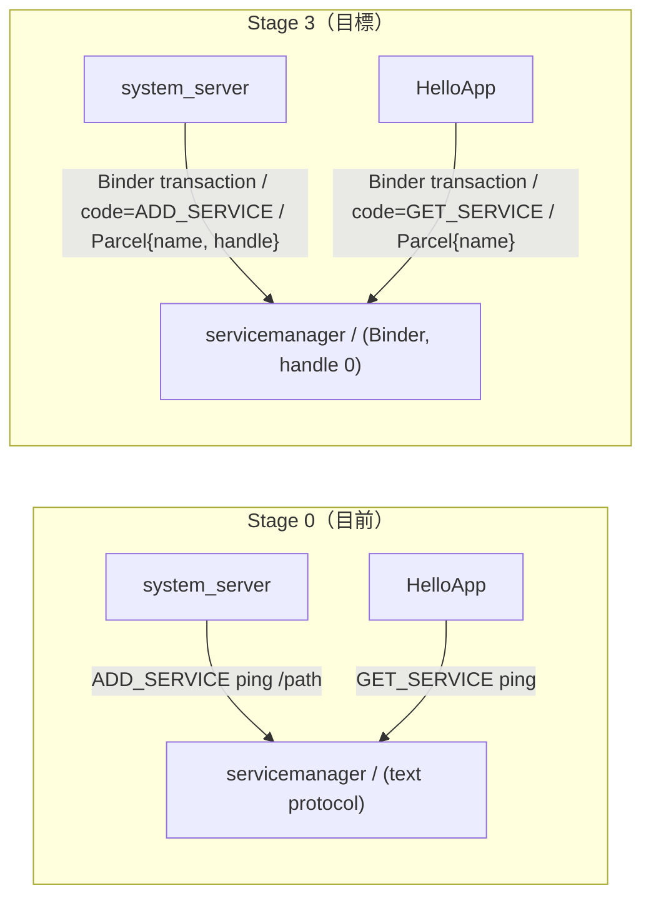
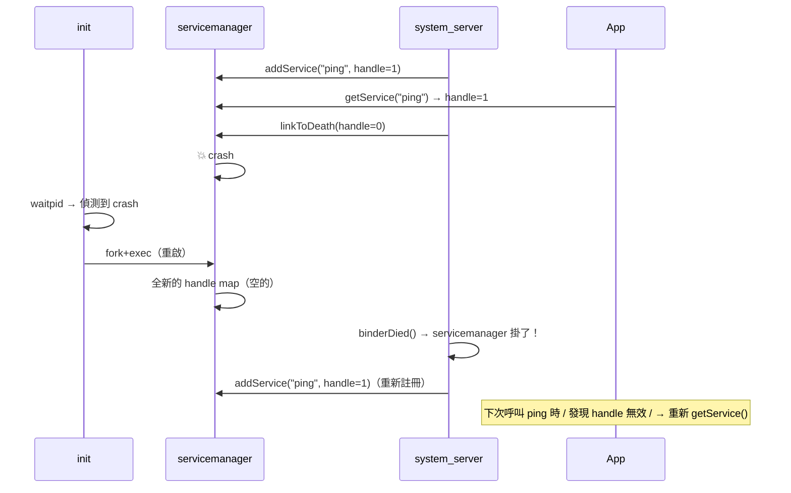
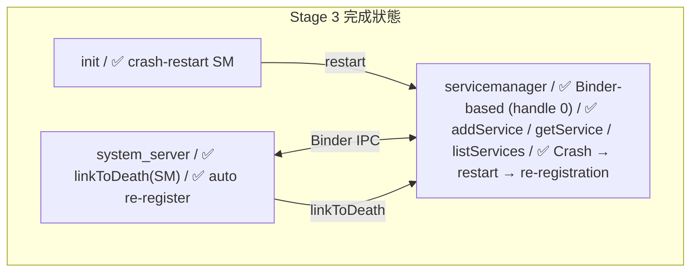

## Stage 3：servicemanager 改用 Binder

> **目標：** 把 Stage 0 的 text-based servicemanager 改成 Binder-based。
> 它是 handle 0——所有 process 啟動後第一個連的對象。

### 為什麼要重寫

目前 servicemanager 用 `ADD_SERVICE ping /tmp/mini-aosp/ping.sock\n` 的 text protocol。
這在 Stage 0 夠用，但有幾個問題：

1. **沒有型別安全** — 傳的全是 string，打錯字只能 runtime 才發現
2. **沒有 caller identity** — 不知道是誰在註冊/查詢
3. **跟 Binder 不統一** — 別的 service 走 Binder，servicemanager 走自己的 protocol

真正 Android 裡 servicemanager 就是一個 Binder service，用 `IServiceManager.aidl` 定義 interface。
所有 process 都用同一套 Binder 機制跟它溝通。



### Step 3A：IServiceManager AIDL + Binder 重寫

#### 🎯 目標

用 AIDL 定義 `IServiceManager` interface，用 Step 2C 的 codegen 產生 Proxy/Stub，
重寫 servicemanager 使用 Binder transport。

#### 📋 動手做

**修改檔案：**
- `frameworks/aidl/IServiceManager.aidl` — 從 placeholder 升級成真正的定義
- `frameworks/native/cmds/servicemanager/main.cpp` — 改用 Binder
- `frameworks/base/core/kotlin/os/ServiceManager.kt` — Kotlin client helper

1. **升級 AIDL 定義：**

 ```
 // IServiceManager.aidl
 interface IServiceManager {
 // 註冊 service：name → binder handle
 void addService(String name, int handle);

 // 查詢 service：name → binder handle，找不到回 -1
 int getService(String name);

 // 列出所有已註冊的 service names
 String[] listServices();
 }
 ```

2. **跑 codegen** 產生 `BpServiceManager.kt` + `BnServiceManager.kt`

3. **重寫 servicemanager（C++）：**
 - 仍然是第一個啟動的 service
 - 監聽固定的 well-known socket：`/tmp/mini-aosp/binder`
 - 自己是 handle 0
 - 內部維護 `map<string, int>` — service name → handle
 - 處理 Binder transaction（用 Stage 2A 的 wire format）

4. **Kotlin client helper `ServiceManager.kt`：**
 ```kotlin
 object ServiceManager {
 fun addService(name: String, binder: IBinder) { ... }
 fun getService(name: String): IBinder? { ... }
 }
 ```
 內部用 `BpServiceManager(handle=0)` 跟 servicemanager 通訊。

5. **修改 system_server 和 HelloApp** — 改用新的 `ServiceManager.addService()` / `getService()`

#### ✅ 驗證

```bash
make -C build all
./scripts/start.sh
# 預期輸出跟 Stage 0 的 PING/PONG 相同，但底層走 Binder：
# [servicemanager] Listening on /tmp/mini-aosp/binder (handle 0)
# [system_server] addService("ping", handle=1) via Binder
# [HelloApp] getService("ping") → handle=1 via Binder
# [HelloApp] PING → PONG — round-trip Xms
# [HelloApp] ✓ Full stack verified (now via Binder IPC)
```

#### 🔍 做完後讀這段

**Handle 0 的特殊地位**

在真正 Android 裡，每個 process 天生就知道 handle 0 = servicemanager。
這是 **hardcoded** 的——不需要查詢，不需要 discover。

這解決了 bootstrap 問題：
> 「我要透過 servicemanager 查詢其他 service，但我怎麼找到 servicemanager 本身？」

答案：handle 0，永遠在那裡。就像 DNS 裡的 root name server。

**servicemanager 的 bootstrap 順序：**
```
1. init 啟動 servicemanager（第一個 service）
2. servicemanager 綁定到 well-known socket，宣告自己是 handle 0
3. init 啟動其他 service（system_server, zygote...）
4. 其他 service 連到 handle 0（servicemanager），註冊自己
5. App 連到 handle 0，查詢想要的 service
```

#### 🆚 真正 AOSP 對照

| | 真正 AOSP | mini-AOSP |
|---|---|---|
| **handle 0** | Kernel Binder driver 的 context manager | 自己的 handle map 裡 handle 0 |
| **AIDL** | `IServiceManager.aidl` → Java + C++ | 同 → Kotlin |
| **成為 context manager** | `ioctl(BINDER_SET_CONTEXT_MGR)` | 綁定 well-known socket path |
| **檔案** | `frameworks/native/cmds/servicemanager/ServiceManager.cpp` | 同路徑 `main.cpp` |

**去讀真正 AOSP 的 source：**
```
frameworks/native/cmds/servicemanager/ServiceManager.cpp → addService(), getService()
frameworks/native/cmds/servicemanager/main.cpp → main()，成為 context manager
frameworks/native/libs/binder/IServiceManager.cpp → defaultServiceManager()
```

重點看 `ServiceManager::addService()` — 它檢查 caller 的 UID
（只有 `AID_SYSTEM` 等特權 UID 能註冊 service）。
我們 Stage 3 先不做權限檢查，Stage 8 再加。

#### 📚 學習材料

- **Service discovery pattern** — 搜尋 "service discovery pattern microservices"，概念相同
- **Bootstrap problem** — 搜尋 "bootstrapping problem in distributed systems"
- **AOSP ServiceManager source** — [在線閱讀](https://cs.android.com/android/platform/superproject/+/main:frameworks/native/cmds/servicemanager/ServiceManager.cpp)

---

### Step 3B：Crash Recovery — servicemanager restart

#### 🎯 目標

servicemanager crash 後 init 重啟它，所有 service 需要重新註冊。
測試整個系統在 servicemanager crash → restart 後能恢復。

#### 📋 動手做

1. **servicemanager 重啟後的問題：**
 - Handle map 清空了（所有 service 的 handle 都丟了）
 - 已連線的 client socket 全斷
 - 之前的 linkToDeath 全失效

2. **解法——re-registration 機制：**
 - system_server 用 `linkToDeath(handle=0)` 監聽 servicemanager
 - servicemanager crash → system_server 收到 `binderDied()`
 - system_server 重新連到新的 servicemanager，重新 `addService()` 所有 service
 - Client 會收到自己 service 的 `binderDied()`，需要重新 `getService()`

3. **在 init.rc 裡，servicemanager 標記為 `restart always`**（Stage 1A 的功能）

4. **寫測試腳本：**
 - 啟動系統 → service 全部註冊 → kill servicemanager → 驗證自動恢復



#### ✅ 驗證

```bash
./scripts/start.sh &
sleep 3

# 驗證 service 正常
echo "LIST_SERVICES" | ... # → 有 ping

# 殺掉 servicemanager
kill $(cat /tmp/mini-aosp/servicemanager.pid)

# 等 init 重啟它（1-2 秒）
sleep 3

# 驗證 service 重新註冊
echo "LIST_SERVICES" | ... # → 又有 ping 了

# 跑一次 PING/PONG 驗證完整流程恢復
java -jar out/jar/HelloApp.jar
# → PONG（成功 = 恢復正常）
```

#### 🔍 做完後讀這段

**真正 Android 裡 servicemanager crash 會怎樣？**

幾乎所有 system service 都會收到 death notification 然後重新註冊。
但在 servicemanager 重啟的那幾百毫秒裡，所有 `getService()` 都會 block 或 fail。

這在真正 Android 上其實很少發生——servicemanager 是最穩定的 daemon 之一。
但測試它的 recovery 路徑是驗證系統 robustness 的好方法。

**比較：如果 system_server crash？**

那更嚴重——Android 會 reboot（soft reboot）。
因為 system_server 裡有太多 stateful service（AMS, PMS...），
重建它們的 state 不如直接重啟整個 framework。

我們在 Stage 8 會處理這個。

#### 📚 學習材料

- **Circuit breaker pattern** — 搜尋 "circuit breaker pattern"，類似的 failure recovery 概念
- **Android system crash recovery** — 搜尋 "what happens when android system server crashes"

---

### Stage 3 完成條件



**驗證：**
```bash
# 1. 正常 flow
make -C build && ./scripts/start.sh
# → PING/PONG 成功，走 Binder

# 2. Crash recovery
kill $(cat /tmp/mini-aosp/servicemanager.pid)
sleep 3
java -jar out/jar/HelloApp.jar
# → PONG（servicemanager 已恢復）
```

通過後就可以進 Stage 4。

---
