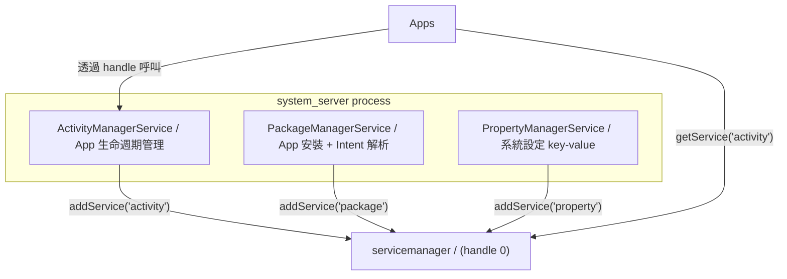
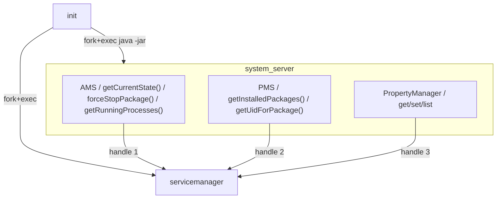

## Stage 4：system_server + Core Managers

> **目標：** 把 system_server 從只有 PingService 的 demo，
> 升級成真正 host 多個 framework service 的容器。

### 這些 Manager 是什麼

在真正 Android 裡，system_server 啟動後會載入 100+ 個 service。
我們只建三個最核心的：

| Manager | 對應真正 AOSP | 用途 |
|---------|-------------|------|
| **ActivityManagerService (AMS)** | `ActivityManagerService.java` | 管理 app lifecycle、process 優先順序、force-stop |
| **PackageManagerService (PMS)** | `PackageManagerService.java` | 掃描 manifest、分配 UID、resolve intent |
| **PropertyManagerService** | `SettingsProvider` / property_service | 暴露 property store（Stage 1B）over Binder |



---

### Step 4A：system_server 架構 + AMS Stub

#### 🎯 目標

重構 system_server 成一個 service 容器——按順序初始化 + 註冊多個 manager。
AMS 先是 stub（能被呼叫，但只有基本功能），Stage 6-8 再逐步完善。

#### 📋 動手做

**修改檔案：**
- `frameworks/base/services/core/kotlin/SystemServer.kt` — 重構
- **新增：** `frameworks/base/services/core/kotlin/am/ActivityManagerService.kt`
- **新增：** `frameworks/aidl/IActivityManager.aidl`

1. **重構 SystemServer.kt：**

 ```kotlin
 object SystemServer {
 fun main(args: Array<String>) {
 Log.i(TAG, "Starting services...")

 // Phase 1: Boot-critical services
 startBootstrapServices()

 // Phase 2: Core services
 startCoreServices()

 // Phase 3: Other services
 startOtherServices()

 Log.i(TAG, "All services started.")

 // Enter looper — 永遠不回傳
 Looper.loop()
 }

 // AMS 必須在 PMS 之前——跟真正 AOSP 一樣
 // PMS 依賴 AMS 來追蹤 app process state
 private fun startBootstrapServices() {
 val ams = ActivityManagerService()
 ServiceManager.addService("activity", ams)
 Log.i(TAG, "Registered: activity (AMS)")

 val pms = PackageManagerService()
 ServiceManager.addService("package", pms)
 Log.i(TAG, "Registered: package (PMS)")
 }

 private fun startCoreServices() {
 // Core services that depend on AMS + PMS being ready
 }

 private fun startOtherServices() {
 val prop = PropertyManagerService()
 ServiceManager.addService("property", prop)
 Log.i(TAG, "Registered: property")
 }
 }
 ```

2. **IActivityManager.aidl（Stage 4 的 stub 版）：**

 ```
 interface IActivityManager {
 // Stage 6 才實作完整版
 int getCurrentState(); // 回傳系統狀態
 void forceStopPackage(String packageName); // 強制停止 app
 String[] getRunningProcesses(); // 列出執行中的 process
 }
 ```

3. **AMS stub 實作：**
 - `getCurrentState()` → 回傳 `BOOT_COMPLETED` 常數
 - `forceStopPackage()` → 印 log（Stage 8 才真的 kill）
 - `getRunningProcesses()` → 回傳空 array（Stage 6 才追蹤）

4. **codegen 產生 Proxy/Stub**，用它跟 servicemanager 對接

#### ✅ 驗證

```bash
make -C build all
./scripts/start.sh &
sleep 3

# 驗證三個 service 都註冊了
# （用 servicemanager 的 listServices）
java -jar out/jar/test_list_services.jar
# [test] Services registered: activity, package, property
# [test] ✓ All managers registered

# 驗證 AMS 能被呼叫
java -jar out/jar/test_ams_client.jar
# [test] AMS.getCurrentState() = BOOT_COMPLETED
# [test] AMS.getRunningProcesses() = []
# [test] ✓ AMS stub responds via Binder
```

#### 🔍 做完後讀這段

**真正 system_server 的啟動順序**

真正 AOSP 的 `SystemServer.java` 也有三個 phase，而且**順序非常重要**：

```java
// frameworks/base/services/java/com/android/server/SystemServer.java
startBootstrapServices(); // AMS, PMS, PowerManager — 最核心，互相依賴
startCoreServices(); // BatteryService, UsageStatsService
startOtherServices(); // NetworkManager, LocationManager, 100+ services
```

AMS 和 PMS 必須先啟動，因為幾乎所有其他 service 都依賴它們。
例如 NetworkManager 需要 PMS 來檢查 app 的 network permission。

**我們的簡化版也保留了這個三階段結構，** 讓你理解 bootstrap 順序的概念。

#### 🆚 真正 AOSP 對照

**去讀真正 AOSP 的 source：**
```
frameworks/base/services/java/com/android/server/SystemServer.java
 → main(), run(), startBootstrapServices(), startCoreServices()

frameworks/base/services/core/java/com/android/server/am/ActivityManagerService.java
 → 23,000+ 行的巨型 class，先瀏覽目錄和 public 方法

frameworks/base/core/java/android/app/IActivityManager.aidl
 → 真正的 AMS AIDL 定義
```

建議先看 `SystemServer.java` 的 `startBootstrapServices()` — 只看它呼叫了哪些 `new XxxService()`
和 `ServiceManager.addService()`，跳過細節。

#### 📚 學習材料

- **"Android SystemServer boot" blog** — 搜尋這個，有很多 boot flow 圖解
- **Dependency injection / service container pattern** — system_server 本質上是個 service container

---

### Step 4B：PackageManagerService + PropertyManagerService Stubs

#### 🎯 目標

完成剩下兩個 manager 的 stub，讓三個核心 service 都能被外部呼叫。

#### 📋 動手做

**新增檔案：**
- `frameworks/aidl/IPackageManager.aidl`
- `frameworks/aidl/IPropertyManager.aidl`
- `frameworks/base/services/core/kotlin/pm/PackageManagerService.kt`
- `frameworks/base/services/core/kotlin/prop/PropertyManagerService.kt`

1. **IPackageManager.aidl（stub 版）：**
 ```
 interface IPackageManager {
 String[] getInstalledPackages();
 int getUidForPackage(String packageName); // → UID 或 -1
 // Stage 7 再加 resolveIntent()
 }
 ```

2. **PMS stub 實作：**
 - 啟動時掃描 `packages/apps/*/AndroidManifest.json`
 - 讀取 package name
 - 為每個 app 分配 UID（從 10000 開始，跟真 Android 一樣）
 - `getInstalledPackages()` → 回傳所有 package name
 - `getUidForPackage()` → 從 map 查

3. **IPropertyManager.aidl：**
 ```
 interface IPropertyManager {
 String getProperty(String key);
 void setProperty(String key, String value);
 String[] listProperties();
 }
 ```

4. **PropertyManagerService 實作：**
 - 連到 init 的 property socket（Stage 1B）
 - 把 Binder 呼叫轉換成 property socket 指令
 - 或者直接自己維護一份 in-memory map

#### ✅ 驗證

```bash
java -jar out/jar/test_pms_client.jar
# [test] PMS.getInstalledPackages() = [com.miniaosp.helloapp]
# [test] PMS.getUidForPackage("com.miniaosp.helloapp") = 10000
# [test] ✓ PMS stub works

java -jar out/jar/test_prop_client.jar
# [test] PropMgr.getProperty("ro.build.version") = "mini-aosp-0.1"
# [test] PropMgr.setProperty("test.key", "test.value") → OK
# [test] PropMgr.getProperty("test.key") = "test.value"
# [test] ✓ PropertyManager works
```

#### 🆚 真正 AOSP 對照

| | 真正 AOSP | mini-AOSP |
|---|---|---|
| **PMS** | 掃描 `/data/app/*.apk`，解析 binary XML | 掃描 `packages/apps/*/AndroidManifest.json` |
| **UID 分配** | `Settings.java` 持久化到 `/data/system/packages.xml` | In-memory map，重啟後重新分配 |
| **Property** | mmap 共享記憶體 + `property_service` | Binder → in-memory map |
| **起始 UID** | 10000（`FIRST_APPLICATION_UID`） | 同 |

**去讀真正 AOSP 的 source：**
```
frameworks/base/services/core/java/com/android/server/pm/PackageManagerService.java
 → scanDirTracedLI() — 掃描 app 目錄
 → 12,000+ 行，先看 constructor 和 main()

frameworks/base/services/core/java/com/android/server/pm/Settings.java
 → mPackages map — 就是 package name → UID 的 map
```

#### 📚 學習材料

- **Android Package Manager internals** — 搜尋 "android packagemanager internals"
- **UID isolation on Android** — 搜尋 "android app sandbox uid"，理解每個 app 一個 UID 的安全模型

---

### Stage 4 完成條件



**驗證：**
```bash
./scripts/start.sh &
sleep 3

# 所有 service 都在
java -jar out/jar/test_list_services.jar
# → activity, package, property

# 各 manager 都能被呼叫
java -jar out/jar/test_ams_client.jar # → ✓
java -jar out/jar/test_pms_client.jar # → ✓
java -jar out/jar/test_prop_client.jar # → ✓
```

通過後就可以進 Stage 5。

---
