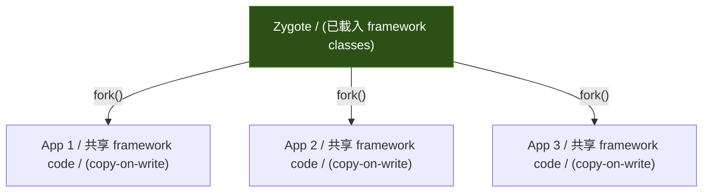
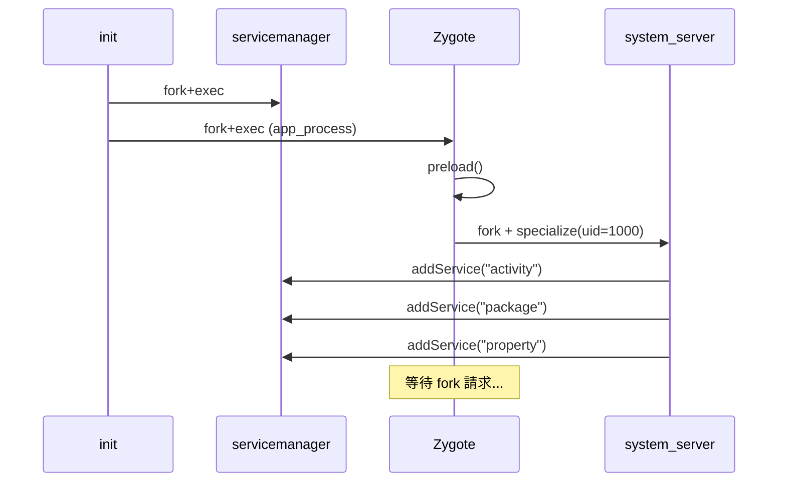

## Stage 5：Zygote

> **目標：** 建造 Android 的 process spawner——
> 所有 app process 都從 Zygote fork 出來，不再由 init 直接啟動。

### 為什麼需要 Zygote

目前每個 Kotlin process 都是 `java -jar xxx.jar` 獨立啟動的。
這有兩個問題：

1. **慢** — 每次啟動都要重新載入 JVM + framework classes（冷啟動 ~2 秒）
2. **浪費記憶體** — 5 個 app = 5 份相同的 framework code 在記憶體裡

Zygote 的解法：**先載入一次共用的 code，然後用 `fork()` 複製出 app process。**



`fork()` 用 **copy-on-write** — child process 跟 parent 共享記憶體頁面，
只有寫入時才複製。所以 5 個 app 的 framework code 實際上只佔一份記憶體。

---

### Step 5A：Zygote — Preload + Fork + Specialize

#### 🎯 目標

寫 Zygote daemon：
1. 啟動時 preload 共用資源
2. 監聽 socket，等待 fork 請求
3. 收到請求後 `fork()` 出 child，設定 UID/env/classpath
4. Child 進入 app 的 `main()`

#### 📋 動手做

**修改檔案：** `frameworks/base/cmds/app_process/main.cpp`（從 stub 升級）
**新增：** Zygote socket protocol

1. **Zygote 主流程（C++）：**

 ```
 main():
 preload() ← 載入共用資源（Phase 1: 幾乎空的）
 listen on /tmp/mini-aosp/zygote.sock

 loop:
 request = accept + read ← 等 fork 請求
 pid = fork()
 if child:
 specialize(request) ← 設 UID, env, argv
 exec("java", "-jar", request.jar_path)
 else:
 report pid to caller
 ```

2. **Fork 請求格式（text，Stage 2 的 Binder 版可以之後升級）：**
 ```
 FORK <package_name> <jar_path> <uid> <gid>\n
 → PID <child_pid>\n
 ```

3. **Specialize — child process 個性化：**
 - `setuid(uid)` / `setgid(gid)` — 設定 Linux UID（需要 root 或 CAP_SETUID）
 - 設定環境變數：`PACKAGE_NAME`, `MINI_AOSP_ROOT`
 - `exec("java", "-jar", jar_path)` — 啟動 app

4. **修改 init.rc** — 不再直接啟動 system_server 和 app，改由 Zygote fork：
 ```
 # init.rc
 service servicemanager /path/to/servicemanager

 service zygote /path/to/app_process
 restart always

 # system_server 和 app 不再列在 init.rc
 # 改由 system_server 透過 zygote socket 啟動 app
 ```

5. **修改 system_server 啟動方式：**
 - Zygote 啟動後，自動 fork 出 system_server（第一個 child）
 - system_server 不再由 init 直接啟動

> ⚠️ **setuid 限制：** 在 K8s pod 裡你可能沒有 root，`setuid()` 會失敗。
> 可以先跳過 UID 設定（所有 process 用同一個 UID），在有 root 的環境再開啟。

#### ✅ 驗證

```bash
./scripts/start.sh
# 預期啟動順序改變：
# [init] Starting servicemanager (PID 1001)...
# [init] Starting zygote (PID 1002)...
# [zygote] Preloading shared resources...
# [zygote] Listening on /tmp/mini-aosp/zygote.sock
# [zygote] Forking system_server...
# [zygote] system_server forked (PID 1003)
# [system_server] Started, registering services...
```

**手動 fork 測試：**
```bash
# 用 socat 手動送 fork 請求
echo "FORK com.miniaosp.helloapp /path/to/HelloApp.jar 10000 10000" | \
 socat - UNIX-CONNECT:/tmp/mini-aosp/zygote.sock
# → PID 1234
# → HelloApp 啟動
```

#### 🔍 做完後讀這段

**真正 Android 的 Zygote 做了什麼 preload？**

```java
// frameworks/base/core/java/com/android/internal/os/ZygoteInit.java
static void preload() {
 preloadClasses(); // ~7,000 個 Java class
 preloadResources(); // 系統 theme、drawable
 preloadSharedLibraries(); // libandroid_runtime.so, libsqlite.so...
 preloadTextResources(); // 國際化字串
}
```

Preload 大約佔 Zygote 啟動的 5-8 秒。
但之後每次 fork 都是瞬間的（~10ms），因為 preloaded 的東西全部被 copy-on-write 共享。

**Phase 1 我們的 preload 幾乎是空的**（不跑 ART，沒有那麼多 class 要載入）。
但 fork + specialize 的架構完全相同。

#### 🆚 真正 AOSP 對照

| | 真正 AOSP | mini-AOSP |
|---|---|---|
| **語言** | C++（`app_main.cpp`）+ Java（`ZygoteInit.java`） | C++ |
| **Preload** | 7,000 classes + resources + .so | 幾乎空的（Phase 1） |
| **Fork** | `fork()` 繼承 ART VM state（copy-on-write） | `fork()` + `exec("java -jar")`（fresh JVM） |
| **Socket** | `/dev/socket/zygote` (init 建立) | `/tmp/mini-aosp/zygote.sock` |
| **Specialize** | `setuid` + `setgid` + `seccomp` + SELinux label | `setuid` + `setgid`（如果有 root） |

**去讀真正 AOSP 的 source：**
```
frameworks/base/cmds/app_process/app_main.cpp → main()，決定是 zygote 還是 app
frameworks/base/core/java/com/android/internal/os/ZygoteInit.java → preload(), forkSystemServer()
frameworks/base/core/java/com/android/internal/os/Zygote.java → nativeForkAndSpecialize()
```

重點看 `ZygoteInit.forkSystemServer()` — 這是 Zygote fork 出的第一個 child。
看它怎麼構造 `args[]` 給 system_server，跟我們的 FORK 指令對照。

#### 📚 學習材料

- **Copy-on-write (COW)** — 搜尋 "copy on write fork explained"，理解為什麼 fork 這麼快
- **`man fork(2)`** — fork 的完整語義
- **`man setuid(2)`** — process UID 的概念
- **"Android Zygote deep dive"** — 搜尋這個，有很多 boot flow 分析

---

### Stage 5 完成條件



**驗證：**
```bash
# 1. Boot 順序正確
./scripts/start.sh
# → init 啟動 servicemanager + zygote
# → zygote fork 出 system_server
# → system_server 註冊所有 manager

# 2. 手動 fork 一個 app
echo "FORK com.miniaosp.helloapp out/jar/HelloApp.jar 10000 10000" | \
 socat - UNIX-CONNECT:/tmp/mini-aosp/zygote.sock
# → HelloApp 啟動 + PING/PONG 成功
```

通過後就可以進 Stage 6。

---
