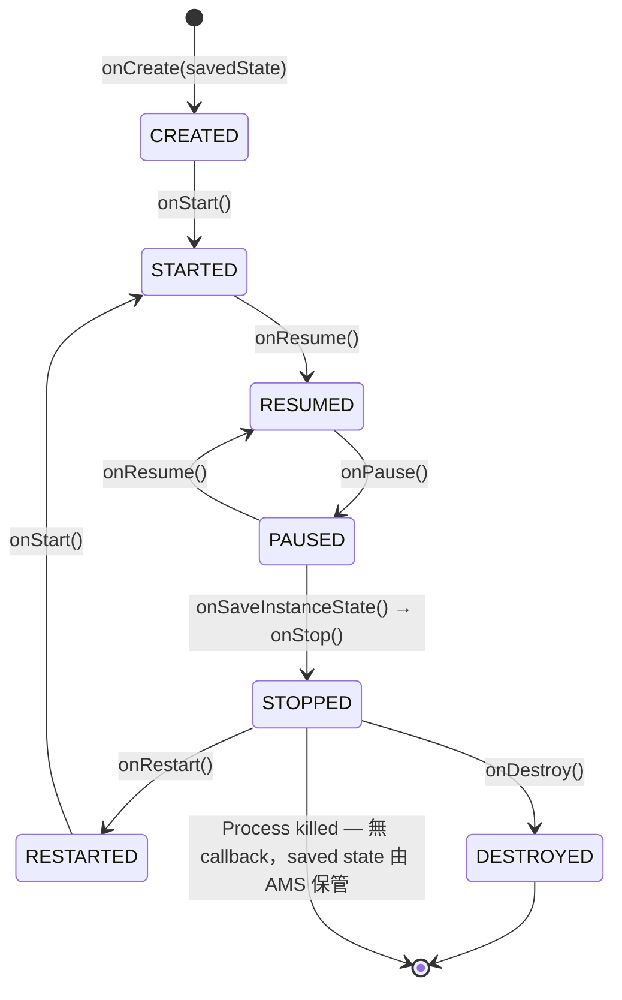
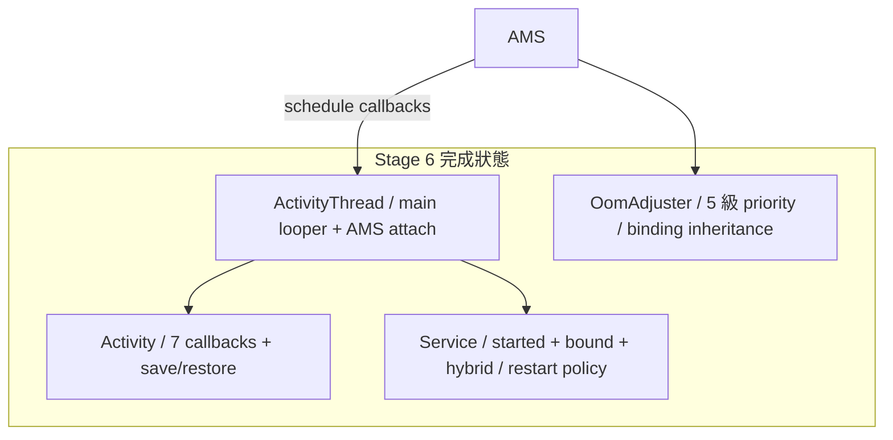

## Stage 6：App Process + Lifecycle

> **目標：** 建造 Android app 的骨架——event loop、7 個 Activity lifecycle callbacks、
> save/restore state、Service 的 started/bound 模式。
>
> 這是 Android developer 最常接觸的層面。做完這個 Stage，你會理解
> 「為什麼 onPause 在 onCreate 之前」、「為什麼 onSaveInstanceState 在 onStop 之前」。

### Activity Lifecycle 全貌



**關鍵行為（必須實作）：**

| 行為 | 規則 |
|------|------|
| A 啟動 B | `onPause(A)` **先於** `onCreate(B)` |
| 可被 kill 的時機 | 只有 `onStop()` 之後 process 才能被 lmkd kill |
| onSaveInstanceState | 在 `onStop()` 之前呼叫，AMS 保管 Bundle |
| onRestoreInstanceState | 在 `onStart()` 之後呼叫，只有有 saved state 時才觸發 |
| onRestart vs onCreate | `onRestart()` = 從背景回來；`onCreate()` = 全新建立或被 kill 後重建 |
| onDestroy 不保證 | Process 被 kill 時不會呼叫 `onDestroy()` |

---

### Step 6A：App Process Template + Event Loop

#### 🎯 目標

建立標準的 app process 骨架——Zygote fork 出來後，每個 app 都跑同樣的 bootstrap 流程。

#### 📋 動手做

**新增檔案：**
- `frameworks/base/core/kotlin/app/ActivityThread.kt` — app process 的真正入口
- `frameworks/base/core/kotlin/app/Application.kt` — Application 基底 class

1. **App process 啟動順序：**

 ```
 Zygote fork → exec java -jar app.jar
 → ActivityThread.main()
 → 建立 main Looper（Looper.prepareMainLooper()）
 → 連到 servicemanager
 → 建立 IApplicationThread binder（AMS 用它推 lifecycle 到 app）
 → 連到 AMS，呼叫 attachApplication(appThread binder)
 → AMS 回覆「啟動這個 Activity」（透過 appThread binder 回呼）
 → ActivityThread 建立 Activity instance，呼叫 onCreate()
 → Looper.loop()（永遠不回傳）
 ```

 > **重要：attachApplication 傳的是 binder，不只是 PID**
 > 真正 AOSP 裡，app 呼叫 `AMS.attachApplication(mAppThread)` 時，
 > `mAppThread` 是一個 `IApplicationThread` binder 物件。
 > AMS 持有這個 binder 的 handle，之後用它推送 lifecycle 事件回 app。
 > 這就是為什麼 AMS 能呼叫 app 的 `scheduleLaunchActivity()`——
 > 它是透過 app 在 attach 時給的 binder 回呼過去的。

2. **ActivityThread.kt：**
 ```kotlin
 object ActivityThread {
 lateinit var mainHandler: Handler
 private lateinit var mainLooper: Looper

 // IApplicationThread — AMS 持有這個 binder 來推送 lifecycle 事件
 val appThread = ApplicationThread()

 fun main(args: Array<String>) {
 // 1. 建立 main looper
 Looper.prepareMainLooper()
 mainLooper = Looper.myLooper()!!
 mainHandler = Handler(mainLooper)

 // 2. 連到 AMS，把自己的 binder 傳過去
 val ams = ServiceManager.getService("activity") as IActivityManager
 ams.attachApplication(appThread)  // 傳 binder，不只是 PID

 // 3. 進入 event loop
 Looper.loop()
 }
 }

 // AMS 透過這個 binder 回呼 app（在 binder thread 上）
 // 用 Handler.post 轉到 main thread 執行
 class ApplicationThread : BnApplicationThread() {
 override fun scheduleLaunchActivity(activityName: String, savedState: Bundle?) {
 ActivityThread.mainHandler.post {
 val activity = instantiateActivity(activityName)
 activity.performCreate(savedState)
 activity.performStart()
 activity.performResume()
 }
 }

 override fun schedulePauseActivity() {
 ActivityThread.mainHandler.post {
 currentActivity?.performPause()
 }
 }
 }
 ```

3. **AMS 端的 `attachApplication(appThread)`：**
 - 保管 appThread binder handle（之後用它推 lifecycle）
 - 記錄 pid → package → appThread 的映射
 - 查看是否有待啟動的 Activity → 透過 appThread 呼叫 `scheduleLaunchActivity()`

#### ✅ 驗證

```bash
# Zygote fork 一個 app，觀察 bootstrap 流程
./scripts/start.sh &
sleep 3

# 透過 zygote fork 一個 test app
echo "FORK com.miniaosp.testapp out/jar/TestApp.jar 10001 10001" | \
 socat - UNIX-CONNECT:/tmp/mini-aosp/zygote.sock
# [TestApp] ActivityThread.main() started
# [TestApp] Attached to AMS (pid=1234)
# [TestApp] Looper running on main thread
```

#### 🆚 真正 AOSP 對照

**去讀真正 AOSP 的 source——這是 Android 裡最重要的 class 之一：**
```
frameworks/base/core/java/android/app/ActivityThread.java
 → main() ← app 的真正入口（超重要）
 → handleLaunchActivity() ← 收到 AMS 的啟動指令
 → performLaunchActivity() ← 建立 Activity + 呼叫 onCreate

frameworks/base/core/java/android/app/Activity.java
 → performCreate(), performStart(), performResume()
```

`ActivityThread.main()` 是每個 Android app 的起點——
你手機上每一個 app process 都從這個函數開始。
裡面做的事跟我們的 `ActivityThread.main()` 結構一模一樣。

---

### Step 6B：Activity — 7 Lifecycle Callbacks

#### 🎯 目標

實作 `Activity` base class，支援完整的 7 個 lifecycle callback。
AMS 負責在正確的時機、正確的順序呼叫它們。

#### 📋 動手做

**新增檔案：**
- `frameworks/base/core/kotlin/app/Activity.kt`
- `frameworks/base/core/kotlin/os/Bundle.kt` — key-value state container

1. **Activity base class：**

 ```kotlin
 abstract class Activity {
 var state: LifecycleState = LifecycleState.INITIALIZED

 // === 7 lifecycle callbacks（子類覆寫）===
 open fun onCreate(savedInstanceState: Bundle?) {}
 open fun onStart() {}
 open fun onResume() {}
 open fun onPause() {}
 open fun onStop() {}
 open fun onRestart() {}
 open fun onDestroy() {}

 // === Save/Restore ===
 open fun onSaveInstanceState(outState: Bundle) {}
 open fun onRestoreInstanceState(savedInstanceState: Bundle) {}

 // === Internal — 由 ActivityThread 呼叫 ===
 internal fun performCreate(saved: Bundle?) {
 state = LifecycleState.CREATED
 onCreate(saved)
 if (saved != null) {
 onRestoreInstanceState(saved) // 只有有 state 才呼叫
 }
 }
 internal fun performStart() {
 state = LifecycleState.STARTED
 onStart()
 }
 // ... performResume, performPause, performStop, performDestroy
 }

 enum class LifecycleState {
 INITIALIZED, CREATED, STARTED, RESUMED, PAUSED, STOPPED, DESTROYED
 }
 ```

2. **Bundle（simplified）：**
 ```kotlin
 class Bundle {
 private val map = mutableMapOf<String, Any?>()
 fun putString(key: String, value: String) { map[key] = value }
 fun getString(key: String): String? = map[key] as? String
 fun putInt(key: String, value: Int) { map[key] = value }
 fun getInt(key: String, default: Int = 0): Int = map[key] as? Int ?: default
 // Parcel 序列化（跨 process 傳 saved state 用）
 fun writeToParcel(parcel: Parcel) { ... }
 companion object {
 fun readFromParcel(parcel: Parcel): Bundle { ... }
 }
 }
 ```

3. **AMS 端的 lifecycle 驅動：**

 ```mermaid
 sequenceDiagram
 participant AMS as AMS
 participant Old as App A (old)
 participant New as App B (new)

 Note over AMS: 收到 startActivity(B)

 AMS->>Old: schedulePauseActivity()
 Old->>Old: onPause()
 Old-->>AMS: activityPaused()

 AMS->>New: scheduleLaunchActivity()
 New->>New: onCreate() → onStart() → onResume()
 New-->>AMS: activityResumed()

 Note over AMS: A 已不可見
 AMS->>Old: scheduleStopActivity(wantsSaveState=true)
 Old->>Old: onSaveInstanceState() → onStop()
 Old-->>AMS: activityStopped(savedState)
 Note over AMS: 保管 A 的 savedState
 ```

 **關鍵順序：`onPause(A)` 必須在 `onCreate(B)` 之前完成。**

4. **寫一個 TestActivity 驗證順序：**
 ```kotlin
 class TestActivity : Activity() {
 override fun onCreate(saved: Bundle?) {
 Log.i(TAG, "onCreate(saved=${saved != null})")
 }
 override fun onStart() { Log.i(TAG, "onStart()") }
 override fun onResume() { Log.i(TAG, "onResume()") }
 override fun onPause() { Log.i(TAG, "onPause()") }
 override fun onSaveInstanceState(out: Bundle) {
 out.putString("key", "saved_value")
 Log.i(TAG, "onSaveInstanceState()")
 }
 override fun onStop() { Log.i(TAG, "onStop()") }
 override fun onRestart() { Log.i(TAG, "onRestart()") }
 override fun onDestroy() { Log.i(TAG, "onDestroy()") }
 }
 ```

#### ✅ 驗證

```bash
# 啟動系統 + 啟動一個 app
# 預期 callback 順序：
# [TestApp] onCreate(saved=false)
# [TestApp] onStart()
# [TestApp] onResume()

# 啟動第二個 app（觸發第一個的 pause/stop）
# [TestApp] onPause()
# ← 這裡 App B 的 onCreate 才開始
# [TestApp] onSaveInstanceState()
# [TestApp] onStop()

# 切回第一個 app
# [TestApp] onRestart()
# [TestApp] onStart()
# [TestApp] onResume()
```

#### 🔍 做完後讀這段

**為什麼 onPause(A) 要在 onCreate(B) 之前？**

這是 Android 最重要的 lifecycle 保證之一。原因：

1. **資料一致性** — A 可能在 onPause 裡 save 資料（例如相機 app 存照片）。
 如果 B 先 onCreate 然後要讀 A 存的資料，A 必須先存完。

2. **資源釋放** — A 可能持有獨占資源（相機、麥克風）。
 B 要用之前，A 必須先在 onPause 裡釋放。

3. **可預測性** — 開發者可以確信：「只要 onPause 被呼叫了，
 我保存的東西一定在新 Activity 啟動之前已完成。」

**為什麼 onDestroy 不保證被呼叫？**

假設 App 在 STOPPED 狀態，lmkd 因記憶體不足 kill 了它。
OS 直接 `kill -9`，沒有機會跑任何 code。
所以**不能把重要的 cleanup 放在 onDestroy 裡**——要放在 `onStop()` 或 `onSaveInstanceState()`。

#### 📚 學習材料

- **Android Developers: Activity Lifecycle** — [官方文件](https://developer.android.com/guide/components/activities/activity-lifecycle) — 有互動式圖表
- **AOSP `Activity.java`** — [在線閱讀](https://cs.android.com/android/platform/superproject/+/main:frameworks/base/core/java/android/app/Activity.java) — 搜尋 `performCreate`

---

### Step 6C：Service Lifecycle — Started + Bound + Hybrid

#### 🎯 目標

實作 Android Service 的三種模式和 restart policy。

```mermaid
graph TD
 subgraph "Started Service"
 S1["startService()"] --> S2["onCreate()"]
 S2 --> S3["onStartCommand()"]
 S3 -->|"stopSelf()"| S4["onDestroy()"]
 end

 subgraph "Bound Service"
 B1["bindService()"] --> B2["onCreate()"]
 B2 --> B3["onBind() → IBinder"]
 B3 -->|"所有 client unbind"| B4["onUnbind()"]
 B4 --> B5["onDestroy()"]
 end

 subgraph "Hybrid（最複雜）"
 H1["startService() + bindService()"]
 H2["同時是 started 和 bound"]
 H3["stopSelf() 呼叫了 / AND / 所有 client unbind"]
 H4["才會 onDestroy()"]
 H1 --> H2 --> H3 --> H4
 end
```



#### 📋 動手做

**新增檔案：**
- `frameworks/base/core/kotlin/app/Service.kt`

1. **Service base class：**
 ```kotlin
 abstract class Service {
 // Started service
 open fun onCreate() {}
 open fun onStartCommand(intent: Intent?, flags: Int, startId: Int): Int {
 return START_NOT_STICKY
 }
 open fun onDestroy() {}
 fun stopSelf(startId: Int? = null) { ... }

 // Bound service
 open fun onBind(intent: Intent): IBinder? = null
 open fun onUnbind(intent: Intent): Boolean = false // true = 之後 onRebind

 companion object {
 const val START_NOT_STICKY = 0 // kill 後不重啟
 const val START_STICKY = 1 // kill 後重啟，intent=null
 const val START_REDELIVER_INTENT = 2 // kill 後重啟，重發最後的 intent
 }
 }
 ```

2. **AMS 追蹤 Service 狀態：**
 - `startedServices: Map<ComponentName, ServiceRecord>`
 - `bindings: Map<ComponentName, List<ConnectionRecord>>` — 誰 bind 了誰
 - Service 的 destroy 條件：`!isStarted && bindCount == 0`

3. **Restart policy 實作（在 AMS 裡）：**

 | onStartCommand 回傳值 | Process 被 kill 後 AMS 做什麼 |
 |---|---|
 | `START_NOT_STICKY` | 不重啟 |
 | `START_STICKY` | 重啟 service，`onStartCommand(null, ...)` |
 | `START_REDELIVER_INTENT` | 重啟 service，重送最後一個 intent |

#### ✅ 驗證

```bash
# MusicService 測試（started service）
# [MusicApp] MusicService.onCreate()
# [MusicApp] MusicService.onStartCommand(action=PLAY)
# ...kill MusicApp process...
# [AMS] MusicApp died, restart policy=START_STICKY
# [AMS] Restarting MusicService...
# [MusicApp] MusicService.onCreate()
# [MusicApp] MusicService.onStartCommand(null) ← STICKY: intent=null

# Bound service 測試
# [AppA] bindService(MusicService) → got IBinder
# [AppB] bindService(MusicService) → got IBinder
# [AppA] unbindService()
# ← MusicService 還活著（AppB 還 bind 著）
# [AppB] unbindService()
# [MusicApp] MusicService.onUnbind()
# [MusicApp] MusicService.onDestroy() ← 現在才 destroy
```

#### 🔍 做完後讀這段

**Hybrid service 是最常被誤解的 Android 概念**

很多開發者不知道一個 Service 可以同時是 started 和 bound。
常見場景：MusicService

1. 用戶按「播放」→ `startService()` → 音樂開始播
2. 用戶打開 MusicApp UI → `bindService()` → 取得 IBinder 控制播放
3. 用戶離開 UI → `unbindService()` → 音樂繼續播（因為還是 started）
4. 用戶按「停止」→ `stopService()` → 現在 Service 才真的結束

**如果只用 bind 不 start**，離開 UI 音樂就停了。
**如果只用 start 不 bind**，UI 沒辦法直接呼叫 Service 的方法。

#### 📚 學習材料

- **Android Developers: Bound Services** — [官方文件](https://developer.android.com/develop/background-work/services/bound-services)
- **"Android Service lifecycle explained"** — 搜尋這個，有很多圖解

---

### Step 6D：Process Priority（5 級）

#### 🎯 目標

實作 Android 的 5 級 process priority。這決定 lmkd 在記憶體不足時先 kill 誰。

#### 📋 動手做

**修改：** AMS 裡新增 `OomAdjuster`

| 優先順序 | Level | oom_adj | 條件 |
|---------|-------|---------|------|
| FOREGROUND | 最高 | 0 | Activity 在 `RESUMED` 狀態，或 BroadcastReceiver 在 `onReceive()` 中 |
| VISIBLE | | 100 | Activity 在 `PAUSED` 狀態 |
| PERCEPTIBLE | | 200 | 執行中的 foreground Service |
| SERVICE | | 500 | 有 started Service（30 分鐘後降級為 CACHED） |
| CACHED | 最低 | 900-999 | Activity 在 `STOPPED`，LRU 排序 |


**Priority inheritance：**
如果 App A（FOREGROUND）bind 到 App B 的 Service，
App B 的 priority 提升到至少跟 App A 一樣。
因為 kill B 會影響到前景的 A——用戶會感知到。

1. **OomAdjuster class：**
 ```kotlin
 class OomAdjuster(private val ams: ActivityManagerService) {
 fun updateOomAdj(processRecord: ProcessRecord) {
 var adj = 999 // 從最低開始

 // 有 RESUMED activity → FOREGROUND
 if (processRecord.hasResumedActivity()) adj = 0
 // 有 PAUSED activity → VISIBLE
 else if (processRecord.hasPausedActivity()) adj = 100
 // 有 foreground service → PERCEPTIBLE
 else if (processRecord.hasForegroundService()) adj = 200
 // 有 started service → SERVICE
 else if (processRecord.hasStartedService()) adj = 500

 // Priority inheritance via bindings
 for (binding in processRecord.bindings) {
 val clientAdj = binding.client.oomAdj
 if (clientAdj < adj) {
 adj = clientAdj // 提升到 client 的 priority
 }
 }

 processRecord.oomAdj = adj
 }
 }
 ```

2. 每次 lifecycle 狀態改變時重新計算所有相關 process 的 oom_adj

#### ✅ 驗證

```bash
# 啟動 App A（FOREGROUND, adj=0）
# 啟動 App B（A 變成 STOPPED → CACHED, adj=900）
# App A bind 到 App B 的 Service（B 提升到 adj=0）
# App A unbind（B 降回 adj=500 或 900）

java -jar out/jar/test_oom_adj.jar
# [test] AppA: FOREGROUND (adj=0)
# [test] AppB: CACHED (adj=900)
# [test] AppA binds to AppB.Service → AppB promoted to adj=0
# [test] AppA unbinds → AppB back to adj=900
# [test] ✓ OomAdjuster works with priority inheritance
```

#### 🆚 真正 AOSP 對照

**去讀真正 AOSP 的 source：**
```
frameworks/base/services/core/java/com/android/server/am/OomAdjuster.java
 → updateOomAdjLSP() ← 4,000+ 行的巨型方法，你的簡化版是它的精華

frameworks/base/services/core/java/com/android/server/am/ProcessList.java
 → FOREGROUND_APP_ADJ, VISIBLE_APP_ADJ, ... ← oom_adj 常數定義
```

真正的 `updateOomAdjLSP()` 非常複雜（考慮 provider、instrumentation、heavy-weight process 等），
但核心邏輯跟你寫的一樣：根據 component 狀態 + binding 關係計算 adj。

#### 📚 學習材料

- **"Android process priority explained"** — 搜尋這個
- **Linux OOM Killer** — 搜尋 "linux oom killer oom_adj"，理解 kernel 怎麼用 oom_adj
- **AOSP `OomAdjuster.java`** — [在線閱讀](https://cs.android.com/android/platform/superproject/+/main:frameworks/base/services/core/java/com/android/server/am/OomAdjuster.java) — 瀏覽 `computeOomAdjLSP()` 的 if-else 鏈

---

### Stage 6 完成條件



**驗證——完整 lifecycle walk-through：**
```bash
# App 啟動
# → onCreate → onStart → onResume (FOREGROUND, adj=0)

# 第二個 App 啟動
# → onPause(first) → onCreate(second)... → onSaveInstanceState(first) → onStop(first)
# first: adj=900 (CACHED), second: adj=0 (FOREGROUND)

# 切回第一個 App
# → onPause(second) → onRestart(first) → onStart(first) → onResume(first)
# first: adj=0, second: adj=900
```

---
