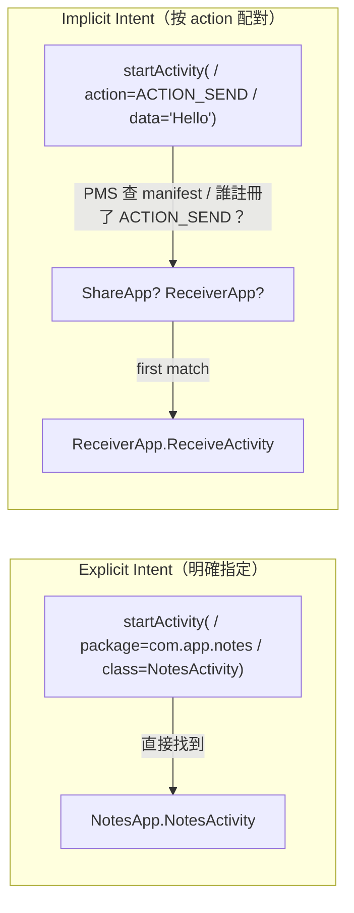

## Stage 7：PackageManagerService + Intent System

> **目標：** 讓 PMS 能掃描、安裝 app，並根據 Intent 找到正確的目標 component。
>
> 這是「我想打開地圖 app」如何變成「啟動 com.google.maps/.MapsActivity」的過程。

### Intent 的兩種模式



---

### Step 7A：PMS — Manifest 掃描 + UID 分配 + 安裝

#### 🎯 目標

把 Stage 4B 的 PMS stub 升級成完整版：
掃描所有 app manifest，解析 component 和 intent-filter，分配 UID。

#### 📋 動手做

**修改：** `frameworks/base/services/core/kotlin/pm/PackageManagerService.kt`

1. **升級 AndroidManifest.json 格式：**

 ```json
 {
 "package": "com.miniaosp.notesapp",
 "versionCode": 1,
 "application": {
 "label": "NotesApp",
 "activities": [
 {
 "name": "NotesActivity",
 "main": true,
 "intentFilters": [
 { "action": "android.intent.action.MAIN" }
 ]
 }
 ],
 "services": [
 {
 "name": "SyncService",
 "exported": false
 }
 ],
 "receivers": [
 {
 "name": "BootReceiver",
 "intentFilters": [
 { "action": "android.intent.action.BOOT_COMPLETED" }
 ]
 }
 ]
 },
 "permissions": ["android.permission.INTERNET"]
 }
 ```

2. **PMS 啟動時：**
 - 掃描 `packages/apps/*/AndroidManifest.json`
 - 為每個 package 分配 UID（10000, 10001, 10002...）
 - 建立 index：
 - `packageMap: Map<String, PackageInfo>` — package name → 完整資訊
 - `componentMap: Map<ComponentName, ComponentInfo>` — component → 所屬 package
 - `intentFilterIndex: Map<String, List<ResolveInfo>>` — action → 可以處理的 component list

3. **新增 API（升級 AIDL）：**
 ```
 interface IPackageManager {
 String[] getInstalledPackages();
 int getUidForPackage(String packageName);
 ResolveInfo resolveActivity(Intent intent); // ← 新增
 ResolveInfo[] queryIntentActivities(Intent intent); // ← 新增
 ResolveInfo resolveService(Intent intent); // ← 新增
 }
 ```

#### ✅ 驗證

```bash
# 建立 5 個 sample app 的 manifest
# PMS 啟動時掃描它們
java -jar out/jar/test_pms_scan.jar
# [PMS] Scanned: com.miniaosp.notesapp (uid=10000)
# [PMS] Scanned: com.miniaosp.musicapp (uid=10001)
# [PMS] Scanned: com.miniaosp.crashyapp (uid=10002)
# [PMS] Scanned: com.miniaosp.receiverapp (uid=10003)
# [PMS] Scanned: com.miniaosp.shareapp (uid=10004)
# [PMS] Intent index: ACTION_SEND → [receiverapp.ReceiveActivity]
# [PMS] Intent index: BOOT_COMPLETED → [receiverapp.BootReceiver, notesapp.BootReceiver]
```

---

### Step 7B：Intent Resolution + App Launch via Intent

#### 🎯 目標

實作完整的 `startActivity(intent)` 流程：
Intent → PMS resolve → AMS → Zygote fork → Activity lifecycle。

#### 📋 動手做

**新增：** `frameworks/base/core/kotlin/content/Intent.kt`

1. **Intent data class：**
 ```kotlin
 data class Intent(
 val action: String? = null, // implicit intent
 val packageName: String? = null, // explicit intent
 val className: String? = null, // explicit intent
 val extras: Bundle = Bundle() // 附帶資料
 ) {
 val isExplicit: Boolean get() = packageName != null && className != null
 }
 ```

2. **startActivity 流程（在 AMS 裡）：**

 ```mermaid
 sequenceDiagram
 participant App as App
 participant AMS as AMS
 participant PMS as PMS
 participant Z as Zygote
 participant Target as Target App

 App->>AMS: startActivity(intent)

 alt Explicit intent
 AMS->>AMS: 直接用 package+class 找 component
 else Implicit intent
 AMS->>PMS: resolveActivity(intent)
 PMS->>PMS: 查 intentFilterIndex
 PMS-->>AMS: ResolveInfo (target component)
 end

 alt Target process 已在跑
 AMS->>Target: scheduleLaunchActivity()
 else Target process 不存在
 AMS->>Z: fork(package, jar, uid)
 Z-->>AMS: child pid
 Note over Target: process 啟動, attachApplication()
 AMS->>Target: scheduleLaunchActivity()
 end

 Target->>Target: onCreate() → onStart() → onResume()
 ```

3. **Sample apps — 建立 5 個 app 的 manifest + stub Activity：**

 | App | 測試什麼 |
 |-----|---------|
 | NotesApp | 背景存活、state save/restore |
 | MusicApp | Foreground Service、bound service |
 | CrashyApp | 故意 crash、測試 linkToDeath 和 restart |
 | ReceiverApp | BroadcastReceiver、intent-filter 接收 ACTION_SEND |
 | ShareApp | 送 implicit intent（ACTION_SEND） |

#### ✅ 驗證

```bash
# Explicit intent — 直接指定目標
java -jar out/jar/test_intent.jar --explicit com.miniaosp.notesapp NotesActivity
# [AMS] Resolving explicit intent → com.miniaosp.notesapp/.NotesActivity
# [AMS] Process not running, requesting Zygote fork...
# [NotesApp] onCreate() → onStart() → onResume()

# Implicit intent — 按 action 配對
java -jar out/jar/test_intent.jar --implicit ACTION_SEND --extra text "Hello!"
# [AMS] Resolving implicit intent: action=ACTION_SEND
# [PMS] Matched: com.miniaosp.receiverapp/.ReceiveActivity
# [ReceiverApp] onCreate(extras={text=Hello!})
```

#### 🆚 真正 AOSP 對照

**去讀真正 AOSP 的 source：**
```
frameworks/base/services/core/java/com/android/server/pm/PackageManagerService.java
 → resolveIntentInternal() ← intent resolution 核心
 → queryIntentActivitiesInternal() ← 查 intent filter

frameworks/base/services/core/java/com/android/server/am/ActivityStarter.java
 → execute() ← startActivity 的完整流程（非常長）
 → startActivityUnchecked() ← 決定 task、launch mode
```

真正的 intent resolution 還考慮 MIME type、URI scheme、category 等。
我們只用 action string matching，但流程結構相同。

#### 📚 學習材料

- **Android Developers: Intents and Intent Filters** — [官方文件](https://developer.android.com/guide/components/intents-filters)
- **"How Android resolves intents"** — 搜尋這個

---

### Stage 7 完成條件

```bash
# 完整 flow：ShareApp 送 ACTION_SEND → PMS resolve → ReceiverApp 收到
./scripts/start.sh &
sleep 3

# 透過 launcher (或測試工具) 啟動 ShareApp
# ShareApp 呼叫 startActivity(Intent(action="ACTION_SEND", extras={text="hi"}))
# → PMS resolve → ReceiverApp.ReceiveActivity.onCreate(extras={text="hi"})
# ✓ Inter-app communication via intents
```

---
