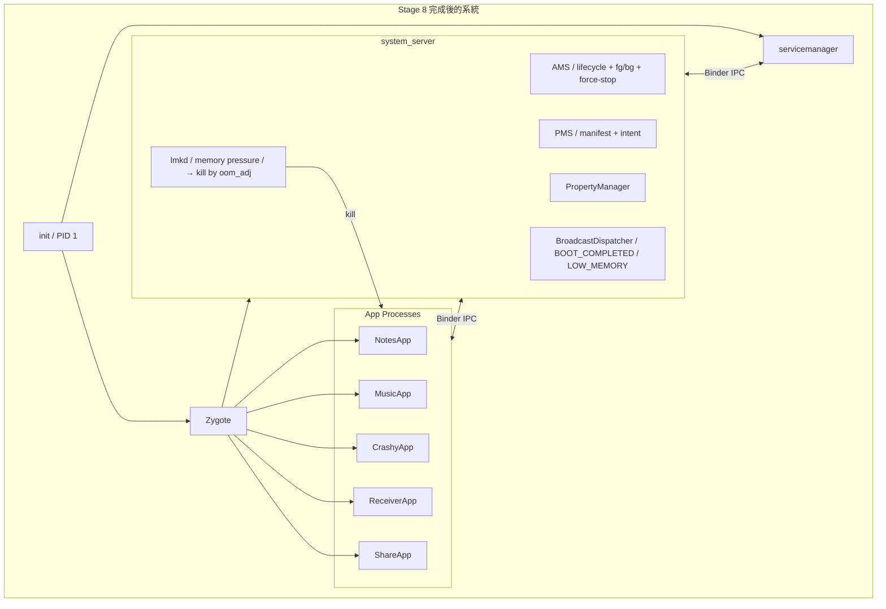
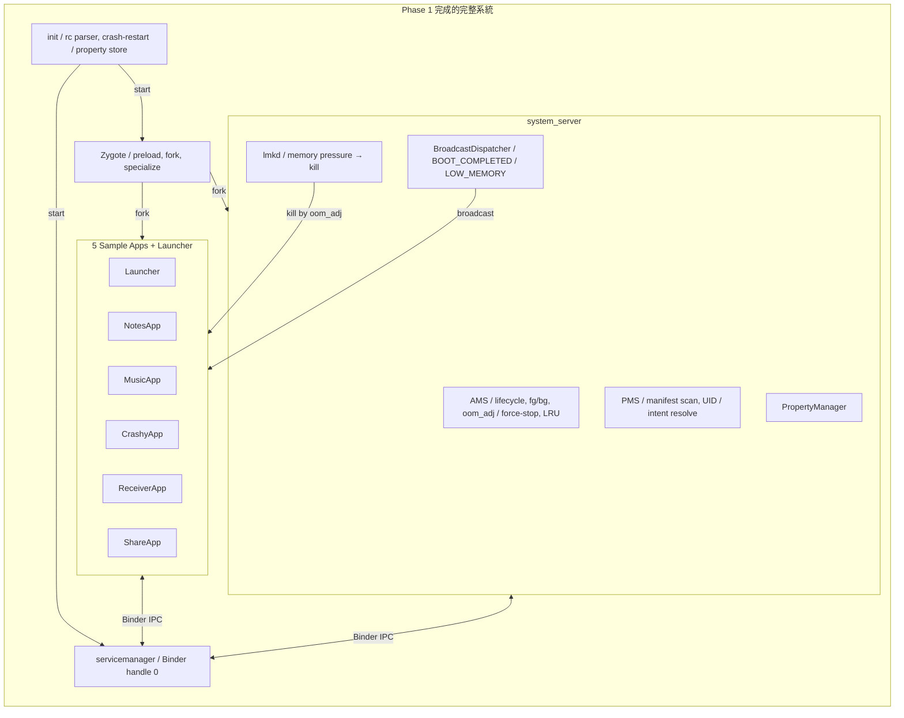

## Stage 8：AMS 完整版 + lmkd + BroadcastReceiver

> **目標：** Phase 1 的最後一塊拼圖——
> 完整的 foreground/background tracking、記憶體壓力下 kill cached apps、
> 系統 broadcast 事件。做完這個，Phase 1 就完成了。

### 大圖



---

### Step 8A：AMS — fg/bg Tracking + Force-Stop

#### 🎯 目標

AMS 追蹤每個 app 的前景/背景狀態，維護 LRU list，支援 force-stop。

#### 📋 動手做

1. **ProcessRecord — 每個 app process 一份：**
 ```kotlin
 data class ProcessRecord(
 val pid: Int,
 val uid: Int,
 val packageName: String,
 var oomAdj: Int = 999,
 var lastActivityTime: Long = System.currentTimeMillis(),
 val activities: MutableList<ActivityRecord> = mutableListOf(),
 val services: MutableList<ServiceRecord> = mutableListOf(),
 var state: ProcessState = ProcessState.CACHED
 )
 ```

2. **LRU list：**
 - 每次 Activity 狀態改變 → 更新 `lastActivityTime`
 - 排序：`oomAdj` 高的在前（先被 kill），同 adj 的看 `lastActivityTime`（最久沒用的先 kill）

3. **Force-stop：**
 ```kotlin
 fun forceStopPackage(packageName: String) {
 val proc = findProcessByPackage(packageName) ?: return
 // 1. 呼叫所有 Activity 的 onDestroy
 // 2. 呼叫所有 Service 的 onDestroy
 // 3. kill process
 // 4. 通知所有 bind 到這個 process 的 client（linkToDeath）
 // 5. 清理 ProcessRecord
 Os.kill(proc.pid, Signal.SIGKILL)
 removeProcessRecord(proc)
 Log.i(TAG, "Force-stopped: $packageName (pid=${proc.pid})")
 }
 ```

#### ✅ 驗證

```bash
# 啟動 3 個 app
# NotesApp (adj=0, fg) → MusicApp (adj=0, fg; Notes→900) → CrashyApp (adj=0, fg; Music→900)
# LRU order: Notes(900, oldest) → Music(900, newer) → Crashy(0, fg)

# Force-stop NotesApp
java -jar out/jar/test_force_stop.jar com.miniaosp.notesapp
# [AMS] Force-stopped: com.miniaosp.notesapp (pid=1234)
# [AMS] Removed from LRU list
```

---

### Step 8B：lmkd — Low Memory Killer

#### 🎯 目標

當系統記憶體不足時，按 oom_adj 從高到低 kill cached app。

> **重要架構約束：lmkd 必須是獨立 daemon（C++ process），不在 system_server 裡。**
> 原因：如果 system_server OOM，lmkd 必須還活著才能 kill 其他 process。
> 這跟真正 AOSP 的架構一致——lmkd 由 init 啟動，跟 AMS 透過 socket 通訊。

#### 📋 動手做

**修改：** `system/core/lmkd/main.cpp`（從 stub 升級）
**修改：** `system/core/rootdir/init.rc`（加入 lmkd service）

0. **在 init.rc 加入 lmkd：**
 ```
 service lmkd ${MINI_AOSP_ROOT}/out/bin/lmkd
 ```
 lmkd 由 init 啟動，跟 servicemanager 和 zygote 平級。

1. **lmkd 架構：**
 ```
 lmkd (獨立 C++ daemon，init 啟動)
   ├─ 開 socket: /tmp/mini-aosp/lmkd.sock
   ├─ AMS 連到這個 socket，定期推送 oom_adj 更新
   ├─ 監聽 /proc/meminfo 或 PSI
   └─ 壓力事件 → 查 oom_adj table → kill → 通知 AMS
 ```

2. **記憶體壓力偵測：**
 - Linux：讀 `/proc/meminfo` 的 `MemAvailable`
 - 或用 cgroup 的 `memory.pressure`（PSI）
 - 簡化版：定時 poll（每 5 秒），可用記憶體低於 threshold 就觸發

3. **Kill 策略：**
 ```
 if (available_mb < THRESHOLD_CRITICAL): // < 200MB
 kill all CACHED processes (adj 900-999)
 elif (available_mb < THRESHOLD_LOW): // < 500MB
 kill oldest CACHED process
 elif (available_mb < THRESHOLD_MODERATE): // < 800MB
 kill oldest CACHED process only if idle > 30 min
 ```

4. **lmkd ↔ AMS 通訊（透過 Unix socket，不是 Binder）：**

 AMS → lmkd：`SET_OOM_ADJ <pid> <adj>\n` — 每次 oom_adj 改變時推送
 lmkd → AMS：`PROC_KILLED <pid>\n` — kill 後通知

 > 為什麼不用 Binder？因為 Binder 依賴 servicemanager，而 lmkd 需要在
 > servicemanager crash 時也能運作。用直接 socket 更可靠。

 ```mermaid
 sequenceDiagram
 participant I as init
 participant L as lmkd
 participant AMS as AMS (in system_server)

 I->>L: fork+exec (啟動 lmkd)
 L->>L: listen on lmkd.sock

 AMS->>L: connect to lmkd.sock
 AMS->>L: SET_OOM_ADJ 1234 0 (foreground)
 AMS->>L: SET_OOM_ADJ 1235 900 (cached)

 L->>L: poll /proc/meminfo
 L->>L: MemAvailable < 500MB!
 L->>L: kill(1235, SIGKILL)
 L->>AMS: PROC_KILLED 1235
 AMS->>AMS: cleanup ProcessRecord
 AMS->>AMS: 保管 savedState
 ```

#### ✅ 驗證

```bash
# 模擬記憶體壓力（用一個程式吃掉大量記憶體）
java -jar out/jar/test_lmkd.jar --simulate-pressure
# [lmkd] Memory pressure detected: available=450MB (threshold=500MB)
# [lmkd] Killing cached process: com.miniaosp.notesapp (adj=999, pid=1234)
# [AMS] Process killed: com.miniaosp.notesapp, saved state retained
# [lmkd] Memory recovered: available=580MB

# 重新啟動被 kill 的 app — 驗證 state 恢復
# → NotesApp.onCreate(savedState={notes=["my note"]})
# → onRestoreInstanceState({notes=["my note"]})
```

#### 🔍 做完後讀這段

**這就是 Android 為什麼要有 onSaveInstanceState**

整個 save/restore 機制存在的唯一原因就是 lmkd。
當系統記憶體不足，Android 會 kill 背景 app，但**用戶不應該感知到**。

流程：
1. App 進入背景 → `onSaveInstanceState()` → AMS 保管 Bundle
2. 記憶體不足 → lmkd kill app → process 消失
3. 用戶切回 app → AMS 告訴 Zygote 重新 fork → `onCreate(savedState)` → 恢復狀態
4. 用戶感覺 app 從來沒被 kill 過

**這就是 Android 能在 4GB RAM 上跑 20+ 個 app 的祕密。**

#### 📚 學習材料

- **"Android lmkd internals"** — 搜尋這個
- **Linux PSI (Pressure Stall Information)** — `man 5 proc`，搜尋 `/proc/pressure/memory`
- **AOSP `lmkd.cpp`** — [在線閱讀](https://cs.android.com/android/platform/superproject/+/main:system/core/lmkd/lmkd.cpp)

---

### Step 8C：BroadcastReceiver

#### 🎯 目標

實作 pub/sub broadcast 系統——system_server 可以廣播事件，
所有在 manifest 裡註冊了 intent-filter 的 app 都會收到。

#### 📋 動手做

1. **系統 broadcast 事件：**

 | Broadcast | 何時發送 | 用途 |
 |-----------|---------|------|
 | `BOOT_COMPLETED` | 所有 service 啟動完畢 | App 可以做開機後的初始化 |
 | `LOW_MEMORY` | lmkd 偵測到記憶體壓力 | App 應該釋放 cache |
 | `PACKAGE_ADDED` | PMS 安裝新 app | 其他 app 可以更新 UI |

2. **BroadcastReceiver base class：**
 ```kotlin
 abstract class BroadcastReceiver {
 abstract fun onReceive(context: Context, intent: Intent)
 // 10 秒限制：onReceive 必須在 10 秒內完成
 // 超時 → AMS 視為 ANR（Phase 1 只印 warning）
 }
 ```

3. **Broadcast 發送流程：**

 ```mermaid
 sequenceDiagram
 participant SS as system_server
 participant AMS as AMS
 participant PMS as PMS
 participant Z as Zygote
 participant R1 as ReceiverApp
 participant R2 as NotesApp

 SS->>AMS: sendBroadcast(BOOT_COMPLETED)
 AMS->>PMS: queryBroadcastReceivers(BOOT_COMPLETED)
 PMS-->>AMS: [ReceiverApp.BootReceiver, NotesApp.BootReceiver]

 loop 每個 receiver
 alt Process 已在跑
 AMS->>R1: scheduleReceiver(BOOT_COMPLETED)
 else Process 沒在跑
 AMS->>Z: fork(ReceiverApp)
 Z-->>AMS: pid
 AMS->>R2: scheduleReceiver(BOOT_COMPLETED)
 end
 end

 R1->>R1: onReceive(BOOT_COMPLETED)
 Note over R1: 10 秒限制
 R1-->>AMS: receiverFinished()
 Note over AMS: R1 process priority 降回原本
 ```

4. **Receiver 執行中的 priority 提升：**
 - `onReceive()` 執行期間，process 提升為 FOREGROUND（adj=0）
 - `onReceive()` return 後，立刻降回原本的 priority
 - 這確保 broadcast 處理不會被 lmkd kill 中斷

#### ✅ 驗證

```bash
# 系統啟動 → BOOT_COMPLETED broadcast
./scripts/start.sh
# [system_server] Sending broadcast: BOOT_COMPLETED
# [ReceiverApp] BootReceiver.onReceive(BOOT_COMPLETED)
# [ReceiverApp] Boot time logged.
# [NotesApp] BootReceiver.onReceive(BOOT_COMPLETED)
# [NotesApp] Scheduled background sync.

# 手動發送 broadcast
java -jar out/jar/test_broadcast.jar LOW_MEMORY
# [AMS] Broadcasting: LOW_MEMORY → 3 receivers
# [NotesApp] LowMemoryReceiver: clearing image cache
# [MusicApp] LowMemoryReceiver: releasing audio buffers
```

---

### Step 8D：Final Integration — 全系統驗證

#### 🎯 目標

所有 Stage 整合在一起，跑完整的 verification scenario。

#### 📋 動手做

**建立完整的 sample apps（5 個 + launcher）：**

| App | JAR | 測試場景 |
|-----|-----|---------|
| **Launcher** | `launcher.jar` | 列出 app、啟動 app、顯示 running processes |
| **NotesApp** | `NotesApp.jar` | 背景 save/restore、被 lmkd kill 後恢復 |
| **MusicApp** | `MusicApp.jar` | Foreground Service、bound service、其他 app bind |
| **CrashyApp** | `CrashyApp.jar` | 2 秒後 crash、測試 AMS restart 和 linkToDeath |
| **ReceiverApp** | `ReceiverApp.jar` | BOOT_COMPLETED + ACTION_SEND receiver |
| **ShareApp** | `ShareApp.jar` | 送 implicit intent 到 ReceiverApp |

**Verification scenarios（全部跑過 = Phase 1 完成）：**

```bash
# === Scenario 1: Boot Smoke ===
./scripts/start.sh
# init → servicemanager → zygote → system_server → launcher
# BOOT_COMPLETED broadcast → receivers 收到
# ✅ 系統在 deadline 內啟動

# === Scenario 2: App Launch ===
# launcher → AMS.startActivity(NotesApp) → zygote fork → lifecycle
# ✅ NotesApp: onCreate → onStart → onResume

# === Scenario 3: Intent Launch ===
# ShareApp: startActivity(ACTION_SEND, text="Hello")
# PMS resolve → ReceiverApp.ReceiveActivity
# ✅ ReceiverApp 收到 extras.text = "Hello"

# === Scenario 4: Cross-App IPC ===
# Launcher bindService(MusicApp.PlaybackService)
# proxy.play() → MusicApp responds
# ✅ Bound Service works cross-process

# === Scenario 5: Background/Foreground ===
# Start Notes → Start Music (Notes goes bg) → Switch back to Notes
# ✅ Notes: pause→save→stop→restart→start→resume

# === Scenario 6: Force Stop ===
# AMS.forceStopPackage("com.miniaosp.notesapp")
# ✅ Process killed, pid cleared, relaunch = fresh start

# === Scenario 7: Low Memory ===
# Start 5+ apps → trigger memory pressure
# ✅ lmkd kills oldest cached app, AMS retains saved state

# === Scenario 8: Crash Recovery ===
# CrashyApp crashes after 2s
# ✅ AMS detects death, linkToDeath fires, can relaunch

# === Scenario 9: Broadcast ===
# sendBroadcast(LOW_MEMORY)
# ✅ All registered receivers execute onReceive within 10s

# === Scenario 10: servicemanager Crash ===
# kill servicemanager → init restarts → services re-register
# ✅ System recovers, apps can resume IPC
```

#### ✅ 最終驗證

```bash
./scripts/start.sh
# 看到完整的 boot log
# 所有 10 個 scenario 自動跑過（或手動觸發）
# 零 error, 零 crash (除了 CrashyApp 故意的)

echo ""
echo "============================================"
echo " 🎉 mini-AOSP Phase 1 Complete!"
echo " Boot → Binder → Services → Apps → Lifecycle"
echo " → Intents → Broadcasts → Memory Management"
echo "============================================"
```

---

### Stage 8 完成條件



---
