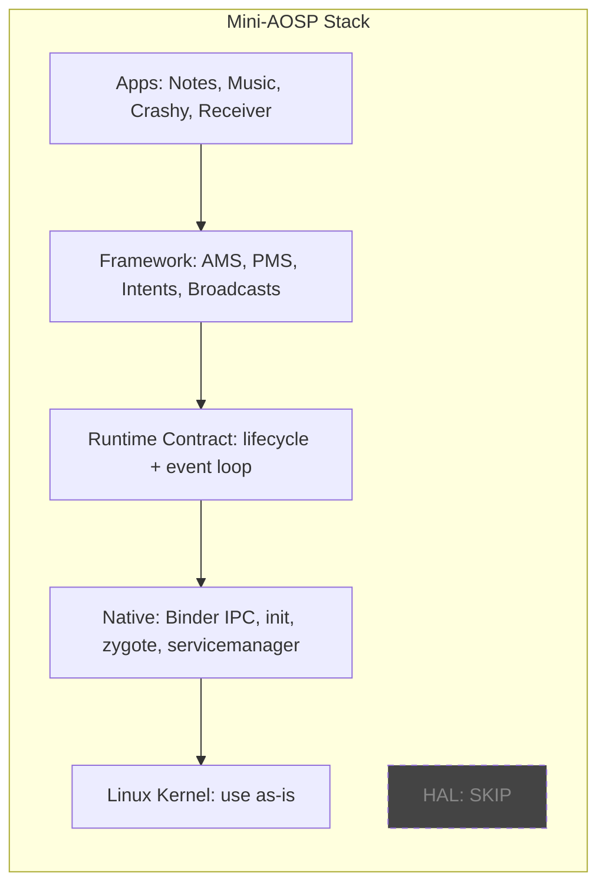
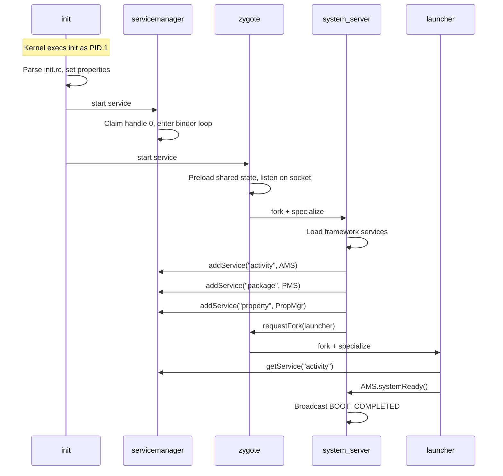
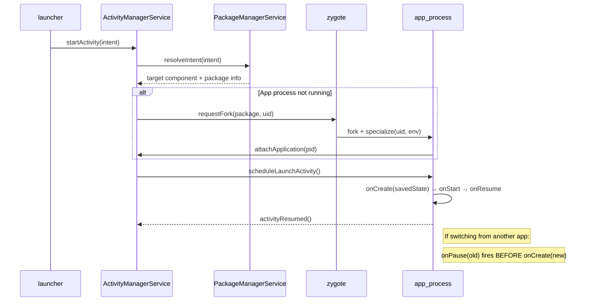
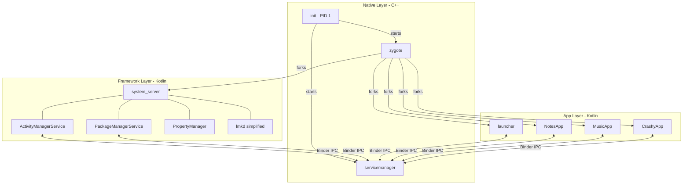
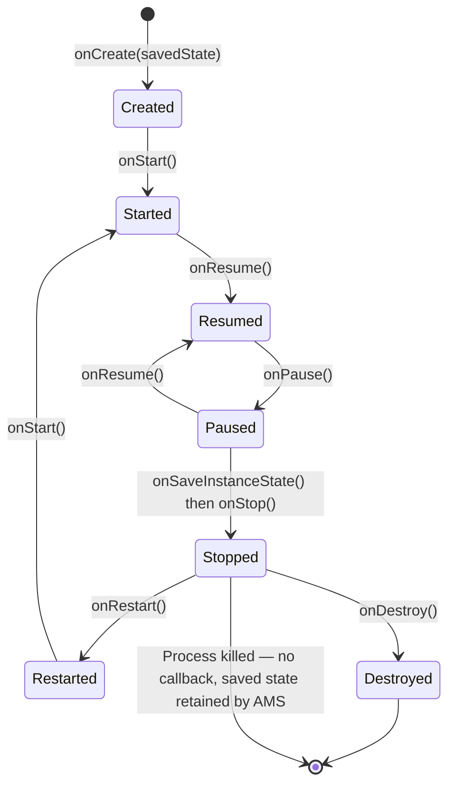
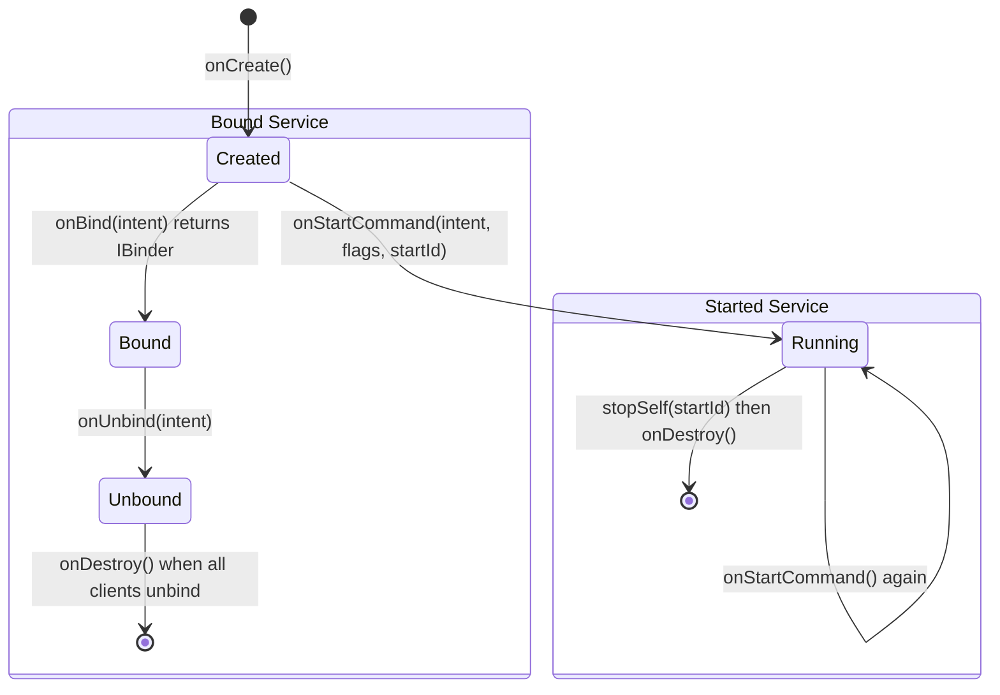
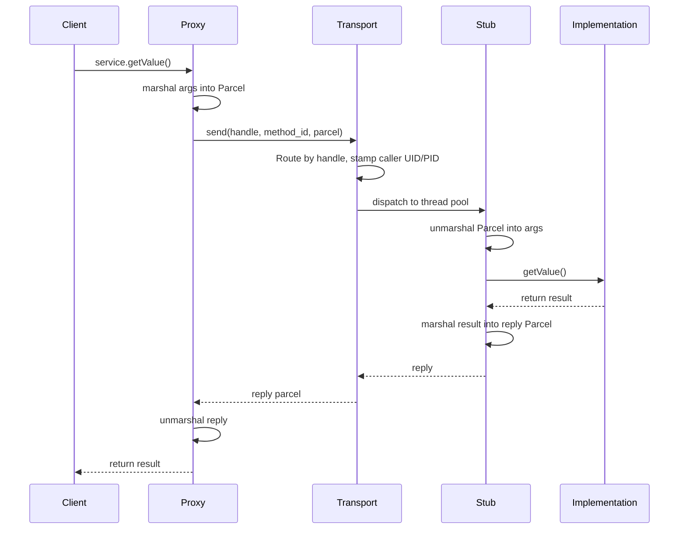
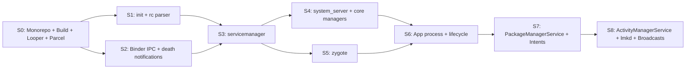
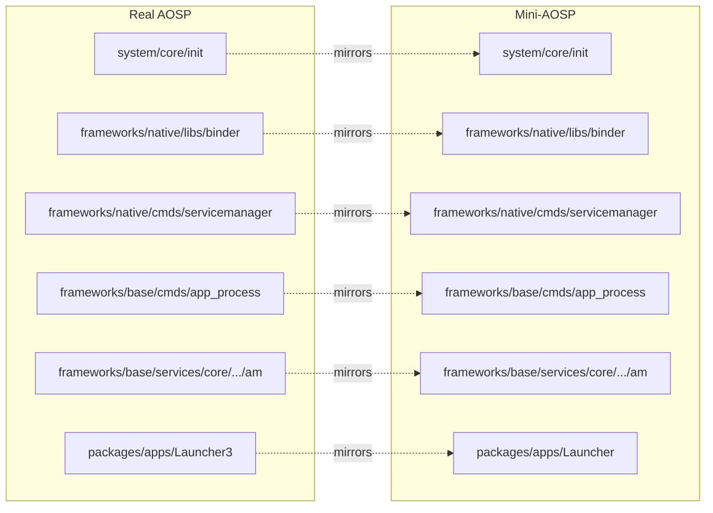
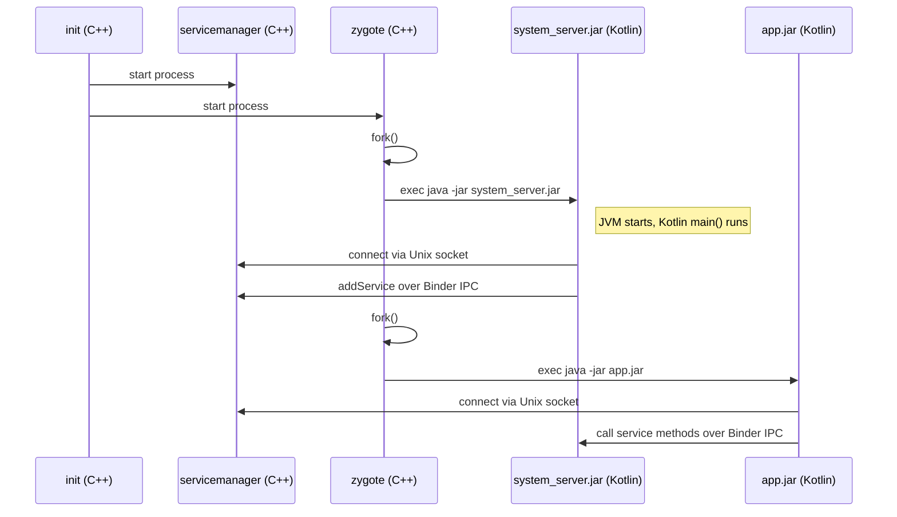

# Phase 1 — Core

A minimal, educational Android-shaped operating system that preserves the core architecture: **init → binder → service registry → zygote → system server → app lifecycle**.

> Phase 2 (HAL, hardware abstraction, ART, ContentProvider) is in [`phase-2-advanced.md`](./phase-2-advanced.md).

### Phase 1 Goal

**All sample apps work as expected on a simulated Android mobile phone.**

When Phase 1 is done, we can boot the system, launch apps, switch between them, have apps talk to each other via Intents and bound Services, receive broadcasts, survive background eviction, and recover from crashes — all within resource constraints that mirror a real Android phone.

**Phase 1 targets mobile phone only.** Phase 2 may explore other form factors (tablet, TV, auto, wear).

---

## Task 1: Scoping & Define Mini-AOSP

### Target Environment

- **Host**: x86_64 Ubuntu Server (single architecture, no cross-compilation)
- **Interaction model**: CLI / log-based (no GUI, no SurfaceFlinger)
- **Kernel**: Android Common Kernel (ACK) x86_64 — or Ubuntu kernel with `binder_linux` module
- **Runtime**: OpenJDK 17+ (ART deferred to Phase 2)
- **Resource limits**: 4 GB RAM, 4 CPU cores, 200 max processes (simulating a mid-range 2024 phone)
- **Form factor**: Mobile phone only (Phase 2 may explore tablet, TV, auto, wear)

### Real Android Architecture vs. Mini-AOSP

| Layer | Real Android | Mini-AOSP |
|---|---|---|
| **6. Apps** | System + 3rd party apps | Sample Apps (Notes, Music, Crashy, Receiver) |
| **5. Framework** | AMS, PMS, WMS, Intents, Broadcasts | AMS, PMS, Intents, Broadcasts |
| **4. Runtime** | ART (bytecode VM, GC, JIT/AOT) | Runtime Contract (lifecycle callbacks, event loop — no VM) |
| **3. Native** | Binder, init, SurfaceFlinger, Zygote | Binder IPC, init, zygote, servicemanager |
| **2. HAL** | Camera, Audio, Sensors... | **SKIP** (no hardware to abstract) |
| **1. Kernel** | Modified Linux (binder driver, ashmem, lmkd) | Stock Linux (use as-is on Ubuntu) |



### Component Decisions: Build / Lean on Linux / Skip

#### Layer 1 — Kernel Primitives

| Component | Real Android | Mini-AOSP | Verdict |
|---|---|---|---|
| Process mgmt | fork/exec/signals/wait | Same | **Lean on Linux** |
| Virtual memory | mmap, copy-on-write | Same | **Lean on Linux** |
| File system | ext4, /proc, /sys | Same | **Lean on Linux** |
| epoll | Event loop foundation | Same | **Lean on Linux** |
| Binder driver | `/dev/binder` kernel module, mmap single-copy | Unix domain sockets + `SO_PEERCRED` | **Build userspace substitute** |
| lmkd | PSI-based memory pressure detection, kill by oom_adj | Simplified threshold + oom_adj scoring | **Build (simplified)** |
| SELinux | Mandatory access control | — | **Skip** |
| Wakelocks / power mgmt | autosleep, wakeup_source | — | **Skip** |
| Ashmem | Shared memory with discard-under-pressure | — | **Skip** |
| Paranoid networking | Restrict network by UID/GID | — | **Skip** |

#### Layer 2 — HAL: **Skip entirely**

Running on standard Ubuntu — no proprietary hardware to abstract away.

#### Layer 3 — Native Daemons & IPC

We use the **exact same names** as real AOSP. The table below shows what we build and what's missing.

| Component | What We Build (Phase 1) | Verdict |
|---|---|---|
| `init` (PID 1) | rc parser, service ordering, crash-restart, property store | **Build** |
| Binder | Unix domain socket transport, Parcel format, handle routing, thread pool, death notifications | **Build** |
| `servicemanager` | Same API: `addService`/`getService`/`listServices`, well-known socket address | **Build** |
| Zygote / `app_process` | Preload shared state, fork+specialize (set UID/env/argv), socket listener, report PID | **Build** |
| AIDL | Simplified IDL → Proxy/Stub codegen (Kotlin only, basic types) | **Build** |
| Looper | epoll-based event loop + MessageQueue + Handler dispatch | **Build** |
| SurfaceFlinger | — | **Skip** (no GUI) |
| AudioFlinger | — | **Skip** (Phase 2) |
| MediaServer | — | **Skip** (Phase 2) |

#### What's Missing vs Real AOSP (Layer 3)

Each component uses the real name but has features intentionally omitted for Phase 1. This table documents exactly what's missing so you know where our implementation diverges:

| Component | Feature in Real AOSP | Missing in Phase 1 | Why |
|---|---|---|---|
| **init** | Service classes: `core`, `main`, `late_start` | Only flat ordering, no class groups | Simplifies boot without losing the sequencing concept |
| **init** | Encrypted `/data` partition mount + `vold` integration | No encrypted storage | No real disk partitions to manage |
| **init** | SELinux context setting per service | No SELinux | UID isolation is sufficient |
| **init** | `ueventd` (device node creation) | No device management | No hardware to enumerate |
| **init** | Trigger-based actions (`on property:X=Y`) | No trigger system | Properties are read-only config for Phase 1 |
| **Binder** | Kernel driver (`/dev/binder`) with mmap single-copy | Userspace Unix sockets (double-copy) | Avoids kernel module; teaches the same API surface |
| **Binder** | Three domains: `binder`, `hwbinder`, `vndbinder` | Single domain only | No HAL layer in Phase 1 |
| **Binder** | Priority inheritance (caller priority propagated to server thread) | No priority inheritance | Not needed without real-time constraints |
| **Binder** | `oneway` (async) transactions with kernel-side ordering | `oneway` flag supported, no kernel ordering guarantee | Good enough for teaching |
| **Binder** | Per-node reference counting, weak references | Simple handle table, no weak refs | Adds complexity without teaching value |
| **Binder** | 1MB transaction size limit, scatter-gather | No size limit enforcement | Not needed at our scale |
| **servicemanager** | Permission check (only `system` UID can register) | All UIDs can register | Can tighten later, not blocking |
| **servicemanager** | VINTF manifest validation for HAL services | No VINTF | No HAL in Phase 1 |
| **servicemanager** | Lazy services (start on first access) | All services start eagerly at boot | Simplifies boot sequence |
| **Zygote** | Preloads ~7,000 Java/framework classes | Preloads shared Kotlin state (much smaller set) | No ART, no DEX — just JVM classes |
| **Zygote** | USAP pool (pre-forked unspecialized processes) | No USAP pool | Performance optimization, not architectural |
| **Zygote** | `fork()` inherits ART VM state (copy-on-write) | `fork()` + `exec("java -jar")` (fresh JVM per process) | No in-process JVM embedding in Phase 1 |
| **Zygote** | Seccomp filter setup on child | No seccomp | Security hardening, not core functionality |
| **AIDL** | Multi-backend codegen (Java, C++, Rust, NDK) | Kotlin-only codegen | Single language for framework layer |
| **AIDL** | Versioned/stable interfaces, hash checking | No versioning | No need for backward compatibility |
| **AIDL** | Parcelable support, FileDescriptor passing | Basic types only (int, long, String, boolean, byte[]) | Sufficient for Phase 1 services |
| **Looper** | Native `epoll` + JNI bridge to Java `MessageQueue` | Separate C++ and Kotlin Looper implementations | No JNI boundary; both use sockets |

#### Layer 4 — Runtime

| Component | What We Build (Phase 1) | Verdict |
|---|---|---|
| ART / Dalvik | **OpenJDK 17+** — Kotlin runs on standard JVM | **Phase 2** (ART is a separate project) |
| Lifecycle contract | Same callbacks delivered via IPC to app main thread | **Build** |
| Main thread looper | Looper + MessageQueue + Handler per app process | **Build** |

> **Key insight**: We use OpenJDK instead of ART. The architecture lessons (lifecycle, IPC, process model) are identical regardless of which runtime executes the bytecode. ART itself is a Phase 2 topic.

#### Layer 5 — Framework Services

| Component | What We Build (Phase 1) | Verdict |
|---|---|---|
| ActivityManagerService (AMS) | Lifecycle state machine, process priority (5 levels), oom_adj, force-stop | **Build** |
| PackageManagerService (PMS) | Scan manifest dir, JSON manifests, UID assignment, intent resolution | **Build** |
| Intent system | Action-string matching, explicit + implicit intents | **Build** |
| BroadcastReceiver | Pub/sub, static registration from manifest | **Build** |
| PropertyManager | `getprop`/`setprop` in-memory store exposed over Binder | **Build** |
| ContentProvider | — | **Phase 2** |
| WindowManager | — | **Skip** (no GUI) |
| NotificationManager | — | **Skip** |
| PowerManager | — | **Skip** |
| All other managers | ~100+ services in real system_server | **Skip** |

#### What's Missing vs Real AOSP (Layer 5)

| Component | Feature in Real AOSP | Missing in Phase 1 | Why |
|---|---|---|---|
| **AMS** | Task/back stack with affinity rules | Simple fg/bg tracking, no task stacks | No UI means no "back" navigation |
| **AMS** | ANR (Application Not Responding) detection | No ANR timeout | Requires windowing to detect UI freeze |
| **AMS** | `startActivityForResult` / result propagation | No result callbacks | Adds complexity; intents are fire-and-forget in Phase 1 |
| **AMS** | Multi-user process tracking | Single user only | Not needed for learning |
| **AMS** | App hibernation, cached app freezing (`CGROUP_FREEZE`) | No freezing, just kill | Simplifies memory management |
| **PMS** | APK signature verification, certificate chains | No signature checks | Trust all manifests in Phase 1 |
| **PMS** | Shared UID / shared user ID | One UID per app, no sharing | Simplifies isolation model |
| **PMS** | Runtime permission grants (dangerous permissions) | Install-time only, all-or-nothing | Phase 2 feature |
| **PMS** | APK parsing (`PackageParser` for binary XML) | JSON manifest parsing | Avoids binary format complexity |
| **Intent** | MIME type matching, URI authority/path matching | Action-string matching only | Sufficient for Phase 1 app interactions |
| **Intent** | Category matching, chooser dialog | No categories, first-match wins | Simplifies resolution |
| **Intent** | `PendingIntent` (deferred intent execution) | No PendingIntent | Phase 2 feature |
| **Broadcast** | Dynamic registration (`registerReceiver()` at runtime) | Static registration from manifest only | Simplifies; apps declare receivers at install |
| **Broadcast** | Ordered broadcasts, sticky broadcasts | Unordered delivery only | Sufficient for `BOOT_COMPLETED` / `LOW_MEMORY` |
| **Broadcast** | Local broadcasts (in-process only) | All broadcasts are system-wide | Not needed at our scale |

#### Layer 6 — App Model

| Component | What We Build (Phase 1) | Verdict |
|---|---|---|
| Manifest | JSON manifest per app | **Build** |
| UID isolation | Unique Linux UID per app at install | **Build** |
| Activity lifecycle | **All 7 callbacks** + `onSaveInstanceState`/`onRestoreInstanceState` (matches AOSP) | **Build** |
| Service lifecycle | Started + Bound + Hybrid, restart policies (`START_STICKY` etc.) | **Build** |
| BroadcastReceiver | Static registration, 10-second execution limit | **Build** |
| App components | Activity + Service + BroadcastReceiver (skip ContentProvider) | **Build 3 of 4** |
| Permissions | Declared in manifest, check at Binder call time | **Build (simplified)** |
| Process priority | 5 levels + priority inheritance via bindings | **Build** |

#### What's Missing vs Real AOSP (Layer 6)

| Feature in Real AOSP | Missing in Phase 1 | Why |
|---|---|---|
| Task/back stack with launch modes (standard, singleTop, singleTask, singleInstance) | No task stacks | No UI means no "back" navigation |
| Task affinity, `FLAG_ACTIVITY_NEW_TASK`, `FLAG_ACTIVITY_CLEAR_TOP` | No intent flags | Requires task stack |
| Configuration change destroy/recreate (screen rotation etc.) | No configuration changes | No hardware/display |
| `ViewModel` surviving config changes | No ViewModel | No config changes |
| Multi-window / PiP | No windowing | No GUI |
| `goAsync()` for BroadcastReceiver | No goAsync | 10-second limit is sufficient |
| Dynamic broadcast registration (`registerReceiver()`) | Static only | Phase 2 |
| `PendingIntent` | No PendingIntent | Phase 2 |
| ContentProvider and its priority effects | No ContentProvider | Phase 2 |

### What's Deferred to Phase 2

| Deferred | Why Not Phase 1 |
|---|---|
| HAL layer | No hardware to abstract on Ubuntu; Phase 2 adds simulated hardware |
| ART / custom runtime | OpenJDK is sufficient; the lifecycle contract is what matters |
| ContentProvider | Not needed for core boot→launch→lifecycle loop |
| SurfaceFlinger / GUI | CLI-based — apps interact via logs and IPC, not pixels |
| SELinux | UID isolation is sufficient for teaching |
| Multi-user | Single-user system |
| OTA / APEX / Mainline | No update mechanism needed |
| Real APK format | JSON manifests instead |
| Telephony / media / camera | Phase 2 with HAL |
| Network stack management | Apps can use Linux sockets directly if needed |

### Summary: The Minimum Feature Set

All components use **real AOSP names**. See "What's Missing" tables above for exact feature gaps.

1. **`init`** — Boot orchestrator: rc parser, service ordering, crash-restart, property system
2. **Binder** — Unix socket transport, Parcels, handles, thread pool, death notifications (`linkToDeath`)
3. **AIDL** — Simplified IDL → Proxy/Stub codegen (Kotlin only, basic types)
4. **`servicemanager`** — Name → handle registry (`addService` / `getService` / `listServices`)
5. **Looper + Handler + MessageQueue** — Per-process event loop and message dispatch
6. **Zygote / `app_process`** — Preload, fork, specialize, report PID
7. **`system_server`** — Hosts all framework services, first process forked from zygote
8. **ActivityManagerService** — Lifecycle state machine, 5-level process priority, oom_adj, force-stop
9. **PackageManagerService** — Manifest scanning, UID assignment, intent resolution, permissions
10. **Intent** — Explicit + implicit (action-string) component activation
11. **BroadcastReceiver** — Pub/sub for system events (`BOOT_COMPLETED`, `LOW_MEMORY`, etc.)
12. **lmkd** — Memory pressure detection + kill-by-oom_adj
13. **App model** — JSON manifest, 3 component types, full AOSP lifecycle (7 Activity callbacks + save/restore, Service restart policies, BroadcastReceiver 10s limit), UID isolation
14. **Runtime** — OpenJDK 17+ (ART deferred to Phase 2)

---

## Architecture Overview

### Boot Sequence



### App Launch Flow



### Process Interaction Map



### Process Table

Mini-AOSP captures the essential Android control plane in 6 processes:


| Process           | Role                                                           | Language |
| ----------------- | -------------------------------------------------------------- | -------- |
| `init`           | Parse rc config, start/supervise daemons, manage properties    | C++      |
| `servicemanager` | Binder context manager, name→handle registry                   | C++      |
| `zygote`         | Preload runtime state, fork & specialize child processes       | C++      |
| `system_server`  | Host core framework managers, register them over Binder        | Kotlin   |
| `launcher`       | Request app start/stop, list running apps                      | Kotlin   |
| `app_process`    | Child process template — runs event loop, connects to services | Kotlin   |


**Language split rationale**: C++ for anything below the service layer (process control, IPC transport, fork/exec). Kotlin for framework services, manager logic, app model, and tests — where sealed classes, coroutines, and data classes pay off.

---

## Essential Components

1. **Linux kernel primitives** — processes, memory, epoll, Unix domain sockets for IPC
2. **`init`** — rc parser, service definitions, startup ordering, crash-restart, property store
3. **Binder IPC** — handle-based transport, parcels, sync/async calls, thread pool, death notifications (`linkToDeath`)
4. **Proxy/Stub codegen** — simplified AIDL: define interfaces → generate marshalling code
5. **`servicemanager`** — `addService` / `getService` / `listServices`
6. **Looper + Handler + MessageQueue** — epoll-based event loop with message dispatch per process
7. **`zygote`** — preload, fork, specialize (uid/env/argv), report PID
8. **`system_server`** — hosts ActivityManager, PackageManager, PropertyManager
9. **Intent system** — explicit (by component name) + implicit (action-string matching) component activation
10. **BroadcastReceiver** — pub/sub for system events, static registration from manifest
11. **App model** — JSON manifest, permissions, uid assignment, 3 component types (Activity, Service, BroadcastReceiver), full lifecycle (7 Activity callbacks + save/restore, Service restart policies, 10s BroadcastReceiver limit)
12. **lmkd (simplified)** — memory pressure threshold → kill cached processes by oom_adj score

**Intentionally excluded** (not needed to understand the core loop): SurfaceFlinger, HAL stack, ART/VM, ContentProvider, media, telephony, SELinux policy, OTA/APEX, real APK parsing, multi-user.

### Activity Lifecycle (follows AOSP)

All 7 callbacks + save/restore — matching real Android:



**Critical AOSP behaviors we implement:**

| Behavior | How It Works |
|---|---|
| **A-starts-B ordering** | `onPause(A)` fires BEFORE `onCreate(B)` — AMS must enforce this |
| **Killable states** | Process can only be killed after `onStop()` (post-Honeycomb rule) |
| **onSaveInstanceState** | Called before `onStop()`. AMS retains the Bundle. Delivered to `onCreate(savedState)` on recreate |
| **onRestoreInstanceState** | Called after `onStart()`, only when saved state exists |
| **onRestart vs onCreate** | `onRestart()` distinguishes "returning from background" vs "first creation" |
| **onDestroy not guaranteed** | When process is killed in STOPPED state, `onDestroy()` is never called |

### Service Lifecycle (follows AOSP)



**Service restart policies (must implement):**

| onStartCommand Return | AMS Behavior After Process Kill |
|---|---|
| `START_NOT_STICKY` | Do not recreate — service is gone |
| `START_STICKY` | Recreate service, call `onStartCommand()` with null intent |
| `START_REDELIVER_INTENT` | Recreate service, redeliver the last intent |

**Hybrid services**: A service can be both started AND bound. It only stops when BOTH conditions are met: `stopSelf()` is called AND all clients unbind.

### BroadcastReceiver Lifecycle (follows AOSP)

- `onReceive()` runs on main thread with a **10-second deadline**
- During `onReceive()`: process is FOREGROUND (oom_adj=0)
- After `onReceive()` returns: process priority drops immediately
- Static registration only in Phase 1 (from manifest)

### Process Priority (follows AOSP ProcessList.java)

| Priority Level | oom_adj | Conditions |
|---|---|---|
| FOREGROUND | 0 | Activity with `onResume()` active, or BroadcastReceiver executing `onReceive()`, or Service in lifecycle callback |
| VISIBLE | 100 | Activity in `onPause()` (visible but not focused), or hosting a foreground Service |
| PERCEPTIBLE | 200 | User-perceptible background work |
| SERVICE | 500 | Holding a started Service. Demoted to CACHED after 30+ minutes |
| HOME | 600 | The launcher app |
| CACHED | 900–999 | Activities in STOPPED state, or empty processes. LRU-ordered within range |

**Priority inheritance**: When App A (FOREGROUND) binds to App B's Service with `BIND_AUTO_CREATE`, App B's priority is elevated to at least App A's level. OomAdjuster must trace binding dependencies.

**Multiple components per process**: Process gets the priority of its **most important** component. One RESUMED activity + one STOPPED activity = FOREGROUND.

### Binder IPC Transaction Flow



---

## Build Order

### Stage Dependency Graph



### Stage Details

| Stage | Deliverable                                             | Key Success Metric                                        |
| ----- | ------------------------------------------------------- | --------------------------------------------------------- |
| 0     | Monorepo, build scripts, logging, looper, parcel format | All binaries build; looper handles timers + fd events     |
| 1     | `init` + rc parser                                     | Starts daemons in order; restarts crashed services        |
| 2     | Binder IPC core + death notifications              | Process A calls service in Process B; 10k req/reply clean |
| 3     | `servicemanager`                                       | 10 named services register and resolve; survives restart  |
| 4     | `system_server` + core managers                        | All managers register; launcher can query them            |
| 5     | `zygote`                                               | Forks child processes; children inherit preloaded state   |
| 6     | App process model + full lifecycle (7 callbacks + save/restore) | App starts, foregrounds, pauses, backgrounds, saves state, stops cleanly |
| 7     | `PackageManagerService` + Intent system                    | Install 5 apps, resolve by name and intent, launch from package name |
| 8     | `ActivityManagerService` + lmkd + BroadcastReceiver        | fg/bg tracking, LRU eviction, force-stop, BOOT_COMPLETED broadcast |


---

## Verification Scenarios


| Scenario | What It Proves |
|---|---|
| **Boot smoke** — init → servicemanager → system_server → zygote all alive within deadline | Boot works |
| **Start one app** — launcher → AMS → zygote fork → app registers → enters foreground | Spawn path works |
| **Intent launch** — ShareApp sends implicit `ACTION_SEND`, system resolves to ReceiverApp | Intent resolution works |
| **Cross-app IPC** — PingPongA binds to PingPongB's Service, calls method, gets response | App-to-app Binder works |
| **Background/foreground** — start NotesApp, start MusicApp, switch between them | Multi-app coexistence |
| **Bound Service** — MusicApp exposes playback Service, launcher binds and calls play/pause | Bound Service lifecycle works |
| **Broadcast delivery** — system sends LOW_MEMORY, all registered receivers get it | Pub/sub works |
| **Force stop** — kill app, verify pid cleared, relaunch gets fresh pid | Clean teardown |
| **Low-memory** — start 5+ apps, trigger pressure, LRU background app evicted | Process policy works |
| **Crash recovery** — kill PackageManager, system restarts it, clients reconnect | Resilience |


### Sample Apps

| App | What It Tests | Key Interactions |
|---|---|---|
| **NotesApp** | Background survival, state retention | Saves in-memory state, survives bg/fg transitions |
| **MusicApp** | Foreground Service persistence | Bound Service with heartbeat, other apps can bind to control playback |
| **CrashyApp** | Death detection, relaunch | Crashes on command, tests `linkToDeath` and AMS restart logic |
| **ReceiverApp** | Broadcast pub/sub | Registers for `BOOT_COMPLETED`, `LOW_MEMORY`, and custom broadcasts |
| **ShareApp** | Inter-app intent communication | Sends `ACTION_SEND` intent with text data, resolved to ReceiverApp |
| **LaunchHelper** | Implicit intent resolution | Registers intent filter for `ACTION_VIEW`, tests multi-app resolution |
| **PingPongA / PingPongB** | Cross-app Binder IPC | A binds to B's Service, calls methods, B responds — tests two-way IPC across apps |

---

## KPIs


| Category    | Metrics                                                             |
| ----------- | ------------------------------------------------------------------- |
| Boot        | Time to servicemanager, system_server, launcher-ready               |
| IPC         | Median ping latency, p99 transaction latency, txn/sec               |
| Spawn       | Zygote fork latency, cold start time, warm relaunch time            |
| Lifecycle   | fg switch latency, force-stop time, background survival duration    |
| Reliability | Crash recovery rate, txn failure rate, leaked handles, zombie count |


---

## Learning Resources

### Primary References

- **AOSP Architecture Overview** — system layer map (kernel → HAL → runtime → framework)
- **AOSP Binder docs** — IPC model, threading, AIDL contracts
- **AOSP Zygote + ART docs** — process spawning, runtime preloading
- **`init/README.md`** in AOSP — boot flow, rc grammar, service lifecycle

### Source Code Entry Points

- `system/core/init/README.md` — boot model
- `frameworks/native/cmds/servicemanager/` — service registry
- `frameworks/base/cmds/app_process/app_main.cpp` — zygote/app bootstrap
- `system/core/libutils/Looper.cpp` — event loop

### Books & Supplementary

- **Android Internals: A Confectioner's Cookbook** — deepest non-official internals reference
- **xv6** — minimal Unix teaching OS for fork/scheduler/memory mental model
- **Linux Kernel Labs** — hands-on kernel development fundamentals

---

## Study Roadmap


| Weeks | Focus                                                       | Build                                       |
| ----- | ----------------------------------------------------------- | ------------------------------------------- |
| 1–2   | xv6 process/memory, Linux epoll, AOSP architecture overview | —                                           |
| 3–4   | AOSP init docs, boot sequence                               | `init` + rc parser                         |
| 5–7   | Binder overview, threading, AIDL, servicemanager source     | Binder IPC + `servicemanager`              |
| 8–9   | `Looper.cpp`, message queue design                          | Looper abstraction                          |
| 10–12 | Zygote docs, `app_main.cpp`                                 | `zygote` spawner                           |
| 13–16 | system_server, AMS/PMS design                               | `system_server` + managers + app lifecycle |

---

## Task 2: Define File Structure

### How Real AOSP Organizes Its Source

AOSP mirrors its architecture in its directory layout:

| AOSP Path | What Lives There |
|---|---|
| `system/core/init/` | init daemon (PID 1) |
| `system/core/lmkd/` | Low Memory Killer daemon |
| `system/core/liblog/` | Logging library |
| `system/core/rootdir/init.rc` | Boot config |
| `frameworks/native/libs/binder/` | Binder IPC native library |
| `frameworks/native/cmds/servicemanager/` | Service registry daemon |
| `frameworks/base/cmds/app_process/` | Zygote / app_process binary |
| `frameworks/base/core/java/android/` | Android framework APIs |
| `frameworks/base/services/core/java/.../am/` | ActivityManagerService |
| `frameworks/base/services/core/java/.../pm/` | PackageManagerService |
| `frameworks/base/services/java/.../SystemServer.java` | system_server entry point |
| `packages/apps/Launcher3/` | Launcher app |
| `packages/apps/Settings/` | Settings app |
| `build/` | Build system (Soong/Make) |

**Pattern**: `system/` = native low-level, `frameworks/` = IPC + services + APIs, `packages/` = apps, `build/` = build tooling.

### Mini-AOSP File Structure

We mirror AOSP's layout at a smaller scale:

```
mini-aosp/
├── system/
│   └── core/
│       ├── init/                  # init daemon (C++)
│       │   ├── main.cpp
│       │   ├── rc_parser.cpp       # init.rc parser
│       │   ├── service_manager.cpp # service supervision (not binder SM)
│       │   └── property_store.cpp  # getprop/setprop
│       ├── lmkd/                   # low memory killer (C++)
│       │   └── main.cpp
│       ├── liblog/                 # logging library (C++)
│       │   ├── log.h
│       │   └── log.cpp
│       └── rootdir/
│           └── init.rc             # boot config
│
├── frameworks/
│   ├── native/
│   │   ├── libs/
│   │   │   └── binder/             # Binder IPC library (C++)
│   │   │       ├── Parcel.cpp      # serialization
│   │   │       ├── Parcel.h
│   │   │       ├── Binder.cpp      # transport layer
│   │   │       ├── Looper.cpp      # epoll event loop
│   │   │       └── Looper.h
│   │   └── cmds/
│   │       └── servicemanager/     # service registry (C++)
│   │           └── main.cpp
│   │
│   ├── base/
│   │   ├── cmds/
│   │   │   └── app_process/        # zygote / app_process (C++)
│   │   │       └── main.cpp
│   │   ├── core/
│   │   │   └── kotlin/             # framework APIs (Kotlin)
│   │   │       ├── app/
│   │   │       │   ├── Activity.kt         # base Activity class
│   │   │       │   ├── Service.kt          # base Service class
│   │   │       │   └── BroadcastReceiver.kt
│   │   │       ├── content/
│   │   │       │   └── Intent.kt           # Intent data class
│   │   │       └── os/
│   │   │           ├── Handler.kt          # message handler
│   │   │           ├── Looper.kt           # Kotlin-side event loop
│   │   │           └── MessageQueue.kt
│   │   └── services/
│   │       └── core/
│   │           └── kotlin/         # system services (Kotlin)
│   │               ├── SystemServer.kt
│   │               ├── am/
│   │               │   └── ActivityManagerService.kt
│   │               ├── pm/
│   │               │   └── PackageManagerService.kt
│   │               └── prop/
│   │                   └── PropertyManagerService.kt
│   │
│   └── aidl/                       # interface definitions
│       ├── IActivityManager.aidl
│       ├── IPackageManager.aidl
│       └── IPropertyManager.aidl
│
├── packages/
│   └── apps/
│       ├── Launcher/               # launcher app (Kotlin)
│       ├── NotesApp/
│       ├── MusicApp/
│       ├── CrashyApp/
│       ├── ReceiverApp/
│       ├── ShareApp/
│       └── PingPong/               # PingPongA + PingPongB
│
├── tools/
│   └── aidl/                       # AIDL codegen script
│       └── codegen.py
│
├── scripts/
│   ├── setup-env.sh                # Install deps (g++, kotlinc, openjdk, qemu)
│   ├── setup-kernel.sh             # Download/build ACK kernel or load binder module
│   ├── setup-cgroups.sh            # Create cgroup with phone resource limits
│   ├── build.sh                    # Build all C++ and Kotlin targets
│   ├── clean.sh                    # Clean build artifacts
│   ├── start.sh                    # Boot mini-AOSP (init → full system)
│   ├── stop.sh                     # Graceful shutdown
│   └── status.sh                   # Show running processes, memory, cgroup stats
│
├── build/
│   ├── Makefile                    # top-level build orchestration
│   ├── cpp.mk                     # C++ build rules
│   └── kotlin.mk                  # Kotlin build rules
│
├── out/                            # build output (gitignored)
│
├── README.md
└── role.md
```

### Directory ↔ AOSP Mapping



### Key Design Decisions

| Decision | Choice | Rationale |
|---|---|---|
| Mirror AOSP paths | Yes | Learning goal — navigating mini-AOSP teaches real AOSP layout |
| C++ and Kotlin in same tree | Yes, separated by layer | `system/` and `frameworks/native/` = C++, `frameworks/base/` and `packages/` = Kotlin |
| Each app is a directory | Under `packages/apps/` | Matches AOSP, each app has its own manifest + source |
| Build output | `out/` (gitignored) | Keeps source tree clean, matches AOSP convention |
| AIDL definitions | `frameworks/aidl/` | Central location for all interface contracts |
| Flat Makefile | `build/Makefile` | Simple, no framework overhead (see Task 3) |

---

## Task 3: Empty Prototype — Kernel, Build System, Layer Interaction

### Q1: What Linux Kernel Does AOSP Use? Why?

AOSP uses **modified Linux LTS (Long Term Support) kernels**, maintained as the **Android Common Kernel (ACK)**:

| ACK Branch | Based On | Status |
|---|---|---|
| android16-6.12 | Linux 6.12 LTS | Current/newest |
| android15-6.6 | Linux 6.6 LTS | Active |
| android14-6.1 | Linux 6.1 LTS | Active (deprecating 2026-07) |
| android12-5.10 | Linux 5.10 LTS | Deprecating 2026-10 |

**Why LTS?** Stability + long-term security patches. Android devices need kernel support for 4+ years, and LTS kernels get upstream fixes for that long.

**How it tracks upstream:** Google maintains an `android-mainline` branch that merges every Linus Torvalds release. When a new LTS is declared, a new ACK branch forks from `android-mainline`.

### Q2: Does AOSP Modify the Linux Kernel?

**Yes, significantly.** Android adds these kernel patches/modules:

| Modification | Purpose | In Mainline Linux? |
|---|---|---|
| **Binder driver** | IPC backbone — `/dev/binder`, `/dev/hwbinder`, `/dev/vndbinder` | Yes (since 3.19) |
| **Ashmem** | Shared memory that can be reclaimed under pressure | Being replaced by memfd |
| **Wakelocks** | Prevent system sleep for background work | Yes (as `wakeup_source`, since 3.5) |
| **Low Memory Killer** | Kill apps by priority under memory pressure | Removed from kernel 4.12, now userspace `lmkd` |
| **ION allocator** | Unified buffer sharing (GPU, camera, display) | Being replaced by DMA-BUF heaps |
| **Paranoid networking** | Restrict network access by UID/GID | Android-only |
| **Logger** | High-speed in-kernel logging | Android-only |

Google reports ~50% of code on a device was historically out-of-tree. **GKI (Generic Kernel Image)** solves this since Android 12 — one Google-built kernel binary per architecture, vendors add hardware support via loadable modules only.

### How to Get the Android Kernel (Phase 1)

Three options, from simplest to most educational:

| Approach | Build Kernel? | Has Binder Driver? | Complexity |
|---|---|---|---|
| **Option A**: Ubuntu kernel + `modprobe binder_linux` | No | Yes (if module exists) | Lowest |
| **Option B**: Build ACK x86_64, boot in QEMU | Yes (~30 min) | Yes (native) | Medium |
| **Option C**: Cuttlefish pre-built images | No | Yes (full Android) | Medium |

#### Option A: Check if Ubuntu already has Binder (try this first)

```bash
# Check if binder module exists in your kernel
grep BINDER /boot/config-$(uname -r)

# If CONFIG_ANDROID_BINDER_IPC=m, load it:
sudo modprobe binder_linux
sudo mkdir -p /dev/binderfs
sudo mount -t binder binder /dev/binderfs
```

If this works, you get real kernel Binder with zero kernel building. Waydroid and other Android-on-Linux projects use this exact approach. Ashmem is gone from kernel 5.18+ — use `memfd_create()` instead.

#### Option B: Build ACK x86_64 from Source (recommended for learning)

```bash
# 1. Clone ACK source (~30 GB)
mkdir android-kernel && cd android-kernel
repo init -u https://android.googlesource.com/kernel/manifest \
  -b common-android15-6.6
repo sync -j$(nproc)

# 2. Build x86_64 kernel + virtual device modules
tools/bazel run //common-modules/virtual-device:virtual_device_x86_64_dist

# 3. Output: out/virtual_device_x86_64/dist/
#    - bzImage (the kernel)
#    - initramfs.img (ramdisk with modules)
#    - *.ko (individual kernel modules)

# 4. Boot in QEMU with our own userspace
qemu-system-x86_64 -enable-kvm -m 4G \
  -kernel out/virtual_device_x86_64/dist/bzImage \
  -initrd our-mini-aosp-initramfs.img \
  -nographic -append "console=ttyS0"
```

This gives us a real Android kernel with Binder, Ashmem, and all Android-specific features. Our mini-AOSP userspace runs directly on top.

#### Option C: Cuttlefish (full Android device, no kernel build)

```bash
# Pre-built images from ci.android.com
# Target: aosp_cf_x86_64_only_phone-userdebug
# Download: aosp_cf_x86_64_phone-img-*.zip + cvd-host_package.tar.gz

mkdir cf && cd cf
tar xvf cvd-host_package.tar.gz
unzip aosp_cf_x86_64_phone-img-*.zip
HOME=$PWD ./bin/launch_cvd --daemon

# Access via adb or browser at https://localhost:8443
```

Useful for studying a running full Android system, but heavy — not where we run our mini-AOSP.

> **Phase 2 note**: In Phase 2, we will modify a **pure upstream Linux LTS kernel** ourselves, adding the Binder driver and other Android patches by hand. See `phase-2-advanced.md`.

### Resource Constraints: Reference Phone Spec

We target a **2024 mid-range Android phone** (Pixel 8 / Galaxy A56 class). This is the most common tier globally and tight enough to exercise memory management.

#### Real Android Phone Specs (for reference)

| Tier | RAM | CPU Cores | Storage | Concurrent Apps |
|---|---|---|---|---|
| Budget (Galaxy A16, Pixel 7a) | 4–6 GB | 8 (2 big + 6 LITTLE) | 128 GB | ~10–15 |
| **Mid-range (Pixel 8, Galaxy A56)** | **8–12 GB** | **8 (tri-cluster)** | **256 GB** | **~20–30** |
| Flagship (Pixel 9 Pro, S25 Ultra) | 12–24 GB | 8 (tri-cluster) | 256 GB–1 TB | ~30–50+ |

#### Android OS Resource Consumption

| Component | Typical Usage |
|---|---|
| Kernel + system_server | ~1.5 GB RAM |
| System UI + framework | ~0.5–1 GB RAM |
| **Total OS idle footprint** | **~2–3 GB RAM** |
| Base AOSP system image | ~4–6 GB storage |
| system_server services | ~40–100+ services, 31 binder threads |

#### Mini-AOSP Reference Target

| Resource | Limit | Rationale |
|---|---|---|
| **RAM** | 4 GB | Simulates ~8 GB phone with ~4 GB free for apps. Tight enough to trigger lmkd |
| **CPU** | 4 cores | Enough for scheduling demos without excess parallelism |
| **Processes** | 200 max | Enough for system + ~10 apps, prevents runaway forks |
| **Storage** | 8 GB | System + app manifests + data |

#### Enforcing Limits with cgroups v2

```bash
# Create cgroup for mini-AOSP
sudo mkdir -p /sys/fs/cgroup/mini-aosp
echo "+cpu +memory +pids" | sudo tee /sys/fs/cgroup/mini-aosp/cgroup.subtree_control
sudo mkdir /sys/fs/cgroup/mini-aosp/phone

# CPU: 4 cores (400000 us per 100000 us period)
echo "400000 100000" | sudo tee /sys/fs/cgroup/mini-aosp/phone/cpu.max

# Memory: 4 GB hard limit, 3 GB soft (triggers pressure before OOM)
echo $((4 * 1024 * 1024 * 1024)) | sudo tee /sys/fs/cgroup/mini-aosp/phone/memory.max
echo $((3 * 1024 * 1024 * 1024)) | sudo tee /sys/fs/cgroup/mini-aosp/phone/memory.high

# Processes: max 200
echo 200 | sudo tee /sys/fs/cgroup/mini-aosp/phone/pids.max

# Add init process (children inherit automatically)
echo $PID_OF_INIT | sudo tee /sys/fs/cgroup/mini-aosp/phone/cgroup.procs
```

Or with `systemd-run` (simpler):

```bash
systemd-run --user --scope \
  --property=CPUQuota=400% \
  --property=MemoryMax=4G \
  --property=MemoryHigh=3G \
  --property=TasksMax=200 \
  ./out/init
```

### Build System

| Decision | Choice | Rationale |
|---|---|---|
| **Build system** | Plain Makefile | Simplest, zero framework overhead, easy for learning |
| **C++ compiler** | `g++` with `-std=c++17` | Standard, available on Ubuntu |
| **Kotlin compiler** | `kotlinc -include-runtime` | Produces self-contained JARs |
| **JVM** | OpenJDK 17+ | Java 16+ has built-in Unix domain sockets (JEP 380) |
| **IPC** | Unix domain sockets (AF_UNIX) | Works from both C++ (POSIX) and Kotlin (java.nio) natively |
| **Message protocol** | Binary Parcel format | Matches AOSP design, teaches serialization |

### How C++ and Kotlin Layers Interact

In real AOSP, `app_process` (C++) embeds the ART VM via `JNI_CreateJavaVM()`. For mini-AOSP, we keep it simpler:



**C++ processes** (init, servicemanager, zygote):
- Built with `g++`, run as native binaries
- Use POSIX sockets for IPC

**Kotlin processes** (system_server, launcher, apps):
- Built with `kotlinc -include-runtime -d process.jar`
- Launched by zygote via `fork()` + `exec("java", "-jar", "process.jar")`
- Use `java.nio.channels.SocketChannel` with `UnixDomainSocketAddress` for IPC

**Both sides speak the same Parcel wire format** — so a C++ servicemanager can talk to a Kotlin system_server seamlessly.

### Empty Prototype Goal

A skeleton where all 6 processes start, connect, and exchange one ping/pong message:

```
$ ./out/init
[init] Starting servicemanager...
[servicemanager] Listening on /tmp/mini-aosp/servicemanager.sock
[init] Starting zygote...
[zygote] Listening on /tmp/mini-aosp/zygote.sock
[zygote] Forking system_server...
[system_server] Started, connecting to servicemanager...
[system_server] Registered: activity, package, property
[zygote] Forking launcher...
[launcher] Started, connecting to servicemanager...
[launcher] Got handle for "activity" service
[launcher] Sent ping to ActivityManager
[system_server] Received ping from launcher, sending pong
[launcher] Received pong — system is ready!
```

### Prerequisites

```bash
# Ubuntu packages needed
sudo apt install g++ openjdk-17-jdk kotlin make
```


