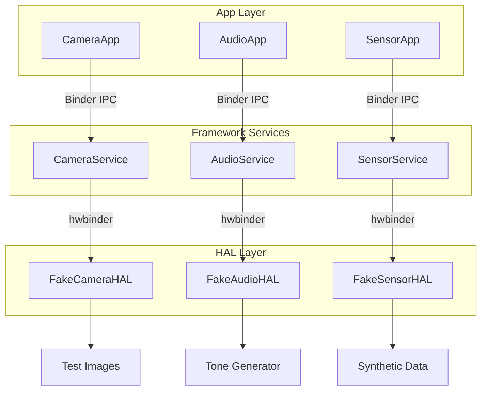

# Phase 2 — Advanced (HAL + Hardware Abstraction)

> **Prerequisite**: Phase 1 (Core) must be complete before starting Phase 2.
> 
> See `phase-1-core.md` for the core boot-to-app-lifecycle loop.

---

## Scope

Phase 2 extends mini-AOSP with the HAL layer, custom runtime, and kernel modifications — enabling apps to interact with (simulated) hardware through the same abstraction pattern real Android uses.

### Form Factors

Phase 1 targets mobile phone only. Phase 2 may explore additional form factors:
- Tablet
- Android TV
- Android Auto
- Wear OS

### Custom Kernel

In Phase 1 we use Google's pre-built Android Common Kernel (ACK). In Phase 2, we follow what Android actually does — **modify a pure upstream Linux kernel ourselves**:

- Start from a vanilla Linux LTS kernel (e.g., 6.6 or 6.12)
- Add the Binder kernel driver (replace our userspace Unix socket substitute)
- Add Ashmem or memfd integration
- Add custom lmkd hooks (PSI-based memory pressure)
- Learn why each "Androidism" exists by implementing it ourselves
- Compare performance: kernel Binder (single-copy, mmap) vs our userspace sockets (double-copy)

## Planned Components

### HAL Interface Layer

Define standard interfaces for hardware access using our simplified AIDL:

| HAL Interface | Methods | Simulated Backend |
|---|---|---|
| `ICameraDevice` | `open()`, `capture()`, `close()` | Returns test PNG images |
| `IAudioDevice` | `play()`, `pause()`, `stop()`, `setVolume()` | Tone generator / wav playback |
| `ISensorDevice` | `registerListener()`, `unregister()`, `getSensorList()` | Synthetic accelerometer/gyro data |

### Framework Services

System services that sit between apps and HALs:

| Service | Responsibility |
|---|---|
| `CameraService` | Permission checks, session management, routes to Camera HAL |
| `AudioService` | Audio routing, volume policy, routes to Audio HAL |
| `SensorService` | Sensor registration, batching, routes to Sensor HAL |

### Architecture

### ART (Android Runtime)

Replace OpenJDK with a custom runtime to learn how Android actually executes app code:

- **Mini-ART** — simplified bytecode VM (interpret a subset of DEX/JVM bytecode)
- **Custom GC** — basic mark-and-sweep garbage collector
- **AOT compilation** — pre-compile app bytecode to native code
- **DEX format** — learn Android's optimized bytecode format vs standard JVM bytecode

### Additional Components

- **ContentProvider** — URI-based cross-app data CRUD, `ContentResolver` pattern
- **Advanced permissions** — runtime permission grants, signature-level checks
- **hwbinder** — separate binder domain for framework-to-HAL communication (mirrors real Android's `/dev/hwbinder`)
- **Dynamic broadcast registration** — `registerReceiver()` at runtime
- **PendingIntent** — deferred intent execution
- **USAP pool** — pre-forked unspecialized processes for faster app launch

---

## Sample Apps (Phase 2)

| App | What It Tests |
|---|---|
| **CameraApp** | Opens camera HAL, captures test image, displays path |
| **AudioApp** | Plays tone via AudioService, tests volume control |
| **SensorApp** | Registers for accelerometer updates, logs synthetic data |
| **ContactsApp** | ContentProvider CRUD — stores/queries contacts, shared across apps |

---

## Status

**Not started** — waiting for Phase 1 completion.
